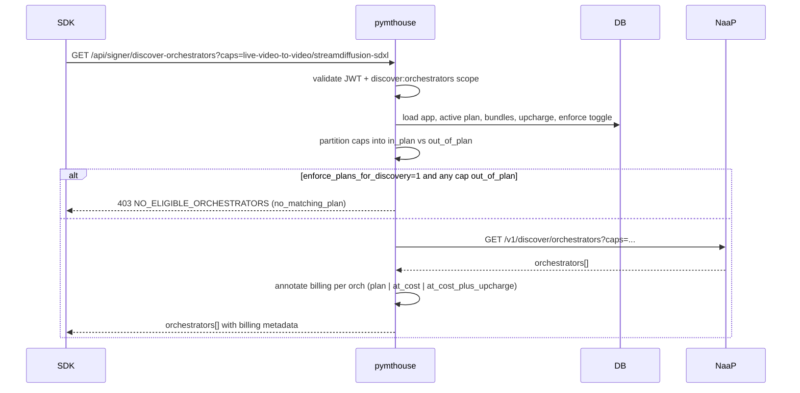

# PymtHouse Epic 3 — Remaining Work & Scope Realignment

Sources: gist `pymthouse-minimal-design.md`, 04-21 strategy meeting notes, current code.

## Confirmed scope changes vs. the gist

These are not gaps to close — they are deliberate direction changes from the 04-21 meeting. The gist should be updated to match.

- **Single shared signer, platform-wide.** `signer_config.id = "default"` stays. "Remote signer per provider" language in the gist (PA-2, Decision 4/5/7) is retired. Implementation already lives in [src/lib/signer-proxy.ts](src/lib/signer-proxy.ts) L33–40.
- **Plans API stays in pymthouse.** `plans` + `plan_capability_bundles` + [src/app/api/v1/apps/[id]/plans/route.ts](src/app/api/v1/apps/[id]/plans/route.ts) remain canonical. NaaP is a data source for the plan builder, not an owner of the plan record.
- **Discovery is a thin pymthouse → NaaP proxy, not signer-local.** Replaces gist Decisions 4 and 5. Pymthouse still enforces billing/plan boundaries on top of what NaaP returns.
- **NaaP feeds used:** pipeline-catalog for plan-builder dropdowns; discover/orchestrators for runtime. No NaaP auth in MVP (unauthenticated calls).
- **Marketplace publish loop remains deferred** (current `/api/v1/apps/[id]/publish` stub at [publish/route.ts](src/app/api/v1/apps/[id]/publish/route.ts) stays disabled).

## New feature set — plan-aware discovery + upcharge

### Data model additions

On `developer_apps`:

- `upcharge_percent REAL NOT NULL DEFAULT 0` — app-wide default upcharge applied to orchestrator-quoted price when pymthouse bills the user.
- `enforce_plans_for_discovery INTEGER NOT NULL DEFAULT 0` — 0 = open at-cost (+upcharge if set); 1 = hard-deny capabilities that do not match an active plan.

On `plans`:

- `upcharge_percent REAL` — nullable per-plan override; `NULL` means "inherit app default"; numeric value (including `0`) wins over the default. Covers the "a plan is allowed to exclude pricing" case by setting `0`.

Schema touchpoints: extend [src/db/schema.ts](src/db/schema.ts) L196–246 (`developerApps`) and L287–311 (`plans`). New drizzle migration `0014_plans_discovery_upcharge.sql`.

### Discovery endpoint rewrite

Replace the signer-backed handler with a plan-aware NaaP proxy.

- Route: keep `GET /api/signer/discover-orchestrators` path for SDK compatibility, but rewrite [src/app/api/signer/discover-orchestrators/route.ts](src/app/api/signer/discover-orchestrators/route.ts) so:
  - Required scope becomes `discover:orchestrators` (add to allowed-scope whitelist in [src/lib/allowed-scopes.ts](src/lib/allowed-scopes.ts); keep `sign:job` for signing routes only).
  - Accept `?caps=pipeline/model` repeatable query, plus optional `?planId=`.
  - Resolve the caller's active subscription/plan from the JWT `app_id` + `user_id` (or API key where used).
  - Merge requested `caps` with the plan's `plan_capability_bundles` rows.
  - Apply enforcement rules (below) to decide which caps to forward.
  - Proxy to `https://naap-api.cloudspe.com/v1/discover/orchestrators?caps=...` with no auth header; forward body to SDK as-is, annotated with per-orchestrator `billing: { mode: "plan" | "at_cost" | "at_cost_plus_upcharge", upchargePercent, planId? }` so the SDK can display pricing.
  - On NaaP upstream error/timeout → 502 with the shared error envelope; pymthouse is no longer responsible for fail-closed discovery since the signer no longer curates.

New lib module: `src/lib/naap-discovery.ts` with `fetchOrchestrators(caps: string[]): Promise<Orchestrator[]>` and `fetchPipelineCatalog(): Promise<Pipeline[]>`, both hitting `https://naap-api.cloudspe.com/v1/...` with a short HTTP timeout and in-process LRU cache (catalog: 5 min; discovery: no cache for MVP).

### Enforcement & billing rules (what to apply at stream time)

Let `app = developer_apps` row, `plan = active subscription plan for this user (may be null)`.

| Requested cap (pipeline/model) | `enforce_plans_for_discovery` | Behavior |
| --- | --- | --- |
| In a `plan_capability_bundles` row for the active plan | any | Normal plan path. Billing uses `maxPricePerUnit` guardrail from the bundle; upcharge = `plan.upcharge_percent ?? app.upcharge_percent`. |
| Not in any plan, **but** some plan exists | 0 (default) | Open at-cost. Discovery includes all orchs returned by NaaP for that cap. Billing = orch price × (1 + upcharge/100) where upcharge = `app.upcharge_percent` (apps default). |
| Not in any plan, **but** some plan exists | 1 | Deny. Return `NO_ELIGIBLE_ORCHESTRATORS` with reason `"no_matching_plan"`, 403. No NaaP call for that cap. |
| App has **zero plans** defined | 0 | Open at-cost. Upcharge `app.upcharge_percent` applied if non-zero, else pure at-cost. |
| App has **zero plans** defined | 1 | Deny. Same 403/`no_matching_plan` shape. |

This matches the user's chosen answer: "the upcharge % should be used if set, otherwise open at-cost, unless the provider specifically enforces discovery plans."

### Billing engine change

`proxyGenerateLivePayment` in [src/lib/signer-proxy.ts](src/lib/signer-proxy.ts) L458–661 currently computes `feeWei` from orchestrator `pricePerUnit` × pixels. Add an upcharge step:

```ts
const upchargePct = resolveUpchargePercent({ app, plan });
const userFeeWei = feeWei + (feeWei * BigInt(Math.round(upchargePct * 100))) / 10_000n;
const platformCutWei = userFeeWei - feeWei; // upcharge is the platform take; defaultCutPercent becomes a floor/override
```

The existing `defaultCutPercent` field on `signer_config` should either be retired or re-purposed as the floor for apps with `upcharge_percent = 0`; recommend keeping `defaultCutPercent` as the "platform cut applied when app does not set its own upcharge" (zero by default in new installs). Decide at implementation time.

`usage_records` gets two new columns: `user_fee` (what the user was billed) and `orch_cost` (what the orch was paid). The current `fee` column stays for back-compat and can mirror `user_fee`.

### Plan builder UI wiring

In [src/app/apps/[id]/plans/page.tsx](src/app/apps/[id]/plans/page.tsx) (and any admin form that edits capabilities), replace free-text pipeline/model inputs with dropdowns sourced from `fetchPipelineCatalog()`. Fetch once per page load; cache for 5 minutes in the `naap-discovery` lib.

Add two form controls on the app settings page (`src/app/apps/[id]/...`):
- Numeric input for `upcharge_percent` (0–100).
- Checkbox for `enforce_plans_for_discovery`.

## Data flow



## Remaining gap work (unchanged from prior plan, still needed)

1. **PostgreSQL RLS on billing-critical tables.** No `ENABLE ROW LEVEL SECURITY` in any `drizzle/*.sql`. Migration + request-scoped `SET LOCAL app.client_id` hook in [src/db/index.ts](src/db/index.ts).
2. **Phase 0 runbooks:** Neon rollback rehearsal, JWKS rotation, shared-signer outage, per-env issuer/audience config.
3. **Structured error envelope** (`error`, `error_description`, `correlation_id`) shared across auth/discovery/signing/token handlers. Affects [src/app/api/signer/discover-orchestrators/route.ts](src/app/api/signer/discover-orchestrators/route.ts), [src/app/api/v1/auth/validate/route.ts](src/app/api/v1/auth/validate/route.ts), all signer routes.
4. **`auth_audit_log` coverage audit** — verify rows are written on app registration, secret rotation, user provisioning, interactive + programmatic token issuance, refresh, revoke.
5. **Integration test matrix:** PKCE failure, redirect URI mismatch, `invalid_scope`, stale JWKS, new discovery enforcement (in-plan/out-of-plan × enforce-toggle), NaaP upstream error, upcharge math correctness.
6. **Multi-provider isolation fixtures** proving cross-`client_id` leak prevention once RLS lands.

## Specification realignment (documentation-only task)

Update `docs/builder-api.md` and the canonical gist to:

- Retire gist §PA-2, Decisions 4, 5, 7 language about per-provider remote signers and signer-owned discovery.
- Describe the NaaP-proxy discovery model and `caps[]` contract.
- Document the `upcharge_percent` + `enforce_plans_for_discovery` fields and the enforcement matrix above.
- Note that NaaP SLA/price feeds are **not** consumed by the plan builder in MVP (deferred), but the pipeline-catalog feed **is**.
- Keep gist §Decision 2A/2B (interactive OIDC vs programmatic tokens) unchanged — this is already implemented.

## Suggested sequencing

1. Migration + schema changes (`upcharge_percent`, `enforce_plans_for_discovery`, per-plan override, `user_fee`/`orch_cost`).
2. `naap-discovery` lib + pipeline-catalog dropdowns in the plan builder.
3. Discovery endpoint rewrite (scope + plan matching + enforcement + annotation).
4. Billing engine upcharge application in `proxyGenerateLivePayment`.
5. Phase 0 RLS + runbooks + error envelope + audit coverage.
6. Spec/docs realignment PR.

## Open items to confirm during implementation (not plan-blocking)

- Should `signer_config.defaultCutPercent` be retired in favor of `developer_apps.upcharge_percent`, or kept as the fallback floor?
- Should the SDK surface the NaaP response verbatim or a pymthouse-normalized shape? (Current recommendation: normalized + `billing` annotation.)
- Is `planId` in the discovery query ever useful, or is the plan always inferred from the token? (Recommendation: infer; reject `planId` mismatches with 403.)
