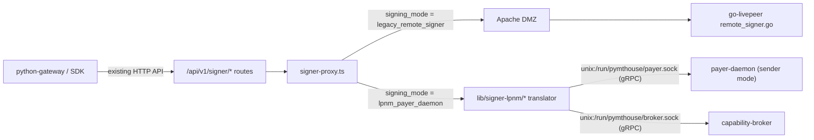

## Goal

Run the **payer-daemon** (sender mode, with the warm key) and **capability-broker** as sibling containers next to PymtHouse. For developer apps opted into the new mode, PymtHouse answers the existing signer HTTP routes by calling the daemon over `unix:<socket>` instead of HTTP-forwarding to go-livepeer's `remote_signer.go`. Legacy apps continue through the unchanged Apache DMZ → go-livepeer path so nothing existing regresses.

## Architecture



Trust spine for the new mode: shared-volume unix socket permissions, same model documented in [livepeer-network-modules/payment-daemon/DESIGN.md](livepeer-network-modules/payment-daemon/DESIGN.md). The existing DMZ JWT path is untouched for legacy apps.

## Per-app routing (lowest-touch entry point)

Add two columns to `developer_apps` and consult them in the **single existing** routing helper. Drizzle schema in [src/db/schema.ts](pymthouse/src/db/schema.ts) (after `jwksUri`):

```ts
signingMode: text("signing_mode").notNull().default("legacy_remote_signer"),
payerDaemonSocket: text("payer_daemon_socket"),
```

Migration `drizzle/0010_add_app_signing_mode.sql` adds the column with `DEFAULT 'legacy_remote_signer'` so every existing app keeps current behaviour.

In [src/lib/signer-proxy.ts](pymthouse/src/lib/signer-proxy.ts), extend `getSignerRoutingContext` to also return `signingMode` + `payerDaemonSocket` (resolved by joining `developer_apps` on `authAppId`). Then at the top of every `proxyXxx` function:

```ts
const ctx = await getSignerRoutingContext(auth.appId);
if (ctx.signingMode === "lpnm_payer_daemon") {
  return lpnmProxy.signOrchestratorInfo(requestBody, auth, ctx);
}
// existing forwardToSigner path unchanged
```

Four 3-line edits — no other touch to the legacy path.

## New code (all under `src/lib/signer-lpnm/`)

- `payer-daemon-client.ts` — `@grpc/grpc-js` + `@grpc/proto-loader` wrapper mirroring [openai-gateway/src/livepeer/payment.ts](livepeer-network-modules/openai-gateway/src/livepeer/payment.ts). Dials `unix:<socketPath>` once per process (LRU keyed by socket), exposes typed `createPayment`, `getDepositInfo`, `identify`, `health`. Proto files imported from `livepeer-network-modules/livepeer-network-protocol/proto/livepeer/payments/v1/{payer_daemon,types}.proto` — added as a workspace path or copied into `pymthouse/proto/livepeer/payments/v1/`.

- `broker-client.ts` — minimal gRPC client for capability-broker's offerings list (used only by `/discover-orchestrators` translation).

- `translator.ts` — translates the four existing PymtHouse endpoints into payer-daemon calls. One function per endpoint:

  - **signOrchestratorInfo**: calls `PayerDaemon.Identify` → returns `{ address, signature }` in the existing JSON shape consumed by [python-gateway/remote_signer.py](python-gateway/src/livepeer_gateway/remote_signer.py) `get_orch_info_sig`. Client-side `@lru_cache` already amortises this.
  - **generateLivePayment**: reuses the existing pricing/decoding helpers in [src/lib/proto.ts](pymthouse/src/lib/proto.ts) and [src/lib/billing-runtime.ts](pymthouse/src/lib/billing-runtime.ts) to derive `(faceValueWei, recipient, capability, offering)` from the request body:
    - `recipient` = `OrchestratorInfo.address`
    - `faceValueWei` = current `calculateFeeWei(pixels, pricePerUnit, pixelsPerUnit)` (same value the legacy path stores in `transactions.amountWei`)
    - `capability` = `livepeer:lv2v` for `type=lv2v`; for `type=byoc` take first capability from the decoded `Capabilities` proto
    - `offering` = `${constraint.pipeline}:${constraint.modelId}` when `resolvePaymentPipelineModelConstraint` returns one, else empty
    - `ticketParamsBaseUrl` = `OrchestratorInfo.transcoder`
    Then builds the JSON response the legacy clients expect:
    - `payment` = base64 of `CreatePaymentResponse.payment_bytes`
    - `segCreds` = locally-built `SegData{auth_token=OrchestratorInfo.auth_token}` (the offchain branch in `remote_signer.py` already does this exact construction)
    - `state` = `{ State: "", Sig: "" }` placeholder so the python-gateway type check `isinstance(state, dict)` keeps passing; the daemon owns nonce/balance internally, so PymtHouse ignores any echoed state in the new mode.
    All existing DB writes in `proxyGenerateLivePayment` (stream session upsert, transactions, usage_records, usage_billing_events, ETH/USD oracle snapshot, upcharge resolution) are factored into a shared helper called by both branches — identity + billing model is identical.
  - **signByocJob**: calls a small new `PayerDaemon.SignBYOCJob` RPC (see "Upstream additions" below). If the daemon lacks it (older builds), return 501 with a clear message; apps in new mode shouldn't be using BYOC signing today.
  - **discoverOrchestrators**: calls capability-broker's offerings list and shapes results into `[{ address, score, capabilities }]` matching the existing `discoveryResponse` in [go-livepeer/server/remote_signer.go](go-livepeer/server/remote_signer.go).

- `socket-resolver.ts` — picks the socket path: `developer_apps.payer_daemon_socket` → env `LPNM_PAYER_DAEMON_SOCKET` → default `/run/pymthouse/payer.sock`. Same scheme for the broker socket.

## Shared helper extracted from signer-proxy

The DB-writing block currently inside `proxyGenerateLivePayment` (the `if (response.ok)` body, ~150 lines) moves to `src/lib/signer-usage.ts` as `recordLivePaymentUsage({ auth, requestBody, signer, providerAppId, feeWei, platformCutWei, pixelsPerUnit, pricePerUnit, manifestId, orchestratorAddress, streamSessionId, requestId })`. Both branches call it after a successful upstream sign. Lets us preserve identity + billing semantics exactly.

## Upstream additions (livepeer-network-modules)

Two tiny `PayerDaemon` RPCs needed for byte-for-byte legacy compat:

```proto
rpc Identify(IdentifyRequest) returns (IdentifyResponse);
rpc SignBYOCJob(SignBYOCJobRequest) returns (SignBYOCJobResponse);
```

`Identify` returns `(address, signature_over_address_hex)` — the same primitive go-livepeer caches as `LivepeerNode.InfoSig`. `SignBYOCJob` mirrors the `FlattenBYOCJob` payload from [go-livepeer/server/remote_signer.go:120](go-livepeer/server/remote_signer.go) and returns `(sender, signature)`. Both are pure key-ops and fit the daemon's warm-key trust boundary. These land in [livepeer-network-protocol/proto/livepeer/payments/v1/payer_daemon.proto](livepeer-network-modules/livepeer-network-protocol/proto/livepeer/payments/v1/payer_daemon.proto) and the sender-mode implementation in the daemon's `internal/service`.

## Deployment

PymtHouse already runs go-livepeer next to itself via compose. Add sibling services for the new mode:

- `payer-daemon` (sender mode, mounts shared volume `pymthouse-signer-sock:/run/pymthouse`)
- `capability-broker` (mounts the same volume)
- pymthouse container mounts the same volume read-write at `/run/pymthouse`

Env on the pymthouse container: `LPNM_PAYER_DAEMON_SOCKET=/run/pymthouse/payer.sock`, `LPNM_BROKER_SOCKET=/run/pymthouse/broker.sock`.

Vercel/serverless deployments can't host long-lived unix sockets — apps in those deployments must keep `signing_mode = legacy_remote_signer`. The default + migration handle this transparently.

## What is explicitly NOT changing

- `AuthResult` shape, DMZ JWT issuance for legacy apps, `signerConfig` table, all four existing route handlers under `src/app/api/v1/signer/*`, python-gateway, naap, and the SDK contract.
- Legacy path through `forwardToSigner` / Apache DMZ / go-livepeer — untouched.
- `transactions`, `stream_sessions`, `usage_records`, `usage_billing_events` schemas and write semantics — both branches go through the same `recordLivePaymentUsage` helper.

## Admin surface (small follow-up, not in core PR)

Add a `signing_mode` radio + optional socket override to the developer app edit page so app owners can flip a single app without touching DB. Today's signer admin page ([src/app/signer/page.tsx](pymthouse/src/app/signer/page.tsx)) stays as-is — it's clearinghouse-wide, not per-app.