# Architecture

This document is the high-level system-of-record for the live repository structure. It is meant to answer four questions:

1. what the major runtime components are
2. how requests and data move through them
3. how code is organized to reflect those flows
4. what rules keep the structure from drifting

## System Summary

Pymthouse is a control plane that sits between:

- platform operators and provider admins
- developer applications and their end users
- a hosted OIDC issuer
- a shared Livepeer signer/DMZ runtime
- a usage, billing, plans, and subscription ledger

At runtime, the single Next.js control plane owns API, dashboard, OIDC, app management, and operational reporting. It persists state in PostgreSQL and coordinates with a separately deployed signer stack.

## Runtime Context

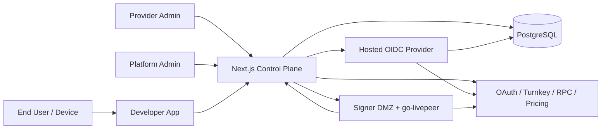


## Repository Shape

```text
src/
├── app/                         # Next.js pages and route adapters only
├── domains/                     # Product/runtime domains
│   ├── developer-apps/
│   ├── end-user-accounts/
│   ├── identity-access/
│   ├── oidc-platform/
│   ├── plans-discovery/
│   ├── signer-runtime/
│   └── usage-billing/
├── platform/                    # Infra, protocol, operational, framework helpers
│   ├── auth/
│   ├── catalog/
│   ├── docs/
│   ├── livepeer/
│   ├── marketplace/
│   ├── oidc/
│   ├── ops/
│   └── signer/
└── shared/                      # Small pure helpers and shared types
    ├── discovery/
    └── utils/
```

## Code Organization

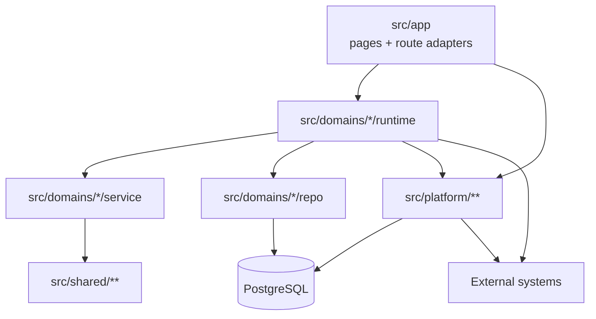


## Domain Map

| Domain | Responsibility | Typical Tables / State |
| --- | --- | --- |
| `identity-access` | dashboard auth, bearer/session auth, invites, audit, Turnkey-backed user/session flows | `users`, `sessions`, `provider_admins`, `admin_invites`, `auth_audit_log` |
| `oidc-platform` | hosted OIDC provider, client policy, consent/interaction handling, device flow, token exchange, signing keys, payload storage | `oidc_clients`, `oidc_payloads`, `oidc_signing_keys` |
| `developer-apps` | developer app lifecycle, admins, users, credentials, domains, branding, marketplace state, review flows | `developer_apps`, `app_users`, `app_allowed_domains`, app-linked OIDC client state |
| `plans-discovery` | plans, discovery profiles, subscriptions, discovery policy resolution | `plans`, `discovery_profiles`, `discovery_profile_bundles`, `subscriptions`, `api_keys` |
| `signer-runtime` | signer config, DMZ-facing proxying, admin control, status/health, payment recording | `signer_config`, signer runtime state, session-linked payment writes |
| `usage-billing` | usage/billing rules, fee normalization, owner/platform charge calculations | `usage_records`, `usage_billing_events`, price snapshots |
| `end-user-accounts` | end-user balances, transactions, billing-facing account reads | `end_users`, `transactions`, `stream_sessions` |

## Domain Relationships

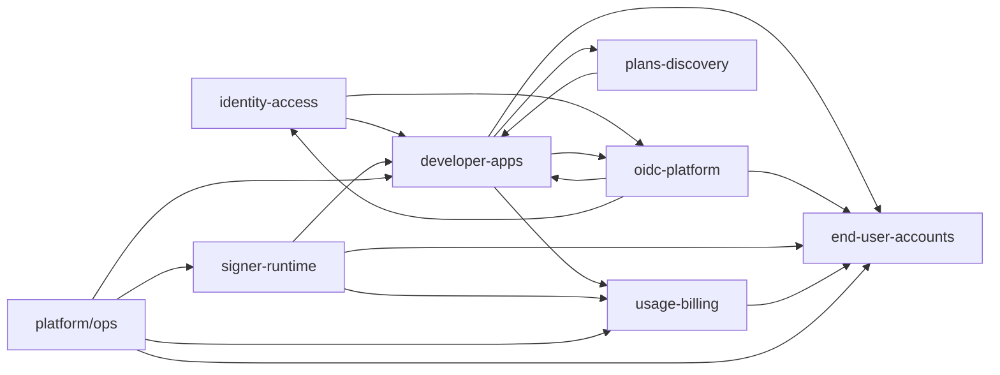


## Layering Rules

Within a domain, dependency direction is:

`types -> repo -> service -> runtime -> ui`

Definitions:

- `types`: domain contracts, type aliases, enums
- `repo`: direct DB access and persistence mapping
- `service`: pure or near-pure business rules
- `runtime`: framework/integration orchestration
- `ui`: React view-model and rendering helpers

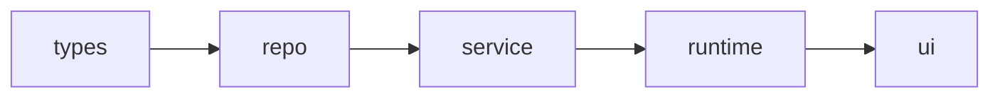


The diagram above is directional, not mandatory by folder count. A domain may omit `types` or `ui` when the slice does not need them.

## Boundary Rules

- `src/app/**` stays thin. Pages and routes translate HTTP/UI concerns into domain or platform calls.
- Direct `@/db/*` imports are allowed only in `src/domains/**/repo/**` and `src/platform/**`.
- The legacy `@/lib/*` namespace is retired. Production code should import permanent homes under `domains`, `platform`, or `shared`.
- OIDC protocol/framework helpers belong in `src/platform/oidc/**`; OIDC business/runtime behavior belongs in `src/domains/oidc-platform/**`.
- Cross-cutting operational/reporting helpers belong in `src/platform/ops/**`.

## Major Runtime Surfaces

### 1. Control Plane App Surface

- dashboard pages under `src/app/dashboard`, `src/app/apps`, `src/app/admin`, `src/app/signer`
- public and marketplace pages under `src/app/page.tsx`, `src/app/marketplace`, `src/app/solutions`
- API route adapters under `src/app/api/**` and `src/app/api/v1/**`

### 2. Hosted OIDC Surface

- issuer metadata under `.well-known`
- interaction and consent pages under `src/app/oidc/**`
- catch-all issuer routes under `src/app/api/v1/oidc/**`
- device verification and third-party login initiation under `src/app/api/v1/oidc/device/**` and `src/app/oidc/device/**`

### 3. Signer Surface

- signer admin/control routes under `src/app/api/v1/signer/**`
- signer-facing proxy routes under `src/app/api/signer/**`
- signer admin/operator page under `src/app/signer/page.tsx`

## End-to-End Request Path

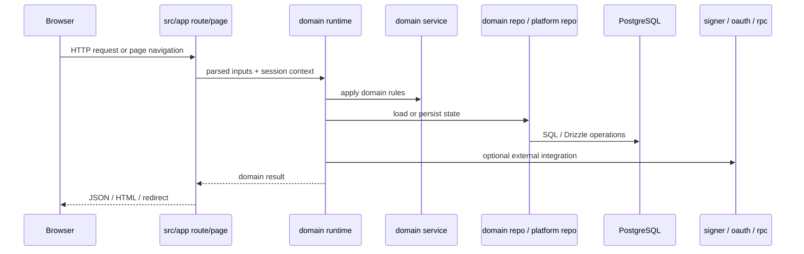

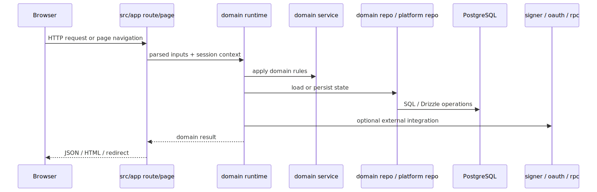

## Authentication and OIDC Flow

The hosted issuer supports:

- interactive authorization code login
- device flow
- client credentials and programmatic tokens
- token exchange for device and gateway flows

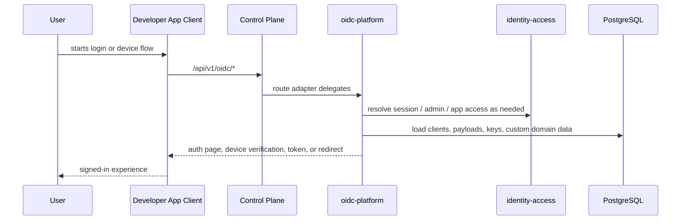

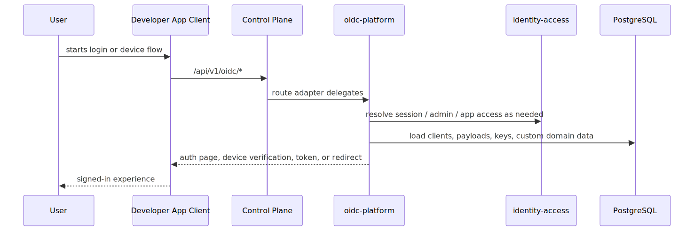

## Developer App Lifecycle Flow

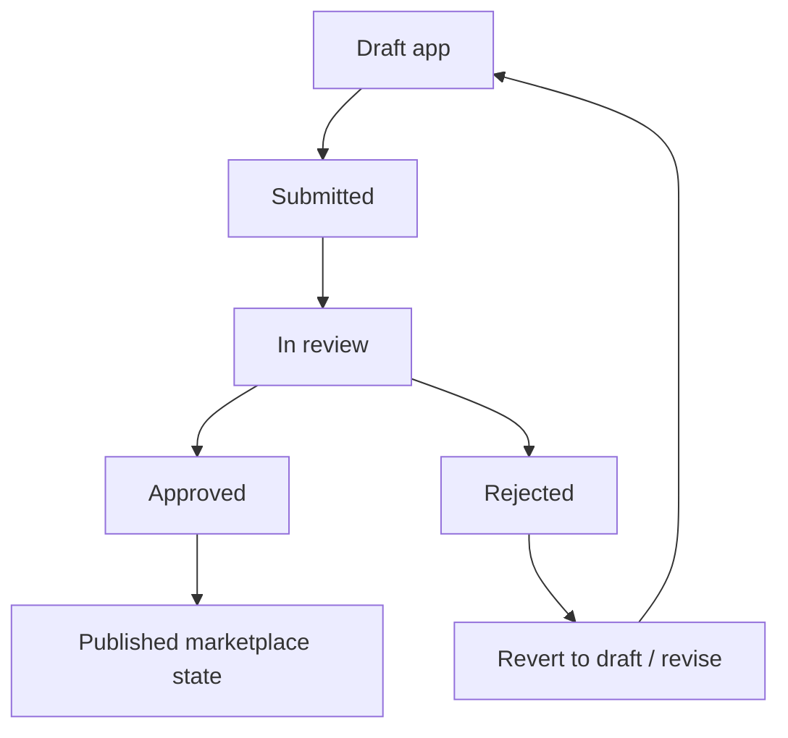


This lifecycle is implemented primarily in `src/domains/developer-apps/**` and surfaced through provider/admin app routes and dashboard pages.

## Signer and Billing Flow

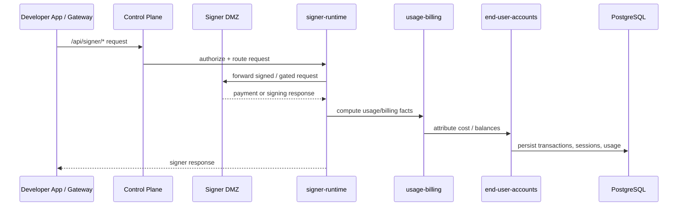

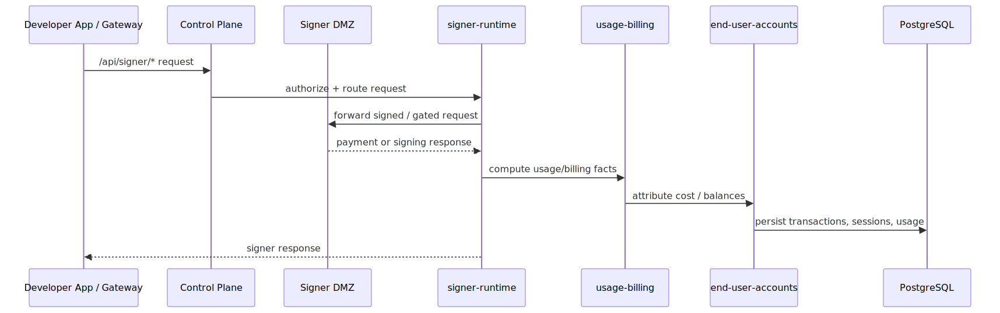

## Plans, Discovery, and Subscription Flow

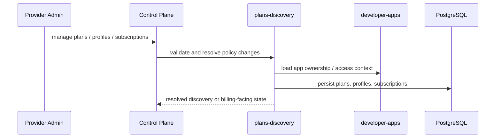

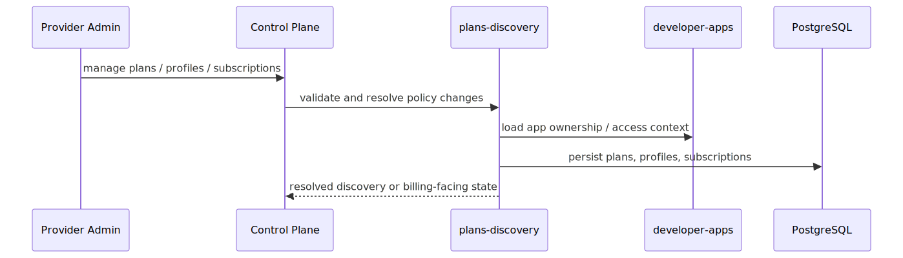

## Data Ownership Overview

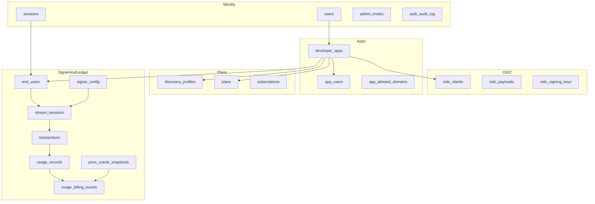


The exact field definitions remain in [src/db/schema.ts](src/db/schema.ts).

## Deployment Topologies

Two production topologies are supported.

### Vercel Control Plane Topology

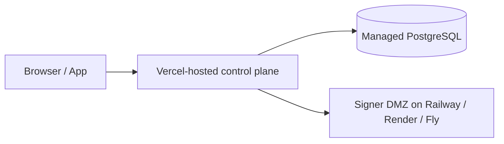


See [docs/vercel-deployment.md](docs/vercel-deployment.md).

### Fully Containerized Topology

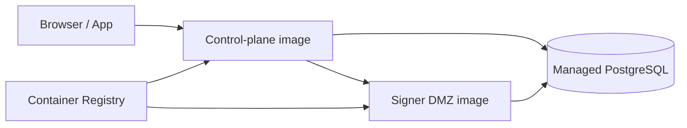


See [docs/container-deployment.md](docs/container-deployment.md) and `infra/deploy/**`.

## Infra Layout

```text
infra/
├── dev/        # local-only compose files; inline builds allowed
├── docker/     # Dockerfiles and build assets
├── scripts/    # supported image build/run/migrate entrypoints
└── deploy/     # production prebuilt-image examples and guides
```

Recommended release sequence:

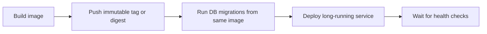


## Mechanical Enforcement

- `scripts/check-compat-imports.js` blocks new production imports from the retired legacy `@/lib/*` namespace.
- `scripts/check-direct-db-imports.js` blocks direct DB imports in extracted route adapters and disallowed domain layers.
- `eslint.config.mjs` enforces route/domain import boundaries on the critical migrated surfaces.
- `npm run lint` runs the repo-level architecture checks before ESLint.

## Current Truths and Non-Goals

- This is still a single Next.js control-plane application, not a microservice fleet.
- Domain separation is primarily a code-organization and reasoning boundary, not a network boundary.
- `src/platform/**` is allowed to contain DB-backed infrastructure code when that code is clearly protocol, framework, or operational infrastructure.
- `src/shared/**` is intentionally small and should stay pure or close to pure.

## Key Files To Read Next

- [AGENTS.md](AGENTS.md)
- [docs/PRODUCT_SENSE.md](docs/PRODUCT_SENSE.md)
- [docs/DEPLOYMENT.md](docs/DEPLOYMENT.md)
- [docs/container-deployment.md](docs/container-deployment.md)
- [docs/vercel-deployment.md](docs/vercel-deployment.md)
- [src/db/schema.ts](src/db/schema.ts)
