# Clearinghouse SDK — Architecture & Design

*Livepeer Dashboard · PymtHouse · builder-sdk · go-livepeer Remote Signer · livepeer-python-gateway*

> **Issue reference:** [livepeer/dashboard#2 — Ship StreamDiffusion playground with hosted-signer trial credits](https://github.com/livepeer/dashboard/issues/2)

---

## Table of Contents

1. [Overview](#1-overview)
2. [High-Level Design](#2-high-level-design)
   - [System Component Map](#21-system-component-map)
   - [Three-Phase Flow](#22-three-phase-flow)
   - [Token Lifecycle](#23-token-lifecycle)
3. [Component Deep Dives](#3-component-deep-dives)
   - [go-livepeer Remote Signer](#31-go-livepeer-remote-signer)
   - [signer-dmz (Apache JWT Bridge)](#32-signer-dmz-apache-jwt-bridge)
   - [PymtHouse](#33-pymthouse)
   - [builder-sdk](#34-builder-sdk)
   - [Livepeer Dashboard](#35-livepeer-dashboard)
   - [livepeer-python-gateway](#36-livepeer-python-gateway)
4. [Per-User ETH Accounting: Mathematical Foundation](#4-per-user-eth-accounting-mathematical-foundation)
5. [OpenMeter — Credit Authority & Pre-Configuration](#5-openmeter--credit-authority--pre-configuration)
6. [Open Issues and Required Work](#6-open-issues-and-required-work)

**Addenda:**
- [Builder API — OpenMeter Credit Provisioning](Builder%20API%20%E2%80%94%20OpenMeter%20Credit%20Provisioning.md) — full API reference for the credits, balance, starter-plan, and OpenMeter config endpoints, including the exact OpenMeter call chain PymtHouse makes for each operation

---

## 1. Overview

The Clearinghouse SDK enables platform applications to run real-time AI video generation on the Livepeer network with per-user trial credit budgets. **OpenMeter is the authoritative store for trial credit tracking** — it holds all granted amounts, aggregates consumed spend via ClickHouse metering, and computes the remaining balance that gates access. PymtHouse and the Dashboard are provisioning clients: they create OpenMeter customers, grant initial credits, and read balances via the OpenMeter API. A platform user's session is authenticated via PymtHouse OIDC, a short-lived JWT is minted that identifies both the platform application and the end user, and that JWT gates access to a hosted go-livepeer remote signer. The remote signer issues probabilistic micropayment tickets to orchestrators on behalf of the platform's shared sender wallet, while usage is recorded asynchronously to OpenMeter. The Livepeer Dashboard (issue #2) is the first platform application — it hosts a StreamDiffusion playground gated behind a free-trial sign-in flow with personal API keys, provisioning trial credits and reading balances directly through the builder-sdk and PymtHouse API.

### Component Roster

| Component | Repository | Branch | Status |
|-----------|-----------|--------|--------|
| go-livepeer Remote Signer | `livepeer/go-livepeer` | `feat/remote-signing-identity` | Identity binding implemented; `oidc` validation mode stub only |
| signer-dmz (Apache JWT bridge) | `pymthouse/pymthouse` | `feat/openmeter-async-flow` | Implemented (`mod_authnz_jwt`, JWKS→PEM loop) |
| PymtHouse (OIDC + billing) | `pymthouse/pymthouse` | `feat/openmeter-async-flow` | M2M token mint, OpenMeter entitlements, balance API implemented |
| builder-sdk | `pymthouse/builder-sdk` | `feat/new-signer` | `createDirectSignerProxyHandler`, device + API key exchange implemented (PR #19) |
| Livepeer Dashboard | `livepeer/dashboard` | `feat/pymthouse-integration` | Usage, keys, device flow, signing session live; OAuth sign-in is mock |
| livepeer-python-gateway | `j0sh/livepeer-python-gateway` | `feat/oidc-clearinghouse` | OIDC device flow, identity enrichment, payment sessions implemented |

---

## 2. High-Level Design

### 2.1 System Component Map

The full system across authentication, signing, and billing in a single view.

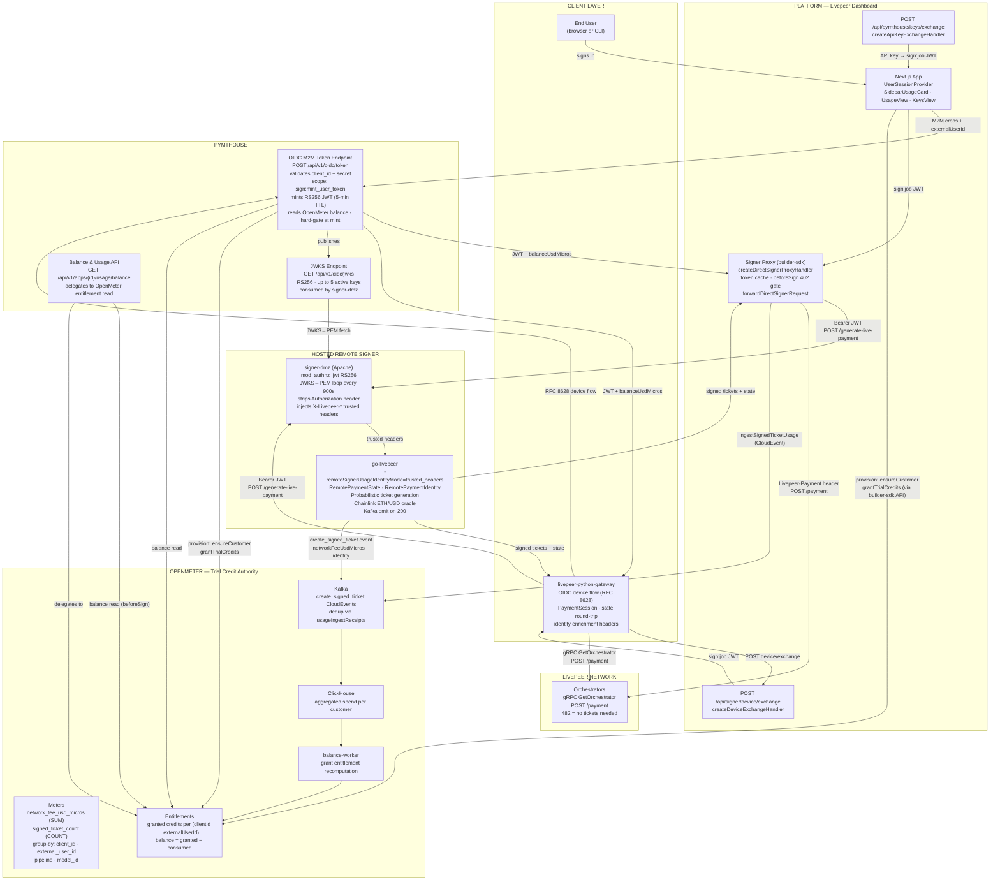

---

### 2.2 Three-Phase Flow

#### Phase 1 — Session Setup

*The platform SDK authenticates, provisions billing, fetches a signed JWT, and optionally checks the trial balance before the first signing call.*

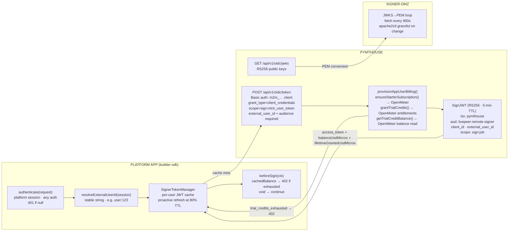

#### Phase 2 — Signing Hot Path

*The warm path is pure in-memory: zero outbound HTTP until go-livepeer. The signer-dmz validates the JWT at the Apache layer, stripping the Bearer token and injecting trusted identity headers before forwarding to go-livepeer.*

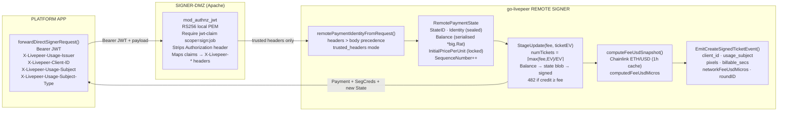

#### Phase 3 — Usage Ingest (Async)

*Entirely off the hot path. The signer proxy ingests ticket data immediately after forwarding the response. OpenMeter is the authoritative consumer — it aggregates events in ClickHouse and the balance-worker recomputes the entitlement balance used to gate future JWT mints. go-livepeer emits the same event to a separate Kafka topic independently (audit and analytics path).*

```mermaid
flowchart LR
  SP["Signer Proxy\nforwardWithOptionalMetering()\npymthouse_hosted mode\ningestSignedTicketUsage()"]
  DR["usageIngestReceipts\nDedup by (clientId, requestId)\ndiagnostic flag on dry-runs"]
  CE["CloudEvent\nspecversion 1.0\ntype: create_signed_ticket\nsource: go-livepeer-remote-signer\nnetworkFeeUsdMicros · identity"]
  KF["OpenMeter Kafka topic\nApache Kafka (KRaft)"]
  SW["openmeter-sink-worker\nKafka → ClickHouse aggregation"]
  CH["ClickHouse\nnetwork_fee_usd_micros SUM\nsigned_ticket_count COUNT\ngroup-by: client_id · external_user_id"]
  BW["openmeter-balance-worker\ngrant entitlement recomputation"]
  BA["OpenMeter Entitlement Value\ngranted − consumed\nread by PymtHouse at JWT mint\ngates beforeSign 402"]

  SP --> DR --> CE --> KF --> SW --> CH --> BW
  BW -->|"entitlement balance updated"| BA
```

---

### 2.3 Token Lifecycle

*Step-by-step per-request flow through `createDirectSignerProxyHandler()` with all path variants.*

#### Cold Path — Token Not in Cache

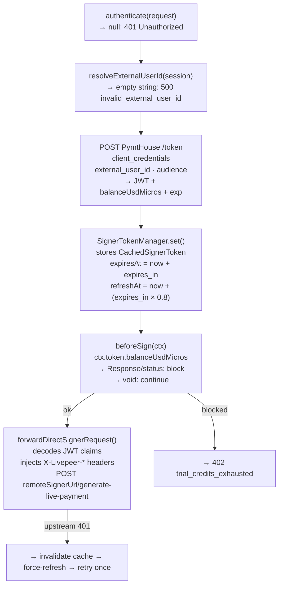

**JWT claims:** `iss=pymthouse · aud=livepeer-remote-signer · client_id · external_user_id · exp · scope=sign:job`

**Token response body:** `{ access_token, expires_in: 300, balanceUsdMicros, lifetimeGrantedUsdMicros }`

#### Warm Path — Token in Cache

On subsequent requests within the token TTL, steps C1→C2 run then the cache is hit directly (zero network I/O to PymtHouse), `beforeSign` receives the **cached** `balanceUsdMicros` (stale by up to one TTL period — tunable via `expires_in`), and the request is forwarded immediately.

#### Device Exchange Path (livepeer-python-gateway / CLI)

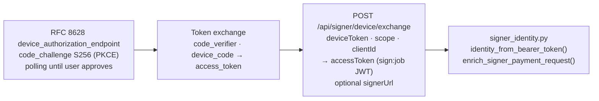

---

## 3. Component Deep Dives

### 3.1 go-livepeer Remote Signer

**Repository:** `livepeer/go-livepeer` · **Branch:** `feat/remote-signing-identity`
**Key files:** `server/remote_signer.go`, `core/accounting.go`, `server/fee_usd.go`, `monitor/kafka.go`

The remote signer is the financial core of the system. It holds the platform's Ethereum private key and issues probabilistic payment tickets to orchestrators on behalf of the platform sender. Identity binding (introduced on this branch) encodes the per-user attribution into every payment cycle without altering the on-chain ticket structure.

#### RemotePaymentState — Interface Contract

Every call to `POST /generate-live-payment` is stateless from the HTTP perspective; the session state is serialised, signed with the signer's Ethereum key, and round-tripped as an opaque blob.

```go
type RemotePaymentState struct {
    StateID              string                  // ManifestID; accounting unit
    PMSessionID          string
    LastUpdate           time.Time
    OrchestratorAddress  ethcommon.Address        // key in AddressBalances
    AuthExpiry           int64
    SenderNonce          uint32
    Balance              string                  // serialised *big.Rat; per-session running credit
    InitialPricePerUnit  int64                   // locked at session start; cannot change
    InitialPixelsPerUnit int64
    SequenceNumber       uint64                  // monotonically increasing; replay prevention
    Identity             RemotePaymentIdentity   // sealed on first request
}

type RemotePaymentIdentity struct {
    Issuer           string  // "https://pymthouse.example/api/v1/oidc"
    ClientID         string  // public app_… OAuth2 client_id
    UsageSubject     string  // external_user_id value
    UsageSubjectType string  // "external_user_id"
}
```

The state blob is signed via `ls.LivepeerNode.Eth.Sign`; `verifyStateSignature` enforces authenticity on every continuation. `SequenceNumber` is incremented on each call and checked for monotonicity — replay of an earlier state blob is rejected.

**Identity binding rules:**
1. **First request** (empty state): `remotePaymentIdentityFromRequest()` extracts identity from HTTP headers (trusted path wins) or JSON body; identity is written into the state and sealed.
2. **Continuation** (state present): identity in the incoming request, if non-empty, is validated to match the sealed identity exactly — all four fields must agree. Any mismatch → HTTP 400.
3. **Header precedence over body**: `X-Livepeer-Usage-Issuer`, `X-Livepeer-Client-ID`, `X-Livepeer-Usage-Subject`, `X-Livepeer-Usage-Subject-Type` are set by the Apache DMZ layer after JWT validation; the body `identity` field is a fallback for direct callers.

#### Identity Modes

| Flag value | Behaviour | Status |
|-----------|-----------|--------|
| `none` (default) | Identity fields ignored entirely | Implemented |
| `trusted_headers` | Identity required on first request; mismatch on continuation → 400 | Implemented |
| `oidc` | go-livepeer validates the Bearer JWT natively via a JWKS endpoint | **Not implemented** — flag accepted, falls through to `none` |

The signer-dmz approach (§3.2) makes the `oidc` mode unnecessary for the current deployment: Apache handles JWKS validation and injects headers that go-livepeer reads in `trusted_headers` mode.

#### Response Code Reference

| HTTP Status | Constant | Meaning | Client action |
|-------------|----------|---------|---------------|
| 200 | — | Tickets generated; new signed state returned | Forward payment to orchestrator; store new state |
| 400 | — | Bad request: malformed state signature, missing fields, or identity mismatch on continuation | Log and abort session |
| 480 | `HTTPStatusRefreshSession` | Ticket params stale (price or params changed) | Fetch fresh `OrchestratorInfo` via gRPC; retry |
| 481 | `HTTPStatusPriceExceeded` | Orchestrator price exceeds configured max or has doubled from `InitialPricePerUnit` | Select a different orchestrator |
| 482 | `HTTPStatusNoTickets` | Session credit already covers the fee; no new tickets are needed this cycle | Skip payment this cycle (non-fatal) |
| 500 | — | Internal error or auth webhook failure | Abort |

**482 semantics:** this is an accounting optimisation, not a budget exhaustion signal. It fires when `Balance (existingCredit) ≥ fee` — the session has already pre-paid for this segment from a prior oversized ticket batch. User budget exhaustion is enforced separately via a 402 from the `beforeSign` hook before the request ever reaches the signer.

#### On-Chain Oracle

`PriceFeedWatcher` (`eth/watchers/pricefeedwatcher.go`) wraps a Chainlink ETH/USD price feed contract. It refreshes hourly (up to 5 retries, 30s base delay), holds the result in memory, and is initialised at startup via `watchers.NewPriceFeedWatcher(backend, *cfg.PriceFeedAddr)`.

`computeFeeUsdSnapshot(fee)` (`server/fee_usd.go`) reads the watcher and computes:

$$\text{usdMicros} = \left\lfloor \frac{\text{feeWei} \times \text{ethUsdMicros}}{10^{18}} \right\rfloor$$

The result is included in both the `RemotePaymentResponse` `Usage` block and the Kafka event. The call is **non-blocking** — if the watcher is unavailable, an empty struct is returned and signing proceeds normally.

**Benefits of using the built-in on-chain oracle:**

1. **Transparent, auditable pricing.** All USD amounts are derived from a public Chainlink round (round ID and `updatedAt` are included in Kafka events), allowing independent verification of spend claims without trusting the platform's internal accounting.
2. **No off-chain price negotiation.** The orchestrator's ETH price per pixel is converted to USD using the same canonical source consumed by the Livepeer protocol itself; there is no separate pricing oracle or bilateral agreement required between the platform and PymtHouse billing.
3. **Non-blocking on the hot path.** The price is cached in-process with a 1-hour TTL and refreshed in the background. Zero outbound HTTP occurs during `GenerateLivePayment`; signing latency is unaffected even if Chainlink is temporarily unreachable.
4. **Rate-locked per session.** `InitialPricePerUnit` is captured at session start and immutable for the session lifetime. A user's USD cost per pixel-second is fixed at the moment their session begins, regardless of orchestrator repricing mid-session.
5. **Single source of truth for billing.** Both go-livepeer Kafka events (`networkFeeUsdMicros`) and PymtHouse OpenMeter ingestion consume the same oracle-derived amount. The OpenMeter `network_fee_usd_micros` SUM meter aggregates these directly, ensuring the user's consumed balance matches the actual value of tickets sent to orchestrators.

#### Kafka Event Schema

Emitted from `monitor.EmitCreateSignedTicketEvent()` on every HTTP 200 response from `GenerateLivePayment`:

```json
{
  "event_type": "create_signed_ticket",
  "session_id": "<stateID>",
  "request_id": "<uuid>",
  "sequence_number": 42,
  "issuer": "https://pymthouse.example/api/v1/oidc",
  "client_id": "app_abc123",
  "usage_subject": "user:7890",
  "usage_subject_type": "external_user_id",
  "orch_address": "0xabc...",
  "pipeline": "lv2v",
  "model_id": "daydreamlive/streamdiffusion",
  "billable_secs": 5.0,
  "pixels": 2764800,
  "num_tickets": 3,
  "session_balance": "1500/1",
  "computed_fee_usd_micros": 12500,
  "eth_usd_price": "3450.00000000",
  "eth_usd_round_id": 110982341,
  "eth_usd_updated_at": "2026-06-01T12:00:00Z"
}
```

#### Known Gaps and TODOs

| Location | Gap | Impact |
|----------|-----|--------|
| `server/remote_signer.go:463` | Global `AddressBalances` map is read/written on every signing call via state restore/write; causes lock contention under concurrent sessions | Performance under load |
| `server/remote_signer.go:242` | No length limits on string/byte fields in `RemotePaymentRequest` | DoS surface |
| `cmd/livepeer/starter/flags.go:150` | `-remoteSignerUsageIdentityMode oidc` is advertised but falls through to `none` | No impact while signer-dmz is used |
| `.vscode/launch.json` | `-remoteSignerJWKSUrl` debug flag referenced but no corresponding code in `flags.go` or `LivepeerNode` | No impact while signer-dmz is used |

---

### 3.2 signer-dmz (Apache JWT Bridge)

**Repository:** `pymthouse/pymthouse` · **Path:** `docker/signer-dmz/`
**Key files:** `docker/signer-dmz/apache/signer-dmz.conf.in`, `docker/signer-dmz/entrypoint.sh`

The signer-dmz is the security boundary between the internet-facing platform and the go-livepeer remote signer process. It validates the PymtHouse-issued JWT at the Apache layer using `mod_authnz_jwt` (RS256, static PEM), strips the `Authorization` header, and injects verified JWT claims as trusted HTTP headers before forwarding to go-livepeer.

This design allows go-livepeer to operate in `trusted_headers` mode — it never performs cryptographic JWT verification itself; that responsibility is fully owned by the DMZ. This separation means the go-livepeer JWKS configuration is unchanged from a standard deployment.

#### JWKS → PEM Loop

On container start, `entrypoint.sh`:
1. Derives `OIDC_ISSUER` from `NEXTAUTH_URL` (appends `/api/v1/oidc`)
2. Rewrites `JWKS_URI` replacing `localhost` → `host.docker.internal` for Docker network reach
3. Calls `scripts/jwks_to_pem.py` to fetch the JWKS and convert the active RS256 key to PEM at `/run/jwt/jwks.pem`
4. Launches a background refresh loop every 900 seconds — fetches the JWKS again, converts to PEM, and runs `apache2ctl graceful` if the PEM changed (zero-downtime key rotation)
5. Starts go-livepeer as a sidecar with `-remoteSignerUsageIdentityMode=trusted_headers`

#### Trusted Header Mapping

| go-livepeer Trusted Header | Source |
|---------------------------|--------|
| `X-Livepeer-Usage-Issuer` | `${OIDC_ISSUER}` environment variable (static) |
| `X-Livepeer-Client-ID` | `%{reqenv:AUTHJWT_CLAIM_client_id}` (from JWT claim) |
| `X-Livepeer-Usage-Subject` | `%{reqenv:AUTHJWT_CLAIM_external_user_id}` (from JWT claim) |
| `X-Livepeer-Usage-Subject-Type` | hardcoded `external_user_id` |

The `Authorization` header is stripped after validation — go-livepeer never sees the raw JWT.

Protected paths: all routes except `healthz`, `status`, and `__signer_cli`. The `Require jwt-claim scope=sign:job` directive ensures only tokens with the correct scope are accepted.

---

### 3.3 PymtHouse

**Repository:** `pymthouse/pymthouse` · **Branch:** `feat/openmeter-async-flow`
**Key files:** `src/lib/oidc/mint-user-signer-token.ts`, `src/lib/openmeter/entitlements.ts`, `src/lib/openmeter/constants.ts`, `scripts/openmeter-bootstrap.ts`

PymtHouse is the OIDC identity provider and **credit provisioning proxy**. It mints the JWTs that gate access to the signer-dmz, enforces trial budgets at mint time by reading from OpenMeter, and provisions credits into OpenMeter on behalf of the platform and Dashboard. **OpenMeter is the authoritative store for all credit tracking** — PymtHouse holds no credit ledger of its own; every balance read and grant write goes directly to the OpenMeter API.

#### M2M Token Endpoint

`POST /api/v1/oidc/token` — intercepted by the Next.js catch-all before node-oidc-provider when all of these are true: `grant_type=client_credentials`, `scope` includes `sign:mint_user_token`.

**Request:**
```
Authorization: Basic {base64(m2mClientId:m2mClientSecret)}
grant_type=client_credentials
scope=sign:mint_user_token
external_user_id={externalUserId}
audience=livepeer-remote-signer
```

**Validation sequence:**
1. Extract and decode `Authorization: Basic …` credentials
2. Look up `m2m_…` client in `oidc_clients` table; verify SHA-256 of secret
3. Check `allowed_scopes` includes `sign:mint_user_token`
4. Resolve the parent `developer_apps` row and the public `app_…` client
5. Call `provisionAppUserBilling({ clientId, externalUserId })`:
   - Upsert `app_users` row
   - Call `ensureStarterSubscriptionForAppUser()` → create OpenMeter customer and Starter plan subscription if not present
   - Call `getTrialCreditBalance()` → read OpenMeter `network_spend` entitlement
   - **Hard gate:** if `hasAccess === false` → throw `MintUserSignerTokenError("trial_credits_exhausted", 402)`
6. Sign JWT (RS256, kid-tagged, 5-minute TTL)

**Minted JWT claims:**
```json
{
  "scope": "sign:job",
  "client_id": "app_abc123",
  "external_user_id": "user:7890",
  "user_type": "external_user",
  "iss": "https://pymthouse.example/api/v1/oidc",
  "aud": "livepeer-remote-signer",
  "sub": "user:7890",
  "kid": "<active key kid>",
  "alg": "RS256"
}
```

**Response body:** `{ access_token, expires_in: 300, balanceUsdMicros, lifetimeGrantedUsdMicros }`

The `balanceUsdMicros` in the response is the value at mint time — returned to the builder-sdk token cache for use by the `beforeSign` hook without an additional round-trip.

#### JWKS Publication

`GET /api/v1/oidc/jwks` — served by node-oidc-provider via the catch-all. Returns up to 5 most-recent RS256 keys from `oidc_signing_keys` table, active key sorted first, with `use: "sig"`, `alg: "RS256"`, `kid`. Consumed by the signer-dmz JWKS→PEM loop.

#### OpenMeter — Credit Authority

PymtHouse calls the OpenMeter API to provision and read credits; it does not own a credit ledger. OpenMeter's ClickHouse-backed metering is the single source of truth for all credit state.

**Meters (configured via `openmeter:bootstrap` or OpenMeter API):**

| Slug | Event type | Aggregation | Value property | Group-by dimensions |
|------|-----------|-------------|----------------|---------------------|
| `network_fee_usd_micros` | `create_signed_ticket` | `SUM` | `$.network_fee_usd_micros` | `client_id`, `external_user_id`, `pipeline`, `model_id` |
| `signed_ticket_count` | `create_signed_ticket` | `COUNT` | *(none)* | `client_id`, `external_user_id`, `pipeline`, `model_id` |

**Customer key:** `"{clientId}:{externalUserId}"` — created in OpenMeter by `ensureOpenMeterCustomer()` at first provision. Balance is always `max(0, floor(entitlement.balance))` — a read-time computation against the ClickHouse aggregate via the OpenMeter entitlement API; no debit writes occur anywhere in PymtHouse's own database.

**Provisioning calls PymtHouse makes to OpenMeter:**

| Call | OpenMeter API | Trigger |
|------|--------------|--------|
| `ensureOpenMeterCustomer()` | `POST /api/v1/customers` (upsert) | First JWT mint for `(clientId, externalUserId)` |
| `ensureMeteredEntitlement()` | `POST /api/v1/customers/{key}/entitlements` | First JWT mint, if `network_spend` entitlement absent |
| `grantTrialCredits()` | `POST /api/v1/customers/{key}/entitlements/{feature}/grants` | First JWT mint; idempotent |
| `getTrialCreditBalance()` | `GET /api/v1/customers/{key}/entitlements/{feature}/value` | Every JWT mint (hard gate) |

**Dashboard provisioning via builder-sdk / API:**

The Dashboard and any other platform application can also provision credits directly via the PymtHouse builder-sdk or the PymtHouse API without going through the token endpoint. The same OpenMeter calls are made — PymtHouse is acting as a thin proxy to the OpenMeter entitlement API with M2M auth enforcement in front.

#### Usage Ingest Path

After the builder-sdk signer proxy receives a 200 from go-livepeer (in `pymthouse_hosted` metering mode):

1. `ingestSignedTicketUsage()` (`src/lib/billing/signed-ticket-ingest.ts`) — skips if `networkFeeUsdMicros <= 0`
2. `recordSignedTicketToOpenMeter()` — inserts dedup row in `usageIngestReceipts` by `(clientId, requestId)`; skips if already present
3. `ingestSignedTicketEvent()` — builds CloudEvent and calls `client.events.ingest()` to OpenMeter's Kafka-backed ingest endpoint
4. OpenMeter Kafka topic → `openmeter-sink-worker` → ClickHouse SUM aggregation
5. `openmeter-balance-worker` recomputes grant entitlement balances on demand

go-livepeer also emits the same `create_signed_ticket` event directly to a separate Kafka topic (for audit and analytics); the signer-proxy ingest is the billing-authoritative path.

#### Balance API

| Endpoint | Returns |
|----------|---------|
| `GET /api/v1/apps/{id}/usage/balance?externalUserId=X` | `{ remainingUsdMicros, consumedUsdMicros, lifetimeGrantedUsdMicros }` |
| `GET /api/v1/apps/{id}/users/{userId}/allowances` | `{ balanceUsdMicros, consumedUsdMicros, lifetimeGrantedUsdMicros, hasAccess }` |

---

### 3.4 builder-sdk

**Repository:** `pymthouse/builder-sdk` · **Branch:** `feat/new-signer` · **PR:** [#19](https://github.com/pymthouse/builder-sdk/pull/19)
**Key files:** `src/signer/server.ts`, `src/signer/token-manager.ts`, `src/signer/forward.ts`, `src/signer/mint-token.ts`

#### `createDirectSignerProxyHandler()`

The main server-side export. Creates a handler `(Request) => Promise<Response>` that manages the full signer proxy lifecycle.

```typescript
function createDirectSignerProxyHandler(
  config: DirectSignerProxyConfig
): DirectSignerProxyHandler
```

**Required config fields:**

| Field | Purpose |
|-------|---------|
| `pymthouseIssuerUrl` | OIDC discovery endpoint; used to locate `token_endpoint` |
| `pymthouseClientId` | Public `app_…` client; used as token cache namespace key |
| `pymthouseM2MClientId` | M2M client for `client_credentials` grant |
| `pymthouseM2MClientSecret` | M2M secret; sent as `Authorization: Basic` |
| `remoteSignerUrl` | go-livepeer signer base URL (behind signer-dmz) |
| `authenticate` | Consumer-provided session extractor; `null` → 401 |
| `resolveExternalUserId` | Maps session → stable user ID string |

**Optional config fields:**

| Field | Purpose |
|-------|---------|
| `beforeSign` | Credit gate; return `Response` or `{status, body?}` to block; `void` to continue |
| `proxyPathPrefix` | Stripped from incoming path before forwarding |
| `defaultRemotePath` | Default remote path when suffix is empty (default: `/generate-live-payment`) |
| `metering` | Post-sign usage ingestion mode |
| `allowInsecureHttp` | Allow HTTP for OIDC discovery in local dev |

**`DirectSignerProxyHandler`** also exposes:
- `.getCachedUsage(externalUserId)` → `CachedSignerToken | undefined` — read balance without network
- `.invalidateToken(externalUserId)` → `void` — force cache eviction

#### `beforeSign` Hook — The 402 Budget Gate

```typescript
beforeSign: async (ctx: DirectSignerBeforeSignContext) => {
  const { balanceUsdMicros } = ctx.token; // from cached token; stale by up to 1 TTL
  if (BigInt(balanceUsdMicros) <= 0n) {
    return { status: 402, body: { error: "trial_credits_exhausted" } };
  }
  // return void to continue
}
```

The `balanceUsdMicros` is sourced from the token exchange response — updated at each refresh (proactive at 80% of 5-minute TTL, minimum every ~4 minutes). Shortening `expires_in` in PymtHouse tightens enforcement; the default 300s TTL caps over-spend to one JWT lifetime worth of usage.

#### `forwardDirectSignerRequest()` — Trusted Header Injection

1. Base64url-decodes the JWT payload (no signature check — already verified by signer-dmz)
2. Extracts `SignerJwtIdentity`: `{ issuer, clientId, usageSubject, usageSubjectType }`
3. Sets outgoing headers: `Authorization: Bearer {jwt}`, `X-Livepeer-Usage-Issuer`, `X-Livepeer-Client-ID`, `X-Livepeer-Usage-Subject`, `X-Livepeer-Usage-Subject-Type`
4. Strips `host` and `content-length`; streams body with `duplex: "half"`
5. On upstream 401 → invalidates cache, force-refreshes token, retries once

#### Metering Modes

| Mode | Behaviour |
|------|-----------|
| `pymthouse_hosted` | After receiving 200, parses `Usage` from response body and calls `ingestSignedTicketUsage()` to PymtHouse |
| `platform_ingest` | Platform owns ingestion; usage snapshot passed to a provided callback |
| `byo_openmeter` | Platform routes CloudEvents to its own OpenMeter instance |

---

### 3.5 Livepeer Dashboard

**Repository:** `livepeer/dashboard` · **Branch:** `feat/pymthouse-integration`
**Key files:** `components/dashboard/UserSessionContext.tsx`, `lib/dashboard/pymthouse-bff.ts`, `app/api/pymthouse/`, `app/api/signer/`

The dashboard is the first platform application consuming the Clearinghouse SDK. Issue #2 scopes it to: a StreamDiffusion playground, sign-in-gated trial credits, personal API keys, and live usage display.

#### Auth State

| Path | Status |
|------|--------|
| Device flow (RFC 8628) — `POST /api/auth/device/complete` | **Implemented** (real PymtHouse calls) |
| Regular sign-in (GitHub / Google / email) | **Mock** — calls `connect(mockUser)` locally; no real OAuth handshake |

Real OAuth sign-in **blocks issue #2 delivery** — the playground requires a persistent identity linked to PymtHouse. This is the primary unresolved gap.

#### `UserSessionProvider`

Mounts on authenticated state; automatically mints a `sign:job` JWT from `POST /api/pymthouse/session/signing-token` (which calls `POST /api/v1/apps/{id}/users/{userId}/token` on PymtHouse via M2M). The token is cached in `localStorage` per user email with an expiry. A proactive refresh timer fires at 80% of the remaining TTL (minimum 30s lead). The signing JWT is exposed via `useUserSession()` for any component that needs to forward requests to the signer.

#### Live Data Surfaces

**`SidebarUsageCard`** — bottom of the sidebar; calls `useAccountUsage(email, 30)` → `GET /api/pymthouse/account-usage`. Shows `$X.XX / $Y.YY remaining` with a gradient progress bar when `lifetimeGrantedUsdMicros > 0` (trial balance visible), or a request-count bar otherwise.

**`UsageView`** (`/usage`) — `AllowanceStrip` with balance, period-reset date, and prior-period delta; `CapabilityTable` with per-pipeline rows (spend in USD, request count, delta). Period is hardcoded to 30 days.

**`KeysView`** (`/keys`) — PymtHouse-backed CRUD. Create reveals plaintext key once; revoke via contextual dropdown. Stale key warning at ≥ 90 days. Key values stored only as prefix + suffix post-creation.

#### API Routes

| Route | Method | SDK handler / BFF function | Purpose |
|-------|--------|--------------------------|---------|
| `/api/pymthouse/keys` | GET / POST / DELETE | `pymthouse-keys-bff.ts` | List / create / revoke API keys |
| `/api/pymthouse/keys/exchange` | POST | `createApiKeyExchangeHandler` | API key → `sign:job` JWT |
| `/api/pymthouse/session/signing-token` | POST | `mintDashboardUserSigningToken` | Mint user signing JWT for browser |
| `/api/pymthouse/account-usage` | GET | `fetchAccountUsageForExternalUser` | Balance + usage from PymtHouse |
| `/api/signer/device/exchange` | POST | `createDeviceExchangeHandler` | Device access token → signer JWT |
| `/api/auth/device/complete` | POST | `completeDashboardDeviceApproval` | RFC 8628 device approval |
| `/api/gateway/sessions/[id]/*` | GET / POST / DELETE | `createGateway*Handler` | Gateway relay routes |

#### Future Work

The billing section (`/settings` → Billing tab) exists as a design-complete UI behind a "Work in progress" blur overlay. Plan, payment method, and invoices are not functional. OpenMeter-backed spend data exists; the UI wiring is the remaining work.

---

### 3.6 livepeer-python-gateway

**Repository:** `j0sh/livepeer-python-gateway` · **Branch:** `feat/oidc-clearinghouse`
**Key files:** `src/livepeer_gateway/oidc_auth.py`, `src/livepeer_gateway/auth_resolve.py`, `src/livepeer_gateway/signer_identity.py`, `src/livepeer_gateway/remote_signer.py`

The Python gateway is the SDK for headless/CLI consumers of the network (including Daydream Scope). It handles OIDC authentication, orchestrator discovery, gRPC session setup, and the payment send loop.

#### OIDC Device Flow (RFC 8628 + PKCE)

`oidc_auth.py` implements three grant paths:

| Path | Function | Use |
|------|----------|-----|
| Browser PKCE (RFC 7636) | `login()` | Interactive; opens browser |
| Device (RFC 8628) | `device_login()` | Headless; prints user code |
| Refresh | `refresh()` | Automatic on token expiry |
| Auto-decide | `ensure_valid_token()` | Primary entry point |

**Replay prevention layers:**
- PKCE `code_verifier` (48-byte random, S256 challenge) — single-use; only the client knows the verifier, so the authorization code cannot be replayed by a third party
- Device flow also includes PKCE (`code_verifier` in both authorization and token exchange)
- OAuth2 `state` parameter validated on browser callback to prevent CSRF
- Token cache stored at `~/.cache/livepeer-gateway/tokens/` with mode `0o600`

#### Auth Resolution Chain

`auth_resolve.py` bridges the OIDC user token to the signer JWT:

1. If explicit `signer_headers` (Bearer) are provided → skip OIDC entirely
2. Run `ensure_valid_token()` → user access token from PymtHouse OIDC
3. `POST {billing_url}/api/signer/device/exchange` with `{ deviceToken, scope: "sign:job", clientId }` → `accessToken` (signer JWT) + optional `signerUrl`
4. Set `Authorization: Bearer {signer_jwt}` on all signer calls

#### Identity Enrichment

`signer_identity.py` decodes the signer JWT payload (no signature check — trust established by the DMZ upstream) and injects identity into payment requests:

```python
headers = livepeer_identity_headers(identity)
# X-Livepeer-Usage-Issuer, X-Livepeer-Client-ID,
# X-Livepeer-Usage-Subject, X-Livepeer-Usage-Subject-Type
```

`enrich_signer_payment_request(headers, payload)` is called before every `/generate-live-payment` POST — it adds both the trusted headers and an `identity` dict in the JSON body (for `trusted_headers` mode compatibility).

#### Payment Sessions

**`PaymentSession` (sync)** and **`LivePaymentSession` (async/aiohttp)** implement the state round-trip pattern:

1. `POST /generate-live-payment` with current `state` blob
2. On 200: extract `payment`, `segCreds`, new `state` → forward payment to orchestrator
3. On 480 (`SignerRefreshRequired`): fetch fresh `OrchestratorInfo` via gRPC `GetOrchestrator`; retry (up to `max_refresh_retries`)
4. On 482 (`SkipPaymentCycle`): non-fatal; skip this cycle, reuse existing state
5. TOFU certificate pinning for orchestrators: `_TOFU_CERT_CACHE` keyed by `host:port`; evict and retry once on cert change

---

## 4. Per-User ETH Accounting: Mathematical Foundation

### The Problem

The platform operates a single Ethereum sender wallet. That sender has an on-chain balance with each orchestrator it works with. Many concurrent user sessions share this sender. The requirement is: **one user must not pay for another user's compute.**

### Session Isolation as the Solution

go-livepeer's `RemotePaymentState` already provides the necessary isolation unit. Each session receives a unique `StateID` (= `ManifestID`). The `Balance` field in the state blob tracks the running credit for that specific session:

- The blob is signed by the signer's Ethereum key; clients cannot forge or tamper with it
- `SequenceNumber` is monotonically incremented and sealed into the signature; earlier blobs cannot be replayed
- `Identity` is bound on the first request and sealed; no other user can continue an existing session
- `InitialPricePerUnit` is locked at session start and sealed; the price cannot be renegotiated mid-session

**Why cross-user overpayment is structurally prevented:** a session's `Balance` string only ever decreases as tickets are issued and increases when the orchestrator reports a win (credit). This balance is the only state that determines whether new tickets are generated. Because the balance is session-scoped and signed, there is no mechanism by which session A's credits can flow to session B.

### Fee and Ticket Math

The fee for a segment is computed from the pixel count and the session's locked price:

$$\text{fee} = \text{pixels} \times \frac{P_{\text{unit}}}{px_{\text{unit}}}$$

where $P_{\text{unit}} = \text{InitialPricePerUnit}$ and $px_{\text{unit}} = \text{InitialPixelsPerUnit}$, both captured at session start and immutable.

Each ticket has a face value and a win probability. The expected value is:

$$\text{EV} = \text{faceValue} \times \text{winProb}$$

The number of tickets to generate for this segment is:

$$n = \left\lceil \frac{\max(\text{fee},\ \text{EV})}{\text{EV}} \right\rceil$$

The `max(fee, EV)` floor ensures that at least one ticket is always issued (the orchestrator's minimum threshold is one ticket EV worth of expected payment). A hard cap of 100 tickets per request prevents fund drain from malformed requests.

**482 accuracy:** `StageUpdate(fee, EV)` returns 0 tickets (→ HTTP 482) when `existingCredit ≥ fee` — the session already has enough pre-paid credit from a prior larger batch. This is correct behaviour; it prevents the sender from issuing duplicate payments for segments already covered. It is not a budget exhaustion signal.

### The USD Budget Gate Chain

Translating ETH-denominated ticket values to USD for user-facing billing requires threading the oracle value from go-livepeer through to PymtHouse:

```
GenerateLivePayment (HTTP 200)
  → computeFeeUsdSnapshot()           [Chainlink ETH/USD, 1h cached]
  → EmitCreateSignedTicketEvent()     [Kafka: networkFeeUsdMicros + identity]
  → ingestSignedTicketUsage()         [signer-proxy hot path, pymthouse_hosted mode]
  → ingestSignedTicketEvent()         [CloudEvent → OpenMeter Kafka]
  → openmeter-sink-worker             [Kafka → ClickHouse SUM]
  → openmeter-balance-worker          [grant entitlement recomputation]
  → getTrialCreditBalance()           [read at next JWT mint]
  → MintUserSignerTokenError 402      [hard gate if hasAccess === false]
  → beforeSign() 402                  [soft gate from cached balance]
```

This chain is entirely async up to the last two steps. The latency between a ticket being sent and the balance being updated is bounded by the OpenMeter sink-worker processing time plus the JWT refresh interval. With a 5-minute JWT TTL and proactive 80% refresh, the maximum over-spend window is approximately 4 minutes of usage. Tightening the TTL reduces this window at the cost of more frequent token exchanges.

---

## 5. OpenMeter — Credit Authority & Pre-Configuration

OpenMeter is the system of record for all trial credit state. Neither the Dashboard nor PymtHouse stores granted or consumed credit amounts in their own databases — all writes and reads go to OpenMeter. PymtHouse and the Dashboard are provisioning clients: they call the OpenMeter API to create customers, grant credits, and read entitlement balances. This separation means:

- The Dashboard can provision or top-up credits for a user directly via the builder-sdk without going through the token endpoint.
- Credit state survives independent of PymtHouse's Postgres — OpenMeter's ClickHouse store is the single source of truth.
- The balance a user sees in the Dashboard's `SidebarUsageCard` and `UsageView` is the same value OpenMeter returns to PymtHouse at JWT mint time.

### Service Topology (`docker-compose.openmeter.yml`)

| Service | Role | Exposed |
|---------|------|---------|
| `openmeter-postgres` | Plan/subscription/customer persistence | Internal only |
| `openmeter-kafka` | CloudEvent ingest bus (KRaft, single-broker) | Internal only |
| `openmeter-clickhouse` | Meter aggregation storage | Internal only |
| `openmeter-redis` | Sink-worker event deduplication (32-day TTL) | Internal only |
| `openmeter` | Main API (`0.0.0.0:8888`) | `127.0.0.1:48888` |
| `openmeter-sink-worker` | Kafka → ClickHouse aggregation | Internal only |
| `openmeter-balance-worker` | Grant entitlement balance computation | Internal only |

### Bootstrap Sequence

Run `npm run openmeter:bootstrap` (`scripts/openmeter-bootstrap.ts`) before first use:

1. Wait for OpenMeter healthy (`GET /api/v1/debug/metrics`)
2. Create `network_fee_usd_micros` meter — SUM, event type `create_signed_ticket`, value `$.network_fee_usd_micros`, group-by `[client_id, external_user_id, pipeline, model_id]`
3. Create `signed_ticket_count` meter — COUNT, same event type and group-by
4. Create `network_spend` feature linked to `network_fee_usd_micros` meter

### Per-App Config Modes

| Mode | `app_openmeter_config.mode` | When to use |
|------|-----------------------------|------------|
| `pymthouse_hosted` | Platform's shared OpenMeter instance | Trial / free tier; recommended for issue #2 |
| `byo_openmeter_cloud` | Developer's own OpenMeter cloud account | Advanced developers needing custom dashboards |
| `byo_openmeter_self_hosted` | Developer's self-hosted OpenMeter | Enterprise / compliance requirements |

### Starter Plan Auto-Provisioning

Provisioning credits into OpenMeter is triggered in two ways:

1. **At first JWT mint** — `provisionAppUserBilling()` runs inside PymtHouse's token endpoint whenever a new `(clientId, externalUserId)` pair is seen.
2. **Via Dashboard or builder-sdk API** — the Dashboard (and any platform app) can call the PymtHouse provisioning API directly to grant credits to a user without waiting for a signing request.

The provisioning sequence (idempotent — safe on every call):

1. Upsert `app_users` row in PymtHouse Postgres (local record only; no credit data)
2. `getOrCreateStarterPlan(clientId)` — creates `__pymthouse_starter__` plan synced to OpenMeter if not present; default $5.00 USD (`OPENMETER_DEFAULT_STARTER_INCLUDED_USD_MICROS=5000000`)
3. `ensureStarterSubscriptionForAppUser()` — **OpenMeter call:** upsert customer `{clientId}:{externalUserId}`; create OpenMeter subscription for Starter plan; persist local `subscriptions` row (OpenMeter subscription ID only)
4. `grantTrialCredits()` — **OpenMeter call:** `POST /api/v1/customers/{key}/entitlements/{feature}/grants`; amount = `includedUsdMicros`; priority 1; 1-year expiry. OpenMeter is the authority for this grant.
5. `getTrialCreditBalance()` — **OpenMeter call:** read entitlement value; hard-gate JWT mint if `hasAccess === false`

**PymtHouse Postgres holds no credit amounts** — steps 3–5 are all OpenMeter API calls. The local `subscriptions` row records only the OpenMeter subscription ID and the customer key for lookup.

### Required Environment Variables

```bash
# PymtHouse core
NEXTAUTH_URL=https://pymthouse.example
NEXTAUTH_SECRET=...

# OpenMeter
OPENMETER_URL=http://127.0.0.1:48888
OPENMETER_DEFAULT_STARTER_INCLUDED_USD_MICROS=5000000
USAGE_SOURCE=openmeter

# signer-dmz
JWKS_URI=https://pymthouse.example/api/v1/oidc/jwks
REMOTE_SIGNER_URL=http://remote-signer:8935
REMOTE_SIGNER_USAGE_IDENTITY_MODE=trusted_headers

# Dashboard
PYMTHOUSE_ISSUER_URL=https://pymthouse.example/api/v1/oidc
PYMTHOUSE_PUBLIC_CLIENT_ID=app_...
PYMTHOUSE_M2M_CLIENT_ID=m2m_...
PYMTHOUSE_M2M_CLIENT_SECRET=pmth_cs_...

# Kafka (go-livepeer)
KAFKA_BROKERS=...
KAFKA_TOPIC=signed-tickets
```

---

## 6. Open Issues and Required Work

### Delivery Blockers for Issue #2

| # | Component | Gap | Notes |
|---|-----------|-----|-------|
| B1 | Dashboard | Real OAuth sign-in (GitHub / Google / email) is mock — calls `connect(mockUser)` locally | Primary blocker; required for persistent identity linked to PymtHouse |
| B2 | Dashboard | StreamDiffusion playground page (`/models/daydreamlive/streamdiffusion`) not yet built | Scoped in issue #2; needs the builder-sdk gateway client wired for browser WebRTC |
| B3 | Dashboard | Browser-side WebRTC / media streaming integration | `livepeer/go-livepeer#3938` resolves the underlying protocol work; wiring into the dashboard is a separate task |

### Near-Term Work (does not block issue #2)

| # | Component | Gap | Notes |
|---|-----------|-----|-------|
| N1 | go-livepeer | Global `AddressBalances` contention — state restore/write touches the global map on every call (`// TODO avoid using the global Balances; keep balance changes request-local`) | Performance under concurrent session load |
| N2 | go-livepeer | No length limits on `RemotePaymentRequest` string/byte fields | Potential DoS surface; add validation before public deployment |
| N3 | Dashboard | `UsageView` period selector is cosmetic — hardcoded to 30 days | Minor UX gap; `PERIOD_DAYS = 30` constant in component |
| N4 | Dashboard | Billing section (`/settings`) is a blurred WIP placeholder | Design-complete; backend data (OpenMeter) exists; wiring is the remaining work |

### Planned / Future Work

| # | Component | Gap | Notes |
|---|-----------|-----|-------|
| F1 | go-livepeer | `oidc` identity mode stub — JWKS native validation not implemented; no code for `-remoteSignerJWKSUrl` | Not needed while signer-dmz handles JWT validation; would allow removing the DMZ layer for deployments that can run a recent go-livepeer binary |
| F2 | go-livepeer | Per-user session USD budget in `RemotePaymentState` — signer could enforce a per-session USD cap directly, enabling hard stops without waiting for the OpenMeter async path | `beforeSign` 402 gate is sufficient for trial-credit enforcement; direct enforcement would tighten the over-spend window to a single request |
| F3 | Dashboard | Workspace-aware tenancy — API keys, usage, and billing scoped to a workspace rather than personal account | As noted in issue #2 comment: workspace = PymtHouse `app_…` client; design is straightforward but requires auth architecture decision |
| F4 | PymtHouse | Paid tiers, payment methods, invoicing | Out of scope for issue #2; billing section UI stub is already in place |

---

*Document version: 2026-06-01 · based on `feat/remote-signing-identity`, `feat/openmeter-async-flow`, `feat/new-signer` (PR #19), `feat/pymthouse-integration`, `feat/oidc-clearinghouse`*

---

## Diagram 1 of 3 — Full Flow — Three Phases

*End-to-end view across session setup, the signing hot path, and async usage ingest. Dashboard is absent from both the token exchange and the signing path.*

### Phase 1 — Session Setup

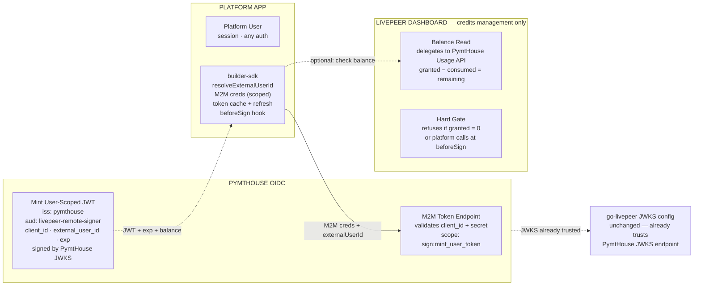

### Phase 2 — Signing Hot Path

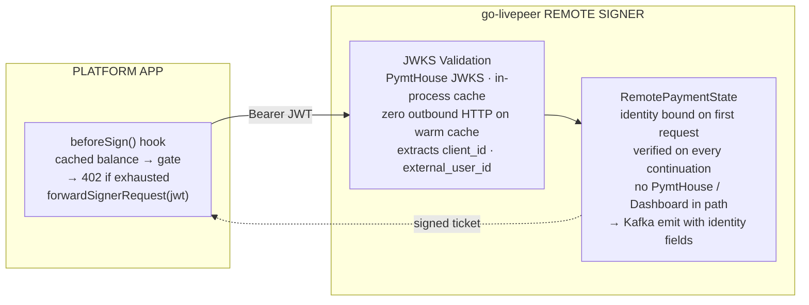

### Phase 3 — Usage Ingest (async)

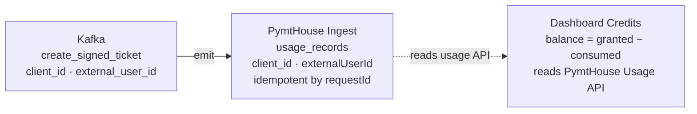

*async · never blocks signing · PymtHouse is usage authority · Dashboard reads from it (no separate debit ledger)*

---

**Token exchange (PymtHouse OIDC direct)**
- Platform SDK holds a PymtHouse M2M credential scoped to `sign:mint_user_token` only
- Calls PymtHouse OIDC `/token` with `{ client_id, client_secret, external_user_id }`
- PymtHouse mints JWT: `iss=pymthouse · aud=livepeer-remote-signer · external_user_id`
- go-livepeer JWKS config unchanged — no deployment change needed

**Signing hot path**
- SDK presents cached JWT directly to go-livepeer
- PymtHouse JWKS validated in-process — zero outbound HTTP on warm cache
- Identity bound into `RemotePaymentState` on first request, verified on continuations
- Dashboard entirely absent from this path

**Dashboard role (credits only)**
- Not in the token exchange path at all
- Manages credit grants and policies per user
- Balance = granted − consumed, where consumed comes from PymtHouse Usage API
- No separate debit ledger — PymtHouse is the single usage authority

---

## Diagram 2 of 3 — Trial Credits — Dashboard grants, PymtHouse measures

*Dashboard owns the grant ledger (append-only). PymtHouse Usage API owns consumed amounts. Balance is always a read-time computation — no debit writes anywhere.*

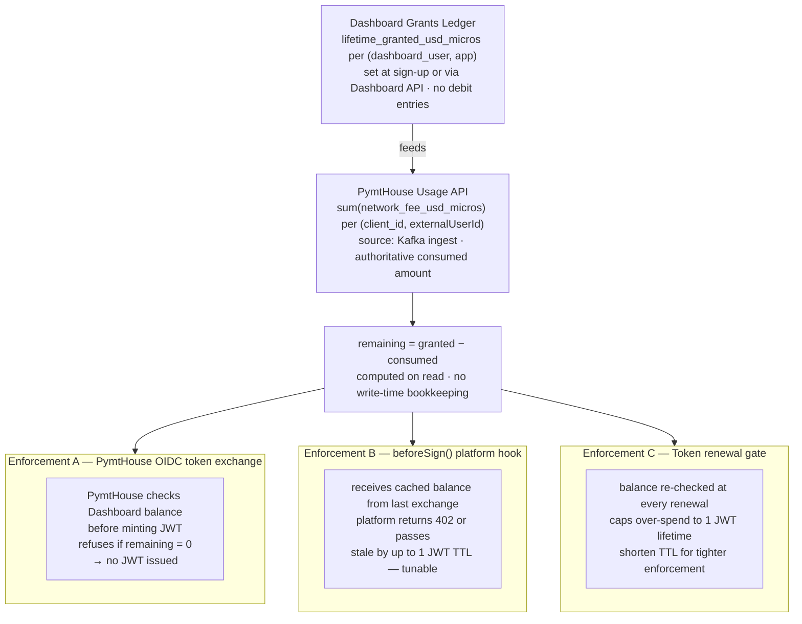

**Why no debit ledger in Dashboard or PymtHouse**
- The builder-sdk signer proxy forwards each signed-ticket CloudEvent to **OpenMeter's Kafka-backed HTTP ingest endpoint** (`openmeter-sink-worker` consumes from that Kafka topic and writes into ClickHouse); PymtHouse writes only a dedup receipt row (`usageIngestReceipts` keyed on `(clientId, requestId)`) — no USD amounts are stored in PymtHouse Postgres
- Balance is always `granted − sum(consumed)` — OpenMeter computes this read-time from ClickHouse SUM aggregation of `network_fee_usd_micros`; no debit write occurs anywhere
- Eliminates dual-consumer consistency risk: **OpenMeter's ClickHouse is the single source of truth** for consumed amounts
- Dashboard provisions credits by calling the PymtHouse API → OpenMeter `POST /api/v1/customers/{key}/entitlements/{feature}/grants`; it never writes to its own grants ledger

**PymtHouse OIDC checks balance at mint time**
- At token exchange PymtHouse calls `getTrialCreditBalance()` → **OpenMeter** `GET /api/v1/customers/{key}/entitlements/{feature}/value` directly
- Hard gate — if `hasAccess === false` (OpenMeter entitlement exhausted), no JWT is issued
- Balance returned in token exchange response body (not JWT claims) for `beforeSign` use
- TTL tuning: 60s = strict, 300s = default, 3600s = low-frequency batch

---

## Diagram 3 of 3 — SDK Token Lifecycle — Cold & Warm Paths

*Step-by-step request flow through `createHostedSignerProxyHandler()`. Cold path performs a token exchange; warm path is pure in-memory with zero outbound HTTP until go-livepeer.*

### Cold Path — token not in cache

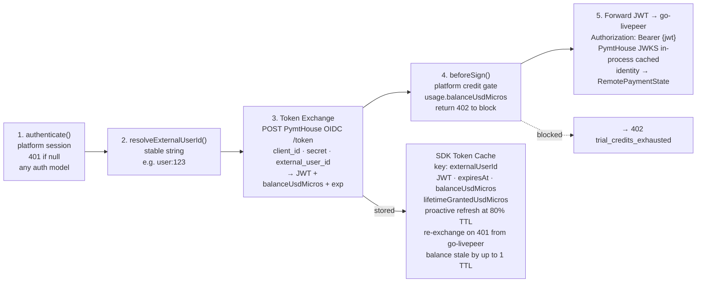

### Warm Path — token in cache

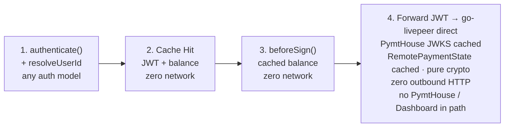

**JWT claims:** `iss=pymthouse · aud=livepeer-remote-signer · client_id · external_user_id · exp · scope=sign:job`

**Response body:** `{ jwt, expiresAt, balanceUsdMicros, lifetimeGrantedUsdMicros }`

**M2M credential** scoped to `sign:mint_user_token` only — cannot call Usage API, Builder API, or any other PymtHouse endpoint.

**Hot path (warm, per-ticket)**
- In-memory cache lookup — zero I/O
- `beforeSign` with cached balance — zero I/O
- HTTP POST to go-livepeer with `Bearer {jwt}`
- PymtHouse JWKS in-process (cached) + `RemotePaymentState` cached — pure crypto

**Out of hot path**
- Token exchange with PymtHouse OIDC — once per session, proactive at 80% TTL
- Balance read (Dashboard → PymtHouse Usage API) — only at exchange time
- JWKS fetch from PymtHouse — once by go-livepeer, then TTL-cached
- Kafka ingest + usage writes — fully async, never blocking