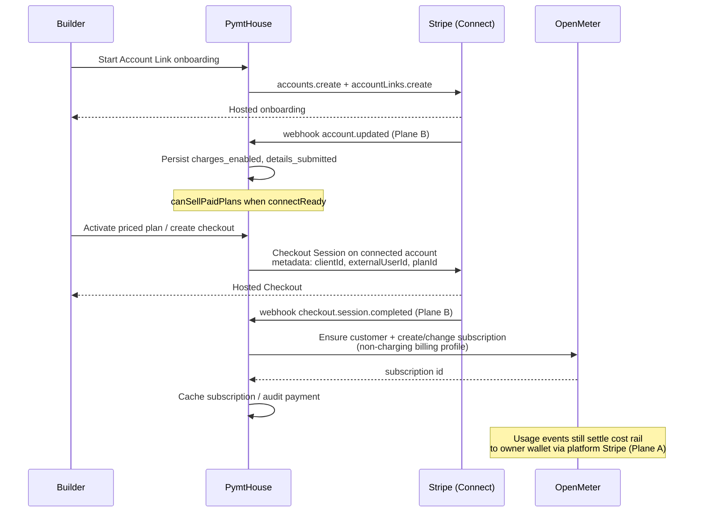
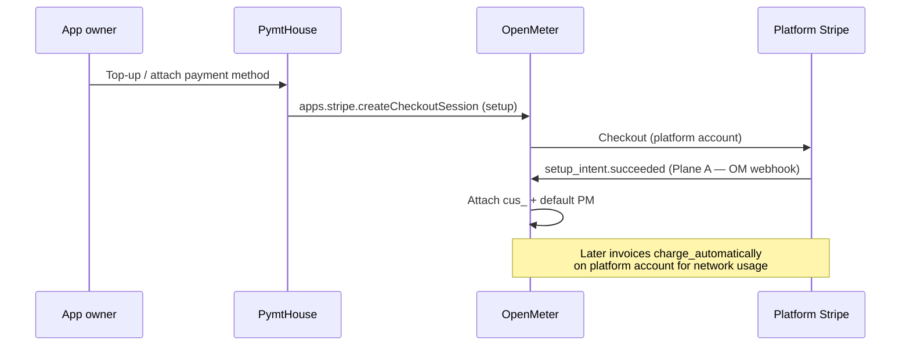

# ADR: Stripe Connect + OpenMeter via two webhook planes

Status: **accepted** (design binding for stacked billing PRs).  
Supersedes the ambiguous “Stripe Connect” naming in the OpenMeter Stripe **app
install** path. Companion to [`activation-gate.md`](./activation-gate.md).

| Stack | PR | Role |
|---|---|---|
| OpenMeter Stripe billing foundations | [#321](https://github.com/pymthouse/pymthouse/pull/321) | Platform OM Stripe app, billing profiles, customer Stripe app data |
| Merchant Connect onboarding | [#322](https://github.com/pymthouse/pymthouse/pull/322) | Account Links, Connect webhook, connected Checkout |
| Plans / phase-out | [#323](https://github.com/pymthouse/pymthouse/pull/323) | Progressive billing, subscription change |
| Cutover scripts | [#324](https://github.com/pymthouse/pymthouse/pull/324) | Sandbox → Stripe / Connect cutover tooling |
| Activation gate | [#325](https://github.com/pymthouse/pymthouse/pull/325) | Cost vs revenue rails; readiness predicate |

## Context

OpenMeter’s Stripe **app** (marketplace install / API key / Konnect org Stripe
app) integrates with a **normal Stripe account**: Tax, Invoicing, Payments, and
Checkout. On install it registers Stripe webhooks (notably
`setup_intent.succeeded`) so Checkout can attach a default payment method to an
OpenMeter customer.

That product is **not** Stripe Connect. It does not onboard Express/Standard
connected accounts, does not emit Account Links, and does not document
destination charges or `application_fee_amount` on connected-account payments.

PymtHouse needs both:

1. **Cost rail** — app owners pay PymtHouse for network usage (always on).
2. **Revenue rail** — Builders optionally collect from their own end users, with
   PymtHouse taking `application_fee_bps`.

Conflating “connect Stripe to OpenMeter” with “Stripe Connect for merchants”
produced oversized PR #124 and incorrect product assumptions. This ADR fixes the
architecture and the vocabulary.

## Decision

**Use two independent Stripe webhook planes and never ask the OpenMeter Stripe
app to charge on connected accounts.**

| Plane | Stripe account scope | Owner | Purpose |
|---|---|---|---|
| **A — OpenMeter Stripe app** | Platform (or Konnect org) Stripe account | OpenMeter / Konnect (auto-installed) | Cost-rail Checkout, invoice sync, PM attach for **owners** |
| **B — PymtHouse Connect** | Connected accounts (`events from Connect`) | `POST /webhooks/stripe` | Merchant readiness, end-user Checkout completion, deauth |

OpenMeter remains the **metering and entitlement brain** for both rails. For
merchant end users it must **meter without auto-collecting** on the platform
Stripe app (Sandbox / non-charging profile, or subscription created only after
Connect payment with no chargeable PM in OM).

### Vocabulary (use in UI and docs)

| Say | Mean |
|---|---|
| **Connect Stripe billing** / OpenMeter Stripe app | Install OM’s Stripe app on the platform account |
| **Merchant Stripe Connect** / connected account | Builder Express/Standard account via Account Links |
| Do **not** say “Stripe Connect” for OM app install | Causes the confusion this ADR kills |

## Architecture

```
 Network usage ──► OpenMeter (plans, entitlements, invoices)
                         │
                         │ Plane A: OM Stripe app webhooks
                         │ (platform account only)
                         ▼
                   Platform Stripe
                   • Owner Checkout / invoices
                   • setup_intent.succeeded → OM attaches PM

 Builder onboarding ──► Account Links (acct_…)
 End-user retail pay ──► Checkout / PaymentIntent
                         (destination or stripeAccount
                          + application_fee_amount)
                         │
                         │ Plane B: /webhooks/stripe
                         │ (Connect events; event.account)
                         ▼
                   PymtHouse
                   • account.updated → readiness flags
                   • checkout.session.completed → ensure OM
                     customer + subscription (meter only)
                   • deauthorized → clear connectReady
```

### Sequence — merchant sells a paid plan



### Sequence — owner cost rail (unchanged OM path)



## Event catalogue

### Plane A — OpenMeter-owned (do not duplicate)

Registered when the OM Stripe app is installed. PymtHouse must **not** steal these
handlers for the same objects unless OM is unreachable and we have an explicit
failover design.

| Event | Consumer | Effect |
|---|---|---|
| `setup_intent.succeeded` | OpenMeter Stripe app | Bind Stripe customer + default PM to OM customer |
| Invoice / payment sync events | OpenMeter Stripe app | Collect platform invoices for owners |

### Plane B — PymtHouse Connect endpoint

Dashboard: **Developers → Webhooks → Listen to events on Connected accounts**.  
Env: `STRIPE_CONNECT_WEBHOOK_SECRET` (preferred) or `STRIPE_WEBHOOK_SECRET` (`whsec_…`),
endpoint `POST /webhooks/stripe`.  
Verify `Stripe-Signature` over the raw body (`src/lib/stripe/webhook.ts`).

| Event | Handler intent | Neon / OM effect |
|---|---|---|
| `account.updated` | `applyConnectedAccountWebhookUpdate` | Refresh `stripe_charges_enabled`, `stripe_details_submitted`, `stripe_payouts_enabled`; set `stripe_connect_status` |
| `account.application.deauthorized` | Ledger insert | Audit trail; readiness cleared via subsequent `account.updated` |
| `checkout.session.completed` | Ledger insert | Worker / future retail subscription ensure |
| `payment_intent.succeeded` / `payment_failed` / `requires_action` | Ledger → invoicing worker | Report Custom Invoicing `payment/status` (paid / failed / action_required) |
| `charge.dispute.created` | Ledger → worker | Report `payment_uncollectible` |

**Readiness predicate** (merchant checkout / activation gate): Connected Account id
present, `charges_enabled`, and `details_submitted`.
`payouts_enabled` is recorded but **not** required (see activation-gate.md).

**Idempotency:** `invoice_events` unique on `(source, external_event_id)` for both
OpenMeter notification ids and Stripe `evt_…` ids.

### Plane C — Merchant Custom Invoicing (OpenMeter invoices → Connect collection)

For `billingMode: "merchant"` apps, OpenMeter generates end-user invoices on a
**non-default** billing profile whose tax/invoicing/payment apps are the Konnect
**Custom Invoicing** app ([docs](https://developer.konghq.com/metering-and-billing/custom-invoicing/)).
OM pauses at `payment_processing.pending` (and optionally draft/issuing sync hooks).

| Stream | Endpoint | Role |
|---|---|---|
| OpenMeter Invoice Notifications | `POST /webhooks/openmeter` | Thin ingress → `invoice_events` |
| Stripe Connect (Plane B) | `POST /webhooks/stripe` | PaymentIntent outcomes → same ledger |
| Railway `invoicing-worker` | claims via `FOR UPDATE SKIP LOCKED` | Off-session direct charge + `application_fee_amount`; reports `POST …/apps/custom-invoicing/{id}/payment/status` |

Bootstrap: `npm run openmeter:custom-invoicing:bootstrap`. Env:
`OPENMETER_CUSTOM_INVOICING_APP_ID`, `OPENMETER_MERCHANT_BILLING_PROFILE_ID`,
`OPENMETER_WEBHOOK_SECRET`. Pin end-user customers with
`assignMerchantCustomInvoicingProfile` (customer overrides — never org default).

Plane A (owner cost rail via native OM Stripe app) is **unchanged**.

## Anti-patterns (rejected)

1. **OM Checkout for merchant end users on the platform Stripe app** — money lands
   in the wrong merchant-of-record; Connect fees and branding are wrong.
2. **Installing one OM Stripe app per Builder** — works for a few partners, not a
   marketplace; not Connect.
3. **Charging on Connect and also `charge_automatically` in OM for the same
   customer** — double charge. Merchant end users must sit on a non-collecting OM
   billing profile (or have no chargeable PM in OM).
4. **Gating end-user provisioning on Connect readiness** — cost rail is owner
   solvency; Connect only gates priced-plan activation and retail Checkout
   ([activation-gate.md](./activation-gate.md)).
5. **Treating `application_fee_bps` as cost recovery** — retail can be $0; network
   cost must always meter to the owner wallet.

## Design decisions and trade-offs

| Decision | Trade-off |
|---|---|
| Two webhook planes | Operational clarity; two secrets / two destinations to monitor |
| OM meters, Connect collects (revenue) | PymtHouse owns Checkout UX and tax edge cases for merchants; OM invoice UI for end users is secondary |
| Platform OM Stripe app only | Simpler Konnect ops; cannot use OM’s multi-Stripe-app routing for Builders |
| Account Links only (no OAuth Connect) | Aligns with current `merchant-connect.ts`; OAuth remains legacy path for OM self-hosted API-key install only |
| Keep OM install API named carefully in UI | Module renamed to `stripe-app-install.ts`; HTTP routes under `/billing/stripe/connect` remain for merchant Connect |

## MoonPay (admin-only; not a user funding rail)

MoonPay / Turnkey on-ramp (`FundAccountOnRampPanel`, `POST …/onramp/sessions`) is
**platform-admin tooling** for signer refill experiments. It is **not** the developer
funding UX. Owners attach a payment method on `/billing` via Plane A
(`POST /api/v1/me/billing/payment-method` → OM `apps.stripe.createCheckoutSession`
setup). Non-admins receive 403 on on-ramp APIs.

## Future: x402 / stablecoin payments via Stripe

eth/usdc (and other crypto/stablecoin) settlement via Stripe is a **future payment-method
type** on the existing planes — not a third webhook plane:

| Rail | Where it lands |
|---|---|
| Owner cost top-up / PM | Plane A (platform Stripe account + OM Stripe app) |
| Merchant retail | Plane B (Connected Account Checkout / PaymentIntents) |

No implementation in the current stack. When Stripe exposes the product surface we need
for x402-style flows, wire it as an additional `payment_method_types` / Checkout option
and keep the same OM metering + Connect readiness model.

## Related code

- OM app install / Konnect link: `src/lib/openmeter/stripe-app-install.ts`
- Billing profiles / owners profile: `src/lib/openmeter/billing-profiles.ts`
- Customer Stripe app data: `src/lib/openmeter/stripe-customer-data.ts`
- Owner PM attach: `src/lib/openmeter/owner-payment-method.ts`,
  `POST /api/v1/me/billing/payment-method`
- Merchant Account Links + Checkout: `src/lib/stripe/merchant-connect.ts`,
  `src/lib/stripe/connect-accounts.ts`
- Connect webhook verify / ledger ingress: `src/lib/stripe/webhook.ts`,
  `src/app/webhooks/stripe/route.ts`
- Custom Invoicing client: `src/lib/openmeter/custom-invoicing.ts`
- OpenMeter invoice notifications: `src/app/webhooks/openmeter/route.ts`
- Ledger + worker: `src/lib/invoicing/*`, `scripts/invoicing-worker.ts`,
  `deploy/invoicing-worker/`
- Activation gate: `src/lib/activation/app-activation.ts`,
  [`docs/activation-gate.md`](./activation-gate.md)

## Implementation tasks

### Done or in-flight (stacked PRs)

- [x] Platform OM Stripe app + billing profile foundations (#321)
- [x] Account Links onboarding + `account.updated` webhook (#322)
- [x] Connected Checkout helpers (#322)
- [x] Activation gate separating cost / revenue (#325)
- [x] Rename OM install module → `stripe-app-install.ts`; expose `billingReady`
- [x] Payments tab copy: “Merchant Stripe Connect” vs OpenMeter Stripe billing
- [x] Owner Stripe payment-method attach on `/billing` (Plane A)
- [x] MoonPay gated to platform admin only
- [x] Plane B ledger for payment_intent.* / deauth / checkout.completed
- [x] Merchant Custom Invoicing (Konnect) + Railway worker + Connect charges

### Remaining

- [ ] Stripe Dashboard: dedicated Connect webhook endpoint (connected-account
      events) pointed at production `/webhooks/stripe`; document secret rotation.
- [ ] Konnect: run `openmeter:custom-invoicing:bootstrap` in each env; set
      `OPENMETER_*` / `STRIPE_CONNECT_WEBHOOK_SECRET` on Vercel + Railway.
- [ ] Wire `assignMerchantCustomInvoicingProfile` into merchant end-user
      provisioning when `billing_mode=merchant`.
- [ ] Cutover audit (#324): flag apps where OM would auto-charge the same
      customer that Connect already bills.
- [ ] x402 / stablecoin payment methods on Plane A and Plane B (design above).

## Success criteria

1. Owner network invoices collect only via Plane A (platform Stripe + OM app).
2. Builder retail payments collect only via Plane B (connected account), including
   OM-generated invoices completed via Custom Invoicing + Connect charges.
3. No end user is charged twice for the same plan period.
4. `canSellPaidPlans` tracks Connect readiness from Plane B webhooks, not OM app
   install status (`billingReady`).
5. Engineers and UI never call OM app install “Stripe Connect.”
6. MoonPay is never presented as the primary owner funding path.
7. Invoice event processing is durable (ledger + SKIP LOCKED worker) and
   idempotent under webhook retries.
