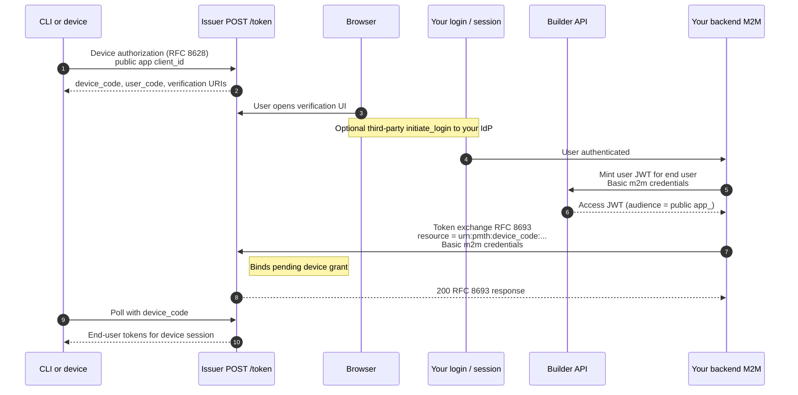
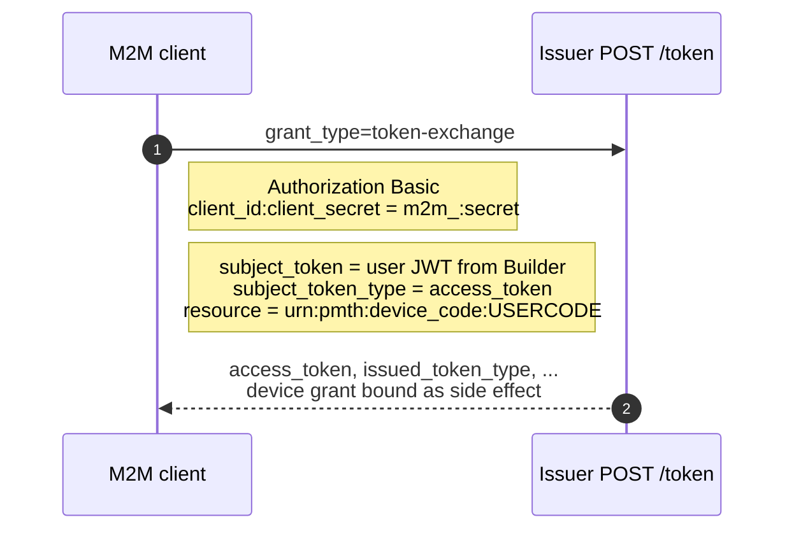
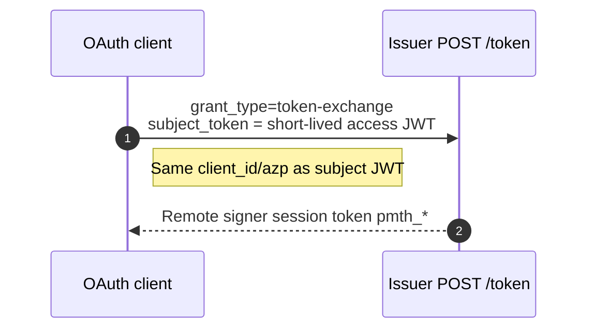
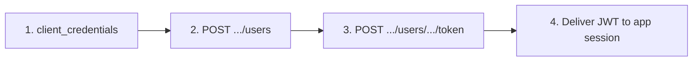

# Builder API (confidential clients)

Public docs: [docs.pymthouse.com](https://docs.pymthouse.com). Mintlify sources: [pymthouse-docs](https://github.com/eliteprox/pymthouse-docs) (`integration/user-management`, `integration/user-tokens`, Usage API); **Billing API** narrative lives in [pymtdocs](https://github.com/eliteprox/pymtdocs) under `docs/integration/` (`billing.mdx`, `plans.mdx`).

This document defines the official PymtHouse Builder API for confidential OAuth clients. It covers machine authentication, end-user provisioning, and issuance of user-scoped JWTs to your backend.

The API follows OAuth 2.0 and OIDC conventions:
- OAuth 2.0 (RFC 6749) for token acquisition
- Bearer token usage (RFC 6750)
- JWT access tokens (RFC 9068)
- Token exchange for remote signer session flow (RFC 8693)
- Resource indicators (RFC 8707)

For issuer-level OIDC behavior and token endpoint details, see [NaaP OIDC integration](naap-oidc-integration.md).

## Identity model

- `client_id` is the canonical app identifier in Builder API URLs.
- Builder API paths use `/api/v1/apps/{clientId}/...`.
- Internal database IDs are implementation details and are not part of the public API contract.

## Authentication

### 1) Obtain machine token (client credentials grant)

Call the OIDC token endpoint:

```http
POST /api/v1/oidc/token
Content-Type: application/x-www-form-urlencoded

grant_type=client_credentials&
client_id=<client_id>&
client_secret=<client_secret>&
scope=users:read users:write users:token
```

Or equivalently: `POST {issuer}/token` with the same body (issuer includes `/api/v1/oidc`).

### 2) Calling Builder and Usage routes

Use either:

```http
Authorization: Bearer <access_token>
```

or confidential **HTTP Basic** auth:

```http
Authorization: Basic base64(client_id:client_secret)
```

**Usage API:** Basic auth (or an authorized provider dashboard session — see [Usage API](#usage-api)) is typical; no extra OAuth scope is required beyond valid credentials for that app.

---

## User management

**Base path:** `/api/v1/apps/{clientId}/users`

| Method | Path | Required scope | Description |
| --- | --- | --- | --- |
| `GET` | `/api/v1/apps/{clientId}/users` | `users:read` | List provisioned users |
| `POST` | `/api/v1/apps/{clientId}/users` | `users:write` | Create/upsert user (`externalUserId` required) |
| `PUT` | `/api/v1/apps/{clientId}/users` | `users:write` | Update user attributes |
| `DELETE` | `/api/v1/apps/{clientId}/users?externalUserId=...` | `users:write` | Deactivate user (`status: inactive`) |

---

## Issue user-scoped JWT

`POST /api/v1/apps/{clientId}/users/{externalUserId}/token`

- Requires **`users:token`** on the calling client.
- Optional JSON body:

```json
{ "scope": "sign:job" }
```

- Requested scope must be a subset of the **public app client’s** allowed scopes (see product-specific validation in code).
- `admin` is explicitly rejected.
- Default scope when omitted: `sign:job`.

---

## Complete device authorization (RFC 8628 + RFC 8693)

Device login uses the **OIDC token endpoint** `POST {issuer}/token` with `grant_type=urn:ietf:params:oauth:grant-type:token-exchange` — not a separate Builder URL.

### Verification URLs

For device code clients, `/device/auth` responses use:

- **`verification_uri`** — Short URL: `{public origin}/oidc/device`
- **`verification_uri_complete`** — Includes `user_code`, `client_id`, and `iss` so the browser can resume without retyping the code

Unauthenticated users may be redirected once to your registered **`initiate_login_uri`** (third-party initiate login) when the app opts in. The redirect target is loaded **from the database for `client_id`** (open-redirect safe).

**Opt-in:** Enable **Redirect device verification to initiate login URI** and set **Initiate login URI** to your HTTPS endpoint that accepts `iss`, `target_link_uri`, and optional `login_hint`. Validate `iss` against discovery and validate `target_link_uri`. **Option B (NaaP):** after login, mint a user JWT via Builder, then call `POST {issuer}/token` with token exchange and `resource=urn:pmth:device_code:<user_code>` (M2M Basic auth), and show `/oidc/device-approved` instead of sending the browser back to `target_link_uri`.

Treat `initiate_login_uri` as a sensitive redirect (HTTPS in production; HTTP on localhost in dev). Avoid open redirects; use CSRF protection on forms that start login.

### Server-side completion (RFC 8693)

1. Mint a **user-scoped access token** (JWT) via `POST /api/v1/apps/{publicClientId}/users/{externalUserId}/token` (subject token must be issued to the **public** `app_…` client).
2. Call **`POST {issuer}/token`** with confidential **M2M Basic auth** (`m2m_…` client) and form body:

| Field | Value |
| --- | --- |
| `grant_type` | `urn:ietf:params:oauth:grant-type:token-exchange` |
| `subject_token` | JWT from step 1 |
| `subject_token_type` | `urn:ietf:params:oauth:token-type:access_token` |
| `resource` | `urn:pmth:device_code:<user_code>` (same code the CLI received; normalization matches `/oidc/device`) |

- M2M client must allow **`device:approve`** or **`users:token`**.
- **`subject_token`** must be a valid access token issued by this issuer to the **public** `app_…` client (`client_id` / `azp`).
- The **public** OIDC client must have **Redirect device verification to initiate login URI** enabled (`device_third_party_initiate_login`) where required.
- On success, the pending RFC 8628 device grant is bound; the response follows RFC 8693 (`access_token`, `issued_token_type`, etc.).

**End-to-end device login** (high level):



**Token-exchange step only** (what most server integrations implement after minting `USER_JWT`):



Example (after minting `USER_JWT` via Builder):

```bash
ISSUER="https://your-pymthouse.example/api/v1/oidc"
M2M_ID="m2m_..."
M2M_SECRET="pmth_cs_..."
USER_JWT="eyJ..."   # access_token from Builder user-token step (sign:job)

curl -sS -u "${M2M_ID}:${M2M_SECRET}" \
  -H "Content-Type: application/x-www-form-urlencoded" \
  --data-urlencode "grant_type=urn:ietf:params:oauth:grant-type:token-exchange" \
  --data-urlencode "subject_token=${USER_JWT}" \
  --data-urlencode "subject_token_type=urn:ietf:params:oauth:token-type:access_token" \
  --data-urlencode "resource=urn:pmth:device_code:ABCD-EFGH" \
  "${ISSUER}/token"
```

**Implied consent:** For confidential clients with third-party device login enabled, when the user opens the verification UI with a **prefilled** `user_code` from `verification_uri_complete`, the secondary “Authorize” step may be skipped after a successful lookup (the user still authenticated at your site or the OP).

---

## Remote signer session exchange (RFC 8693)

Exchange a short-lived access token for a long-lived opaque remote signer session token (`pmth_*`):

```http
POST {issuer}/token
grant_type=urn:ietf:params:oauth:grant-type:token-exchange
subject_token_type=urn:ietf:params:oauth:token-type:access_token
subject_token=<access_token>
scope=sign:job
```

**Constraints:**

- The authenticated `client_id` must match the `subject_token` audience / client binding (`client_id` or `azp`).
- The `subject_token` must already include `sign:job` scope.



---

## Interactive login and machine access

### Authorization code (interactive)

1. Redirect the user to `{issuer}/auth` with `response_type=code`, `client_id`, `redirect_uri`, `scope`, `state`.
2. Exchange the code at `{issuer}/token` with `grant_type=authorization_code`, the same `redirect_uri`, and `client_id` + `client_secret` for confidential clients.
3. Request only scopes allowed for that client. **Public clients:** PKCE is required. **Confidential clients:** client authentication is required.

### Client credentials (machine)

```http
POST {issuer}/token
grant_type=client_credentials
client_id=...
client_secret=...
scope=...
```

---

## Usage API

Aggregated request and fee usage for a developer application — read-only, tenant-scoped, for billing dashboards and analytics. It follows the same **`client_id`** path convention as the Builder API.

**Endpoint:** `GET /api/v1/apps/{clientId}/usage`

### Identity model

- **`clientId`** in the path is the OAuth `client_id` of the developer app.
- Per-user breakdowns include internal **`endUserId`** (PymtHouse UUID) and the builder’s **`externalUserId`** for correlation.

### Authentication

| Mode | Description |
| --- | --- |
| **Confidential client (recommended)** | `Authorization: Basic base64(client_id:client_secret)` — same credentials as other server-to-server calls |
| **Provider session** | Logged-in app owner, platform admin, or team member with `providerAdmins` access — powers the in-app dashboard |

Requests that fail auth or tenant match receive **`404 Not Found`** (not `401`/`403`) to avoid leaking whether a `client_id` exists.

### Query parameters (all optional)

| Name | Type | Default | Description |
| --- | --- | --- | --- |
| `startDate` | ISO 8601 | — | Inclusive lower bound on `usage_records.created_at` |
| `endDate` | ISO 8601 | — | Inclusive upper bound |
| `groupBy` | `none` \| `user` \| `pipeline_model` | `none` | `user` adds `byUser`; `pipeline_model` adds `byPipelineModel` (requires matching billing events) |
| `userId` | string | — | Filter to one internal **`usage_records.user_id`** (not `externalUserId`) |
| `gatewayRequestId` | string | — | When set, filters billing events to that gateway request and may include `events` detail |

Invalid dates return `400 Bad Request`. Resolve `externalUserId` → internal id via the Builder user listing or a prior `groupBy=user` response.

### Response shape (`200 OK`)

```json
{
  "clientId": "app_f4c21e7ac5f35d3e91bfad7f",
  "period": {
    "start": "2026-01-01T00:00:00.000Z",
    "end":   "2026-12-31T23:59:59.999Z"
  },
  "totals": {
    "requestCount": 1423,
    "totalFeeWei":  "128750000000000000"
  },
  "byUser": [
    {
      "endUserId":      "5d2b...-uuid",
      "externalUserId": "user-123",
      "requestCount":   42,
      "feeWei":         "3750000000000000"
    }
  ]
}
```

- **`totalFeeWei`** and **`feeWei`** are **decimal strings of wei** (use BigInt-safe parsing; they may exceed `Number.MAX_SAFE_INTEGER`).
- **`byUser`** appears only when `groupBy=user`. Records with no user roll up under `endUserId: "unknown"` and `externalUserId: null`.

### Usage examples

```bash
export BASE_URL="http://localhost:3001"
export CLIENT_ID="app_yourClientId"
export CLIENT_SECRET="pmth_cs_yourSecret"
```

App-level totals:

```bash
curl -sS -u "${CLIENT_ID}:${CLIENT_SECRET}" \
  "${BASE_URL}/api/v1/apps/${CLIENT_ID}/usage"
```

Per-user breakdown:

```bash
curl -sS -u "${CLIENT_ID}:${CLIENT_SECRET}" \
  "${BASE_URL}/api/v1/apps/${CLIENT_ID}/usage?groupBy=user"
```

Date window:

```bash
curl -sS -u "${CLIENT_ID}:${CLIENT_SECRET}" \
  "${BASE_URL}/api/v1/apps/${CLIENT_ID}/usage?startDate=2026-01-01T00:00:00.000Z&endDate=2026-12-31T23:59:59.999Z"
```

Filter by internal user id:

```bash
export USER_ID="internal-app-user-uuid"

curl -sS -u "${CLIENT_ID}:${CLIENT_SECRET}" \
  "${BASE_URL}/api/v1/apps/${CLIENT_ID}/usage?userId=${USER_ID}"
```

**Security:** Do not call the Usage API from a browser with Basic auth; keep secrets server-side.

### Usage data model (`usage_records`)

| Column | Meaning |
| --- | --- |
| `user_id` | Internal `endUserId`; `null` if unattributed |
| `fee` | Wei as decimal string; summed into responses |
| `created_at` | Used for `startDate` / `endDate` filters |

---

## Billing API

Current-cycle **billing snapshot** and **plan CRUD** for a developer app. Full field-by-field reference: Mintlify pages in `pymtdocs/docs/integration/` (see document header).

### Network cost and USD valuation

PymtHouse stores two distinct monetary representations:

- **Wei** — the canonical, exact on-chain unit. All `*Wei` fields are decimal strings.
- **USD micros** — integer strings representing US dollars × 10⁶ (e.g. `1000000` = $1.00). USD values are computed from the ETH/USD oracle at the moment each ticket is signed and are **never recomputed retroactively**.

ETH convenience fields (e.g. `networkFeeEth`, `ownerChargeEth`) are decimal strings derived from the stored wei.

### ETH/USD oracle

The billing oracle uses the livepeer/naap public-exchange pattern (PR #283):

1. Fresh `price_oracle_snapshots` DB cache (5-minute TTL)
2. Live Binance `ETHUSDT` ticker
3. Live Kraken `XETHZUSD` ticker
4. Stale DB cache
5. `ETH_USD_PRICE` environment variable
6. Default fallback `3000`

The oracle source and observation timestamp are stored with each transaction so every USD value can be audited.

**Endpoint:** `GET /api/v1/prices/eth-usd`

Returns `{ ethUsd: { priceUsd, source, observedAt, isFallback } }`.

### Trusted pipeline/model attribution

Billable **`usage_billing_events`** rows are created when the signing request resolves to a pipeline/model constraint. Price evidence (`priceWeiPerUnit` / `pixelsPerUnit` and orchestrator address) comes from the **negotiated ticket** on the request (decoded orchestrator info), i.e. the price agreed with the orchestrator by **`python-gateway`** before signing — PymtHouse does **not** call NaaP on this hot path.

1. **Constraint:** `pipeline` + `modelId` on the payment request (from the `python-gateway` metadata envelope or a direct API caller), **or** base64 **`capabilities`** (`net.Capabilities`) from which PymtHouse can derive a single pipeline/model (same shape the Go remote signer uses).
2. **No NaaP fetch on signing:** `POST /api/signer/generate-live-payment` does not load dashboard pricing for validation. **`GET /api/v1/pipeline-pricing`** still proxies NaaP for UIs; it uses **`fetchDashboardPricing()`** without an in-process pricing cache.
3. **Ledger insert:** When a constraint is present, PymtHouse records **`usage_billing_events`** using the signed ticket units and a **`pipeline_model_constraint_hash`** over `{ pipeline, modelId, orchAddress, priceWeiPerUnit, pixelsPerUnit }`. **`price_validation_status`** is **`matched`** in that case.
4. **Diagnostics:** **`transactions`** always records metering when the signer succeeds and `feeWei > 0`. If no pipeline/model can be resolved, **`price_validation_status`** is **`missing_constraint`** and no **`usage_billing_events`** row is written. Older rows may still show legacy statuses such as **`pricing_unavailable`**. Signing is **not** blocked by attribution gaps — the gateway still receives the signer response.

**Usage API:** `groupBy=pipeline_model` aggregates from **`usage_billing_events`**, so breakdown rows appear for new traffic that includes `pipeline` + `modelId` (or derivable capabilities) on each payment.

#### Gateway payment metadata contract

`python-gateway` embeds these fields in each `/generate-live-payment` payload when attribution metadata is provided:

```json
{
  "paymentMetadataVersion": "2026-04-usage-attribution-v1",
  "attributionSource": "pymthouse_gateway",
  "gatewayRequestId": "job-or-session-id",
  "pipeline": "text-to-image",
  "modelId": "stabilityai/sdxl"
}
```

PymtHouse uses these fields for attribution and billing-event grouping together with the negotiated ticket price from the request. The go-livepeer remote signer is not required to sign pipeline/model metadata for v1.

### NaaP catalog and pricing routes

| Endpoint | Description |
| --- | --- |
| `GET /api/v1/pipeline-catalog` | NaaP pipeline catalog (cached 5 min). Used by Plans UI dropdowns. |
| `GET /api/v1/pipeline-pricing?pipeline=...&model=...` | NaaP per-orchestrator pricing rows (proxied each request; no in-process cache). Used for UI estimates. |

### Usage API — pipeline/model grouping

`GET /api/v1/apps/{clientId}/usage` supports:

| Parameter | Description |
| --- | --- |
| `groupBy=pipeline_model` | Aggregate by validated pipeline/model. |
| `groupBy=user` | Aggregate by app user (existing behaviour). |
| `gatewayRequestId=...` | Filter and return per-record billing event detail for a specific gateway job. |

Response totals now include:

| Field | Description |
| --- | --- |
| `totalFeeWei` | Total network fee (existing). |
| `totalFeeEth` | Decimal ETH. |
| `networkFeeUsdMicros` | Transaction-time USD micros. |
| `ownerChargeWei` | Network fee + platform cut. |
| `ownerChargeUsdMicros` | Transaction-time USD micros. |
| `platformFeeWei` | PymtHouse platform cut. |
| `endUserBillableUsdMicros` | Retail after upcharge. |

### Billing summary

**Endpoint:** `GET /api/v1/apps/{clientId}/billing`

Returns the active plan, subscription period, aggregated usage, per-day timeline, overage, **owner cost breakdown** (network fee + platform fee + total), **retail breakdown** (included allowance consumed vs remaining), and **pipeline/model breakdown** from validated `usage_billing_events`.

#### Plan fields (new)

| Field | Description |
| --- | --- |
| `includedUsdMicros` | Subscription usage allowance in USD micros (e.g. `10000000` = $10.00). |
| `generalUpchargePercentBps` | Default positive upcharge for all retail usage, basis points. |
| `payPerUseUpchargePercentBps` | Fallback upcharge for free/no-credit users; inherits `generalUpchargePercentBps` if unset. |
| `billingCycle` | `"monthly"` (default). |
| `discoveryProfileId` | Optional FK to an app-scoped discovery profile (see **Discovery profiles** below). Omitted from billing summary payloads today; present on **`GET .../plans`**. |

#### Capability bundle fields (new)

| Field | Description |
| --- | --- |
| `upchargePercentBps` | Pipeline/model-specific upcharge override, basis points. Takes precedence over `generalUpchargePercentBps` for matching usage. |

### Authentication (billing summary)

| Mode | Description |
| --- | --- |
| **Confidential client** | `Authorization: Basic base64(m2m_id:m2m_secret)` — same tenant rules as Usage API |
| **Provider session** | App owner, platform admin, or `providerAdmins` team member |

Failures use **`404 Not Found`** when auth or tenant match fails (same anti-enumeration pattern as Usage API).

### Example (billing summary)

```bash
curl -sS -u "${CLIENT_ID}:${CLIENT_SECRET}" \
  "${BASE_URL}/api/v1/apps/${CLIENT_ID}/billing"
```

### Example (usage groupBy=pipeline_model)

```bash
curl -sS -u "${CLIENT_ID}:${CLIENT_SECRET}" \
  "${BASE_URL}/api/v1/apps/${CLIENT_ID}/usage?groupBy=pipeline_model"
```

### Discovery profiles (provider session + M2M read)

Reusable **discovery** configuration (orchestrator ranking defaults) lives in **`discovery_profiles`** and **`discovery_profile_bundles`**. **Billing plans** reference an optional `discoveryProfileId`. Editing discovery no longer requires touching subscription pricing fields.

**Base path:** `/api/v1/apps/{clientId}/discovery-profiles`

| Method | Path | Auth | Description |
| --- | --- | --- | --- |
| `GET` | `/discovery-profiles` | **M2M Basic** or provider session | List profiles with resolved `policy` and `capabilities[]` (`pipeline`, `modelId`, `discoveryPolicy`) |
| `POST` | `/discovery-profiles` | Provider session only | Create profile: `name` (required), optional `policy`, optional `capabilities[]` with `{ pipeline, modelId, discoveryPolicy }` only |
| `GET` | `/discovery-profiles/{profileId}` | **M2M Basic** or provider session | One profile |
| `PUT` | `/discovery-profiles/{profileId}` | Provider session only | Update `name`, `policy`, and/or replace `capabilities[]` |
| `DELETE` | `/discovery-profiles/{profileId}` | Provider session only | Delete profile; **`409`** if any plan still references it |

**Implementation:** [`src/app/api/v1/apps/[id]/discovery-profiles/route.ts`](../src/app/api/v1/apps/[id]/discovery-profiles/route.ts), [`src/app/api/v1/apps/[id]/discovery-profiles/[profileId]/route.ts`](../src/app/api/v1/apps/[id]/discovery-profiles/[profileId]/route.ts).

### Plans (provider session + M2M read)

**Base path:** `/api/v1/apps/{clientId}/plans`

| Method | Path | Auth | Description |
| --- | --- | --- | --- |
| `GET` | `/api/v1/apps/{clientId}/plans` | **M2M Basic** (same pattern as billing: path `{clientId}` = public `app_…` id, credentials must resolve to that app) **or** provider dashboard session | List plans and capability bundles. Each plan includes optional **`discoveryProfileId`** and **resolved** **`discoveryPolicy`** (from the linked profile) plus per-bundle **resolved** **`discoveryPolicy`** (from `discovery_profile_bundles` keys matching each billing bundle’s `pipeline` / `modelId`). |
| `POST` | `/api/v1/apps/{clientId}/plans` | Provider session only | Create plan (`name` required). Optional **`discoveryProfileId`** (must belong to the same app). Each **`capabilities[]`** entry is billing-only: `pipeline`, `modelId` (`"*"` allowed), SLA/upcharge fields — **not** `discoveryPolicy`. |
| `PUT` | `/api/v1/apps/{clientId}/plans` | Provider session only | Update plan (body must include `id`; optional **`capabilities`** replaces entire bundle set). Optional **`discoveryProfileId`** (`null` clears the link). |
| `DELETE` | `/api/v1/apps/{clientId}/plans?planId=...` | Provider session only | Delete plan and its bundles |

**Discovery view (integrators, e.g. NaaP):**

| Method | Path | Auth | Description |
| --- | --- | --- | --- |
| `GET` | `/api/v1/apps/{clientId}/plans/discovery` | **M2M Basic** or provider session | **Active** plans only: `id`, `name`, `status`, **resolved** `discoveryPolicy`, and `capabilities[]` with `pipeline`, `modelId`, **resolved** `discoveryPolicy`. Same JSON shape as before migration. |

**`discoveryPolicy`** (optional JSON object, aligned with NaaP orchestrator leaderboard plan inputs):

- `topN` — integer 1…1000  
- `sortBy` — `"slaScore"` \| `"latency"` \| `"price"` \| `"swapRate"` \| `"avail"`  
- `slaMinScore` — number 0…1  
- `slaWeights` — `{ latency?, swapRate?, price? }` each 0…1  
- `filters` — `{ gpuRamGbMin?, gpuRamGbMax?, priceMax?, maxAvgLatencyMs?, maxSwapRatio? }` (`maxSwapRatio` 0…1; `gpuRamGbMin` ≤ `gpuRamGbMax` when both set)

**Implementation:** [`src/app/api/v1/apps/[id]/billing/route.ts`](../src/app/api/v1/apps/[id]/billing/route.ts), [`src/app/api/v1/apps/[id]/plans/route.ts`](../src/app/api/v1/apps/[id]/plans/route.ts), [`src/app/api/v1/apps/[id]/plans/discovery/route.ts`](../src/app/api/v1/apps/[id]/plans/discovery/route.ts), [`src/shared/discovery/discovery-plans.ts`](../src/shared/discovery/discovery-plans.ts), [`src/domains/plans-discovery/runtime/discovery-resolution.ts`](../src/domains/plans-discovery/runtime/discovery-resolution.ts).

---

## End-to-end integration flows

### Recommended backend flow

1. Backend obtains a machine token via `client_credentials`.
2. Backend creates or upserts the external user via `/users`.
3. Backend issues a user-scoped JWT via `/users/{externalUserId}/token`.
4. Backend returns that JWT to the app session for the same external user.



For **RFC 8628 device login**, after step 3 call **`POST {issuer}/token`** with RFC 8693 token exchange and `resource=urn:pmth:device_code:<user_code>` as described in [Complete device authorization](#complete-device-authorization-rfc-8628--rfc-8693).

### Example (upsert user)

```bash
CLIENT_ID="app_1234567890abcdef"
CLIENT_SECRET="pmth_cs_..."

curl -sS -u "${CLIENT_ID}:${CLIENT_SECRET}" \
  -H "Content-Type: application/json" \
  -d '{"externalUserId":"user-123","email":"a@example.com","status":"active"}' \
  "https://your-pymthouse.example/api/v1/apps/${CLIENT_ID}/users"
```

---

## Security boundaries and privilege model

- **Tenant boundary** is enforced by matching `client_id` between the route path and the authenticated confidential client (and related checks in code).
- **User token scopes** are bounded by the parent app’s allowed scopes; **`admin`** escalation is blocked on user-token issuance.
- **Usage API and billing summary:** tenant isolation and `404` behavior reduce enumeration of valid apps.
- **Confidential secrets** must remain server-side only.

---

## Implementation checklist

- Register each integrating app as an OIDC client; use discovery metadata rather than hard-coded paths.
- Grant minimum scopes (`users:read`, `users:write`, `users:token`, etc.) per backend.
- Store and rotate client secrets via the app credentials endpoint (`/api/v1/apps/{clientId}/credentials`).
- Map one external user identifier to one Builder API user record.
- Migrate away from legacy `/api/v1/naap/*` routes to OIDC + Builder APIs.
- For usage attribution, populate `usage_records.user_id` when a request maps to a provisioned user; store fees as decimal wei strings.
- For pipeline/model billing, negotiated-ticket evidence is captured through the `/generate-live-payment` flow (or via the `python-gateway` metadata envelope). PymtHouse records `usage_billing_events` after off-path or asynchronous reconciliation of that evidence, while billing totals and plan management remain available via `GET /api/v1/apps/{clientId}/billing` and `/plans` respectively.
- For billing dashboards, call `GET /api/v1/apps/{clientId}/billing` for cycle totals, timeline, overage, and USD breakdown; manage plans via `/plans` from a trusted operator session.
- Use `groupBy=pipeline_model` on the Usage API to get per-pipeline/model ETH and USD breakdown.
- Ensure `(client_id, request_id)` uniqueness for usage rows where applicable.
- Do not attempt to recompute historical USD values using the current oracle rate; use the stored `*UsdMicros` fields.

---

## Implementation reference

**Builder and users**

- [`src/app/api/v1/apps/[id]/users/route.ts`](../src/app/api/v1/apps/[id]/users/route.ts)
- [`src/app/api/v1/apps/[id]/users/[externalUserId]/token/route.ts`](../src/app/api/v1/apps/[id]/users/[externalUserId]/token/route.ts)

**OIDC and token exchange**

- [`src/app/api/v1/oidc/[...oidc]/route.ts`](../src/app/api/v1/oidc/[...oidc]/route.ts)
- [`src/domains/oidc-platform/runtime/device-token-exchange.ts`](../src/domains/oidc-platform/runtime/device-token-exchange.ts)
- [`src/domains/oidc-platform/runtime/gateway-token-exchange.ts`](../src/domains/oidc-platform/runtime/gateway-token-exchange.ts)

**Auth and usage**

- [`src/domains/identity-access/runtime/request-auth.ts`](../src/domains/identity-access/runtime/request-auth.ts) (`authenticateAppClient`, JWT parsing)
- [`src/app/api/v1/apps/[id]/usage/route.ts`](../src/app/api/v1/apps/[id]/usage/route.ts)
- [`src/app/api/v1/apps/[id]/billing/route.ts`](../src/app/api/v1/apps/[id]/billing/route.ts)
- [`src/app/api/v1/apps/[id]/plans/route.ts`](../src/app/api/v1/apps/[id]/plans/route.ts)
- [`src/domains/developer-apps/runtime/provider-access.ts`](../src/domains/developer-apps/runtime/provider-access.ts) and [`src/domains/developer-apps/repo/provider-access.ts`](../src/domains/developer-apps/repo/provider-access.ts) (`getAuthorizedProviderApp`, `getProviderApp`)
- [`src/db/schema.ts`](../src/db/schema.ts) (`usageRecords`, `usageBillingEvents`, `priceOracleSnapshots`, `appUsers`)

**Billing oracle and catalog**

- [`src/domains/usage-billing/service/billing-runtime.ts`](../src/domains/usage-billing/service/billing-runtime.ts) (pipeline/model validation, upcharge resolution, USD micros)
- [`src/platform/ops/prices/public-exchange-spot.ts`](../src/platform/ops/prices/public-exchange-spot.ts) (Binance/Kraken spot fetch)
- [`src/platform/ops/prices/eth-usd-oracle.ts`](../src/platform/ops/prices/eth-usd-oracle.ts) (ETH/USD oracle with DB cache)
- [`src/platform/catalog/naap-catalog.ts`](../src/platform/catalog/naap-catalog.ts) (NaaP catalog with TTL cache; pricing fetch is uncached)
- [`src/app/api/v1/prices/eth-usd/route.ts`](../src/app/api/v1/prices/eth-usd/route.ts)
- [`src/app/api/v1/pipeline-catalog/route.ts`](../src/app/api/v1/pipeline-catalog/route.ts)
- [`src/app/api/v1/pipeline-pricing/route.ts`](../src/app/api/v1/pipeline-pricing/route.ts)

**Gateway payment metadata (cross-repo)**

- [`../python-gateway/src/livepeer_gateway/payment_metadata.py`](../../python-gateway/src/livepeer_gateway/payment_metadata.py) (canonical metadata envelope)
- [`../python-gateway/src/livepeer_gateway/payments_base.py`](../../python-gateway/src/livepeer_gateway/payments_base.py) (metadata embedded in payment payloads)
- [`../pymthouse-gateway/src/pymthouse_gateway/livepeer/lv2v.py`](../../pymthouse-gateway/src/pymthouse_gateway/livepeer/lv2v.py) (gateway attribution passed to python-gateway)

---

## Design notes

1. **`client_id` as the external app identifier** reduces ambiguity and avoids exposing internal foreign keys.
2. **Builder endpoints** keep internal FK usage server-side for relational integrity.
3. **User JWT issuance** is explicit and scoped — machine tokens do not implicitly inherit end-user privileges.
4. **Basic auth** remains supported for confidential server-to-server clients.
5. **OIDC** uses one registration model for all clients to avoid special-case trust paths.
6. **RFC 8693** preserves auditable token transitions for device binding and remote signer sessions.
7. **Usage totals** use wei strings to avoid JSON precision loss; **404** on usage and billing summary routes limits information leakage.
8. **Billing summary** collapses plan, subscription window, usage, daily timeline, overage, USD cost, and pipeline/model breakdown into one response; raw per-request data remains on the Usage API.
9. **USD micros** are computed once at signing time using the oracle ETH/USD snapshot and stored immutably; historical USD accuracy depends on oracle quality at signing time, not later queries.
10. **Fail-closed billing**: requests without a validated pipeline/model constraint do not generate billable usage events, preventing unattributed usage from accumulating silently.
11. **Attribution source** (`pymthouse_gateway`, `python_gateway`, `direct_api`) is stored with each billing event so reporting can distinguish gateway-originated usage from direct API integrations.

---

## Troubleshooting

### NextAuth session decrypt errors

If logs show repeated `JWT_SESSION_ERROR` or `JWEDecryptionFailed`:

- Keep `NEXTAUTH_SECRET` stable.
- Ensure `.env.local` is not unintentionally overriding `.env`.
- Clear browser cookies for the app origin and sign in again.
