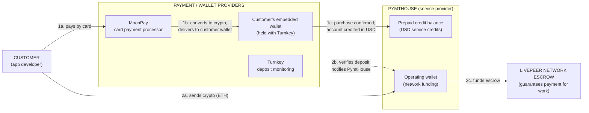
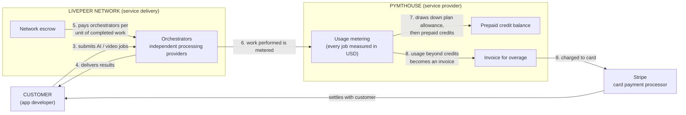

# PymtHouse — Payments and Services Rendered (Business Overview)

> **Audience:** non-technical (legal / business). This document shows who pays whom,
> what services are delivered in exchange, and which third parties touch funds.
> It intentionally omits engineering detail; the technical companion is
> [`system-architecture.md`](./system-architecture.md).
>
> Shareable image exports of both diagrams:
> [`diagrams/business-payment-flow-money-in.png`](./diagrams/business-payment-flow-money-in.png),
> [`diagrams/business-payment-flow-services-billing.png`](./diagrams/business-payment-flow-services-billing.png).

## The parties

| Party | Role in the relationship |
|---|---|
| **Customer** (app developer / app owner) | Buys processing capacity; pays by card (fiat) or by depositing cryptocurrency |
| **PymtHouse** | Service provider and billing clearinghouse: meters usage, maintains the customer's prepaid credit balance, issues invoices |
| **Turnkey** | Regulated wallet infrastructure provider: creates and holds the customer's embedded crypto wallet; notifies PymtHouse of deposits |
| **MoonPay** | Fiat on-ramp payment processor: converts the customer's card payment into cryptocurrency delivered to the customer's wallet |
| **Stripe** | Card payment processor for subscription charges and overage invoices |
| **Livepeer network (orchestrators)** | Independent third parties who perform the actual AI/video processing work and are compensated per unit of work |

## Flow of funds and services (two views)

### Diagram A — Money in (how the customer funds the service)

### Diagram B — Services rendered and billing

## How to read the diagrams

**Diagram A — money in (two independent routes):**

1. **Card purchase (1a–1c).** The customer pays MoonPay by card. MoonPay converts
   the payment to cryptocurrency and delivers it to the customer's own wallet
   (held with Turnkey). Once the purchase is confirmed, PymtHouse adds an
   equivalent **prepaid credit balance in US dollars** to the customer's account.
   These credits are what the customer actually spends on services.
2. **Direct crypto deposit (2a–2c).** Cryptocurrency sent to PymtHouse's operating
   wallet is detected and verified by Turnkey, which notifies PymtHouse. PymtHouse
   then moves those funds into a **network escrow** account — the mechanism the
   Livepeer network uses to guarantee that processing providers get paid. *This
   route funds the network side; it does not create customer credits.*

**Diagram B — services rendered and billing:**

3. The customer submits processing jobs (for example AI video generation).
4. Independent **orchestrators** on the Livepeer network perform the work and
   return the results.
5. Orchestrators are compensated from the network escrow, per unit of completed
   work, through the network's own payment mechanism (cryptographically signed
   payment tickets).
6. PymtHouse meters every unit of work the customer consumes, in US dollars.
7. Consumption is applied in a fixed order: first any **plan allowance** included
   with the customer's subscription, then the customer's **prepaid credits**.
8. If consumption exceeds allowance plus credits, the remainder becomes an invoice.
9. The invoice is **charged to the customer's card via Stripe**.

## Custody summary (who holds what)

| Funds | Held by | Notes |
|---|---|---|
| Customer's crypto wallet | **Turnkey** (wallet infrastructure), owned by the customer | Created automatically at sign-up; PymtHouse never holds the keys |
| Prepaid credit balance | **PymtHouse** ledger (USD-denominated bookkeeping entry) | Not a crypto asset; a service credit |
| Network escrow (deposit + reserve) | Livepeer network smart contract, funded from PymtHouse's operating wallet | Collateral that guarantees orchestrator payment |
| Card payments | **MoonPay** (on-ramp) or **Stripe** (invoices) | Standard payment-processor custody |

## Key business points

- **Two separate money purposes.** Customer card purchases become *service
  credits* (what the customer spends). Crypto deposits to the operating wallet
  become *network collateral* (what guarantees the workers get paid). They are
  deliberately independent.
- **Services are rendered by third parties.** PymtHouse brokers, meters, and
  bills; the compute work itself is performed by independent orchestrators who
  are paid from escrow per completed unit of work.
- **Settlement order is fixed:** subscription allowance → prepaid credits →
  card-settled invoice. The customer can never consume beyond this chain: when
  allowance and credits are exhausted and no card is on file, service stops.
