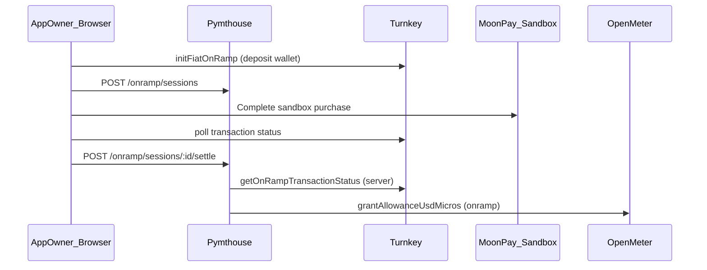
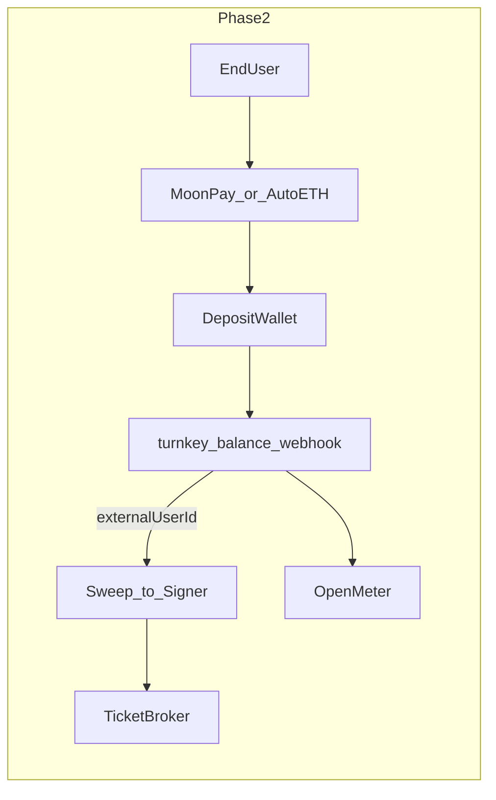

# MoonPay fiat on-ramp local demo

Short local demonstration of Turnkey Wallet Kit + MoonPay sandbox funding an app
owner's OpenMeter allowance in pymthouse.

Phase 1 credits **USD allowance** via OpenMeter after MoonPay clears. Moving ETH
to the Arbitrum remote signer / TicketBroker deposit is **phase 2** (chain +
sweep work).

## Prerequisites

### Turnkey (dashboard)

- MoonPay sandbox credential configured via Turnkey (`CreateFiatOnRampCredential`)
- Wallet Kit Auth Proxy enabled for your org

### Environment (`.env.local`)

| Variable | Purpose |
| --- | --- |
| `NEXT_PUBLIC_ORGANIZATION_ID` | Turnkey org for Wallet Kit |
| `NEXT_PUBLIC_AUTH_PROXY_CONFIG_ID` | Turnkey Auth Proxy config |
| `DATABASE_URL` | Postgres (Neon/local) |
| `OPENMETER_URL` | Hosted Konnect or self-hosted OpenMeter |
| `OPENMETER_API_KEY` | OpenMeter API key |
| `TURNKEY_ORG_ID` | Server-side status verification on settle |
| `TURNKEY_API_PUBLIC_KEY` | Turnkey API key (settle verification) |
| `TURNKEY_API_PRIVATE_KEY` | Turnkey API private key |

MoonPay API keys live in the **Turnkey dashboard**, not in pymthouse env files.

### Local app

```bash
cd /path/to/pymthouse
npm install
cp .env.example .env.local   # fill values above
npm run db:migrate
npm run dev                    # http://localhost:3001
```

Optional clearinghouse stack (not required for OpenMeter-only demo):

```bash
docker compose -f docker-compose.clearinghouse.railway.yml --env-file .env.local up -d --build
```

No Railway deploy is required for this demo.

## Demo flow

1. Sign in at `/login` with **Turnkey Wallet Kit** (not Google/GitHub only).
2. Open your app → **Usage** tab (`/apps/{clientId}/usage`).
3. In **Fund account (demo)**, enter a USD amount **> 20** (MoonPay minimum).
4. Click **Fund with MoonPay** and complete the sandbox purchase in the popup.
5. pymthouse:
   - registers `onramp_sessions` with your deposit wallet + `externalUserId`
   - verifies Turnkey `getOnRampTransactionStatus === COMPLETED`
   - grants OpenMeter allowance (`source: onramp`)
6. Confirm balance increased in the panel and via:

```bash
curl -s "http://localhost:3001/api/v1/apps/{clientId}/usage/balance?externalUserId={ownerUserId}" \
  -H "Cookie: ..." | jq
```

7. Verify DB:

```sql
SELECT id, external_user_id, deposit_wallet_address, status, granted_usd_micros, settled_at
FROM onramp_sessions
ORDER BY created_at DESC
LIMIT 5;
```

## API routes

| Method | Path | Auth |
| --- | --- | --- |
| `POST` | `/api/v1/apps/{clientId}/onramp/sessions` | App owner session |
| `POST` | `/api/v1/apps/{clientId}/onramp/sessions/{sessionId}/settle` | App owner session |

Create session body:

```json
{
  "externalUserId": "<platform-user-id>",
  "depositWalletAddress": "0x...",
  "onRampTransactionId": "<turnkey-on-ramp-tx-id>",
  "fiatCurrencyCode": "USD",
  "fiatAmount": "25"
}
```

## Architecture



### Chain note

Turnkey MoonPay delivers crypto to the **deposit wallet** on **Ethereum** (or Base).
The pymthouse remote signer operates on **Arbitrum One**. Bridging and sweeping to
`fundDepositAndReserve` is documented below as phase 2.

## Phase 2 (not implemented)

| Piece | Approach |
| --- | --- |
| Per-user deposit wallet | Provision Turnkey wallet per `app_users` row; persist `deposit_wallet_address` |
| End-user self-serve | Embed Wallet Kit in integrator apps; same session/settle APIs |
| Automated ETH deposits | Extend `shouldProcessTurnkeyDeposit` to watch registered deposit addresses |
| Attribution | Map deposit address → `(clientId, externalUserId)` |
| Move to signer | Turnkey-signed sweep + bridge to Arbitrum signer |
| TicketBroker credit | Reuse `executeTurnkeyFunding` after ETH lands on signer |



## Troubleshooting

| Symptom | Check |
| --- | --- |
| No fund panel on Usage | You must be the **app owner** and logged in |
| Turnkey not configured | `NEXT_PUBLIC_ORGANIZATION_ID` + `NEXT_PUBLIC_AUTH_PROXY_CONFIG_ID` |
| Popup blocked | Allow popups for localhost |
| Settle 503 | `TURNKEY_ORG_ID` + API keys on server |
| Allowance unchanged | `OPENMETER_URL` / API key; Konnect `createGrant` path |
| `below_min_fund` on signer | Unrelated — that's Arbitrum signer webhook, not this demo |

## Related docs

- [Turnkey balance → TicketBroker funding](./turnkey-ticket-funding.md)
- [Builder API allowances](./builder-api.md)
- [OpenMeter + Railway clearinghouse](./openmeter-railway.md)
