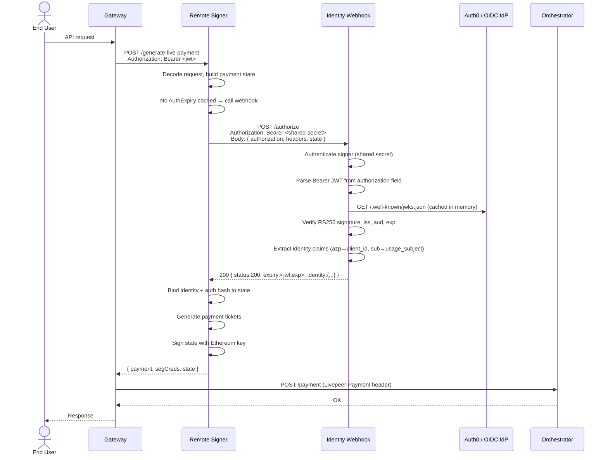
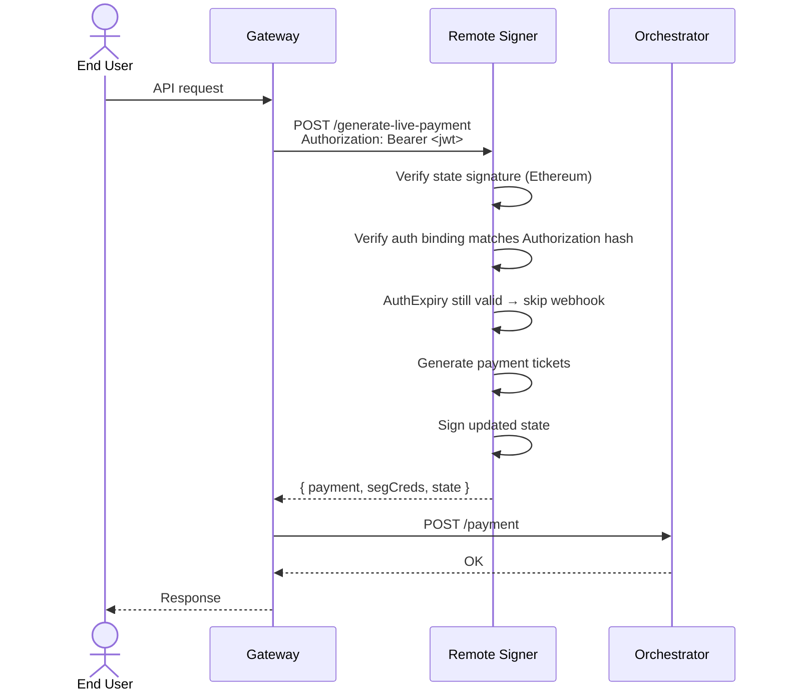

# Remote Signer Authentication Architecture

## Overview

This document describes the end-to-end authentication and identity architecture for the Livepeer **remote signer clearinghouse**. It details how an OIDC-compatible identity provider (Auth0 or equivalent), the `remote_signer_webhook` sidecar, the go-livepeer remote signer, and OpenMeter combine to enforce per-user payment authorization, establish canonical billing identity, and produce usage events — all without requiring an HTTP proxy in front of the signing service.

The key architectural insight is that the **webhook callback functions as an OIDC authentication adapter**: it translates a standard Bearer JWT carried in `Authorization` headers into a `UsageIdentity` struct that is cryptographically bound to the signer's payment state. The signer does not parse JWTs directly. Token verification logic is entirely encapsulated in the webhook sidecar, which is swappable for any identity provider that issues RS256 JWTs via JWKS.

The mechanism is introduced in [go-livepeer PR #3897](https://github.com/livepeer/go-livepeer/pull/3897).

---

## Table of Contents

1. [System Components](#1-system-components)
2. [Network Topology](#2-network-topology)
3. [Authentication Flow](#3-authentication-flow)
4. [Webhook as OIDC Adapter](#4-webhook-as-oidc-adapter)
5. [Session Binding and Auth Caching](#5-session-binding-and-auth-caching)
6. [Usage Identity and Metering](#6-usage-identity-and-metering)
7. [Deployment Reference](#7-deployment-reference)
8. [Key Design Decisions](#8-key-design-decisions)
9. [Implementation Tasks](#9-implementation-tasks)

---

## 1. System Components

| Component | Repository / Binary | Role |
|-----------|---------------------|------|
| **End-user client** | SDK / gateway application | Obtains JWT from IdP; sends `Authorization: Bearer` on API calls |
| **Gateway** | `go-livepeer -gateway` | Forwards `Authorization` header unchanged to the remote signer |
| **Remote signer** | `go-livepeer -remoteSigner` | Holds Ethereum key; generates payment tickets; delegates auth to the webhook |
| **Identity webhook** | `@pymthouse/builder-sdk/signer/webhook` | OIDC adapter: verifies JWT via JWKS, returns `UsageIdentity` |
| **Identity provider** | Auth0 / Keycloak / any OIDC-compliant issuer | Issues JWTs; publishes JWKS at `/.well-known/jwks.json` |
| **OpenMeter** | OpenMeter Cloud or self-hosted | Receives `create_signed_ticket` CloudEvents; aggregates per-user meters |
| **OpenMeter Collector** | `ghcr.io/openmeterio/openmeter-collector` | Consumes Kafka events from go-livepeer; transforms and forwards to OpenMeter |

---

## 2. Network Topology

The remote signer does **not** need to be behind an HTTP authentication proxy. Authentication is performed in-process via the webhook callback. The signer remains on a private network, accessible only by authorized gateways.

```
┌─────────────────────────────────────────────────────────────────────┐
│  Public / Untrusted Zone                                            │
│                                                                     │
│   ┌──────────────┐       ┌──────────────┐                          │
│   │  End User    │──JWT→ │   Gateway    │                          │
│   │  Client      │       │ (go-livepeer │                          │
│   └──────────────┘       │  -gateway)   │                          │
│                          └──────┬───────┘                          │
└─────────────────────────────────┼───────────────────────────────────┘
                                  │  Authorization: Bearer <JWT>
                                  │  POST /generate-live-payment
                                  ▼
┌─────────────────────────────────────────────────────────────────────┐
│  Private / Trusted Zone                                             │
│                                                                     │
│   ┌──────────────────────┐     ┌──────────────────────────────┐    │
│   │   Remote Signer      │────▶│   Identity Webhook Sidecar   │    │
│   │  (go-livepeer        │     │  (builder-sdk/signer/webhook) │    │
│   │   -remoteSigner)     │◀────│                              │    │
│   └──────────┬───────────┘     └─────────────┬────────────────┘    │
│              │                               │ JWKS verify         │
│              │  Kafka                        │ (HTTPS outbound)     │
│              │  create_signed_ticket         ▼                     │
│              ▼                     ┌─────────────────────┐         │
│   ┌─────────────────────┐          │  Identity Provider  │         │
│   │  OpenMeter Collector│          │  Auth0 / Keycloak   │         │
│   └──────────┬──────────┘          └─────────────────────┘         │
│              │ CloudEvents                                          │
│              ▼                                                      │
│   ┌─────────────────────┐                                          │
│   │  OpenMeter          │                                          │
│   │  (Cloud or local)   │                                          │
│   └─────────────────────┘                                          │
└─────────────────────────────────────────────────────────────────────┘
```

**There is no authentication proxy in front of the remote signer.** The `Authorization` header from the client is forwarded by the gateway to the signer's `POST /generate-live-payment` endpoint, and the signer invokes the webhook to evaluate it. The webhook is the only component that makes outbound HTTPS calls — exclusively to the identity provider's JWKS endpoint.

---

## 3. Authentication Flow

The following sequence shows a first-request (no cached auth) and a subsequent request (cached auth) within the same streaming session.

### 3.1 Initial Request



### 3.2 Subsequent Requests (Cached Auth)

For all subsequent calls within the same session, while `state.AuthExpiry` is in the future:



The webhook is skipped entirely after the first successful authorization until the JWT's `exp` claim elapses. This is critical for performance on the signing hot path.

---

## 4. Webhook as OIDC Adapter

The identity webhook (`@pymthouse/builder-sdk/signer/webhook`) functions as a **protocol adapter** between the OIDC token format and the signer's internal `UsageIdentity` type. This separation is intentional: the remote signer has no knowledge of JWT structure, OIDC discovery, or JWKS. It only knows whether the webhook approved the request and what identity to attach.

### 4.1 Adapter Responsibilities

```
                 ┌────────────────────────────────────────────────────┐
                 │           Identity Webhook Sidecar                  │
                 │                                                      │
  Signer sends → │  1. Authenticate caller (shared secret)             │
  PaymentWebhookRequest  2. Extract "Authorization" field              │
                 │  3. Parse Bearer token                               │
                 │  4. Verify JWT signature via JWKS (RFC 7517)        │
                 │  5. Validate iss, aud, exp, nbf claims               │
                 │  6. Map claims to UsageIdentity:                     │
                 │     azp / client_id → UsageIdentity.ClientID        │
                 │     sub             → UsageIdentity.UsageSubject    │
                 │     iss             → UsageIdentity.Issuer          │
                 │  7. Return expiry = jwt.exp                         │
                 │                                                      │
  ← Returns      │  PaymentWebhookResponse { status, expiry, identity }│
                 └────────────────────────────────────────────────────┘
```

### 4.2 Claim Mapping for Auth0

Auth0 JWTs use `azp` (authorized party, per [RFC 7519](https://datatracker.ietf.org/doc/html/rfc7519#section-4.1)) for the client identifier rather than `client_id`. The webhook sidecar handles this transparently via configurable claim keys, with `azp` as fallback when `client_id` is absent:

```go
// cmd/remote_signer_webhook/server.go
clientID := claimString(claims, clientIDKey)   // CLAIM_CLIENT_ID env (default: "client_id")
if clientID == "" {
    clientID = claimString(claims, "azp")      // Auth0 fallback
}
```

| Auth0 JWT Claim | `UsageIdentity` Field | Config Key |
|-----------------|----------------------|------------|
| `iss` | `Issuer` | (automatic) |
| `azp` | `ClientID` | `CLAIM_CLIENT_ID=azp` |
| `sub` | `UsageSubject` | `CLAIM_USAGE_SUBJECT=sub` |
| (static) | `UsageSubjectType` | `USAGE_SUBJECT_TYPE=auth0_user_id` |

### 4.3 JWKS Verification and Key Rotation

The sidecar uses [`github.com/MicahParks/keyfunc`](https://github.com/MicahParks/keyfunc) to cache and verify JWKS. The verification lifecycle:

1. **Startup**: JWKS is fetched synchronously. If the IdP is unreachable, the process exits.
2. **Normal verification**: JWT signature is verified from the in-memory key set. No network call is made.
3. **Unknown `kid` or signature error**: JWKS is refetched once synchronously (reactive refresh), then the token is retried.
4. **Operator rotation**: Call `POST /admin/refresh-jwks` (authenticated with `WEBHOOK_SECRET`) to force an out-of-band refresh before keys are retired.

This means **JWKS verification is not on the payment hot path** under normal operation. Network calls to the IdP occur only at startup, on key rotation, or on the infrequent webhook invocations (which are themselves skipped while `AuthExpiry` is valid).

### 4.4 Why the Signer Does Not Parse JWTs Directly

From the PR #3897 discussion:

> "There is zero reason to add explicit JWT support here. You can pass in a JWT to the webhook since that receives all the request headers. The auth policy (including any token structure) is the webhook's concern, not the signer's."

This is a deliberate layering choice. Keeping JWT/OIDC knowledge out of the signer means:

- The signer is not coupled to any identity provider schema or token format.
- The webhook is swappable (custom policy engine, different IdP, mTLS, API key validation) without any signer code changes.
- The signer only enforces the `AuthBinding` hash, ensuring token substitution attacks within a session are rejected.

---

## 5. Session Binding and Auth Caching

### 5.1 AuthBinding

When the webhook returns a non-empty `identity`, the signer computes a SHA-256 hash of the `Authorization` header value and stores it in the signed `RemotePaymentState`:

```go
// common/remotesignerwebhook/types.go
func AuthBindingHash(authorization string) string {
    normalized := strings.TrimSpace(authorization)
    sum := sha256.Sum256([]byte(normalized))
    return hex.EncodeToString(sum[:])
}
```

On every subsequent request within the session, the signer validates that the incoming `Authorization` header produces the same hash. This prevents a different end user from hijacking an active session by reusing its signed state with a substituted token.

The raw JWT is never stored in state — only the binding hash. This satisfies minimum data retention requirements and avoids leaking token material through signed state blobs.

### 5.2 AuthExpiry and Caching Logic

```go
// server/remote_signer.go
if state != nil && state.AuthExpiry != 0 && time.Now().Unix() <= state.AuthExpiry {
    return http.StatusOK, nil   // skip webhook entirely
}
```

`AuthExpiry` is populated from the webhook response's `expiry` field. The reference sidecar sets `expiry` to the JWT's own `exp` claim:

```go
// cmd/remote_signer_webhook/server.go
Expiry: claimExpiry(claims),   // returns jwt exp, falls back to now+5m
```

This means the signer's auth cache naturally aligns with token validity. When the JWT expires, the next `generate-live-payment` call triggers a fresh webhook invocation. If the end user's token has been revoked or rotated, the webhook will return a rejection (`status: 403`) and the signer will propagate that status back to the gateway caller without signing any new state.

### 5.3 State Integrity

`RemotePaymentState` is serialized as JSON, signed with the signer's Ethereum private key (`Eth.Sign`), and returned to the gateway as an opaque blob (`RemotePaymentStateSig`). The state includes:

| Field | Purpose |
|-------|---------|
| `AuthExpiry` | Unix timestamp for cached auth decision |
| `AuthBinding` | SHA-256 of the Authorization header value |
| `Identity` | `UsageIdentity` as returned by the webhook |
| `SequenceNumber` | Monotonic counter preventing replay |
| `Balance` | Running session balance in wei |

The gateway returns this blob verbatim on subsequent calls. The signer re-verifies the Ethereum signature before trusting any field — so neither the gateway nor any intermediary can tamper with cached auth state.

---

## 6. Usage Identity and Metering

When the webhook returns a valid `identity`, the signer emits it into the `create_signed_ticket` Kafka monitor event:

```go
// server/remote_signer.go
if !state.Identity.Empty() {
    eventData["issuer"]             = state.Identity.Issuer
    eventData["client_id"]          = state.Identity.ClientID
    eventData["usage_subject"]      = state.Identity.UsageSubject
    eventData["usage_subject_type"] = state.Identity.UsageSubjectType
}
monitor.SendQueueEventAsync("create_signed_ticket", eventData)
```

The OpenMeter Collector consumes this Kafka topic, performs field renaming and Wei-to-USD-micros conversion, and ingests a CloudEvent conforming to the [CloudEvents 1.0 specification](https://cloudevents.io/):

```json
{
  "specversion": "1.0",
  "type":        "create_signed_ticket",
  "id":          "<request_id>",
  "source":      "go-livepeer-remote-signer",
  "subject":     "<client_id>:<usage_subject>",
  "time":        "<current_time>",
  "data": {
    "client_id":              "<azp claim>",
    "external_user_id":       "<sub claim>",
    "network_fee_usd_micros": 12345,
    "pipeline":               "live-video-to-video",
    "model_id":               "unknown",
    "pixels":                 "921600",
    "fee_wei":                "1000000000000000"
  }
}
```

OpenMeter meters (`network_fee_usd_micros` SUM, `signed_ticket_count` COUNT) aggregate these events grouped by `client_id`, `external_user_id`, `pipeline`, and `model_id`.

### Metering Pipeline (Decoupled from Auth Path)

```
Remote Signer ──Kafka──▶ OpenMeter Collector ──CloudEvents──▶ OpenMeter
                              (Bloblang transform:
                               usage_subject → external_user_id,
                               computed_fee Wei → network_fee_usd_micros)
```

Metering is **asynchronous and decoupled from the authentication path**. The signing hot path is never blocked on OpenMeter availability.

---

## 7. Deployment Reference

### 7.1 Component Configuration

#### Identity Provider (Auth0)

Bootstrap with [auth0-livepeer](https://github.com/pymthouse/auth0-livepeer) (`npm run bootstrap` or `npm run deploy`):

- **API / Resource Server**: identifier = `livepeer`, scope = `sign:job`, `signing_alg = RS256`
- **Public client**: `app_type = native`, device code + refresh token grants
- **M2M client**: `app_type = non_interactive`, `client_credentials` grant

#### Identity Webhook Sidecar

```bash
# builder-sdk signer/webhook (JWT_ISSUER, JWT_AUDIENCE, WEBHOOK_SECRET from .env.livepeer)
JWKS_URL=https://YOUR_TENANT.auth0.com/.well-known/jwks.json \
JWT_ISSUER=https://YOUR_TENANT.auth0.com/ \
JWT_AUDIENCE=livepeer \
WEBHOOK_SECRET=<shared-secret> \
CLAIM_CLIENT_ID=azp \
USAGE_SUBJECT_TYPE=auth0_user_id \
pnpm --dir builder-sdk webhook:serve
```

The sidecar exposes two endpoints:

| Endpoint | Purpose |
|----------|---------|
| `POST /authorize` | Called by remote signer; validates JWT; returns `UsageIdentity` |
| `POST /admin/refresh-jwks` | Operator tool; forces JWKS cache refresh out-of-band |

#### Remote Signer

```bash
./livepeer \
  -remoteSigner \
  -network mainnet \
  -httpAddr 127.0.0.1:7936 \
  -remoteSignerWebhookUrl http://127.0.0.1:8090/authorize \
  -remoteSignerWebhookHeaders 'Authorization:Bearer <shared-secret>' \
  -monitor \
  -kafkaBootstrapServers kafka:9092 \
  -kafkaGatewayTopic livepeer-gateway-events \
  -ethUrl wss://mainnet.infura.io/ws/v3/<key> \
  -ethPassword /path/to/keystore/password
```

#### Gateway

```bash
./livepeer \
  -gateway \
  -httpAddr :9935 \
  -remoteSignerUrl http://127.0.0.1:7936 \
  -remoteSignerHeaders 'Authorization:Bearer <gateway-to-signer-token>'
```

The `-remoteSignerHeaders` flag (added in PR #3897) injects headers on all gateway-to-signer requests (`/sign-orchestrator-info`, `/generate-live-payment`, `/discover-orchestrators`). These headers authenticate the **gateway** to the **signer** at the network level. They are distinct from the `Authorization: Bearer <jwt>` forwarded from the **end user** to the signer for the webhook identity check.

> **Note**: `-remoteSignerHeaders` must not be forwarded to `-orchWebhookUrl`. They may contain secrets intended solely for the remote signer.

#### OpenMeter Collector

```bash
docker compose -f config/docker-compose.collector.yml --env-file .env.livepeer up -d
```

Collector config: [`config/openmeter-collector.yaml`](../config/openmeter-collector.yaml).

### 7.2 End-to-End Startup Sequence

```
1. Start OpenMeter (cloud or docker)
2. Run openmeter:bootstrap (create meters, feature)
3. Start Identity Provider (Auth0 tenant already running)
4. Start identity webhook sidecar (fetches JWKS at startup)
5. Start remote signer (verifies webhook reachability at startup)
6. Start gateway (verifies remote signer reachability at startup)
7. Start OpenMeter Collector
```

Steps 1–4 must complete before step 5 because the remote signer validates the webhook URL at startup. Step 6 requires step 5. Step 7 is independent and can start at any time.

### 7.3 Bootstrap CLI

The [auth0-livepeer](https://github.com/pymthouse/auth0-livepeer) CLI provisions Auth0 and OpenMeter in a single command and writes `.env.livepeer` and `sdk-config.json`:

```bash
cd auth0-livepeer
npm run bootstrap -- \
  --auth0-domain YOUR_TENANT.auth0.com \
  --auth0-mgmt-client-id <mgmt-m2m-id> \
  --auth0-mgmt-client-secret <mgmt-m2m-secret> \
  --app-name "My Platform" \
  --api-audience livepeer \
  --openmeter-url https://openmeter.cloud \
  --openmeter-api-key om_xxx \
  --output .env.livepeer
```

---

## 8. Key Design Decisions

### 8.1 No HTTP Proxy Required

The previous architecture required an Apache `mod_authnz_jwt` DMZ proxy in front of the signer to reject unauthenticated requests before they reached the Ethereum key material. The webhook callback eliminates this requirement.

The signer now performs authorization itself, inline, by delegating to the webhook sidecar. The sidecar is co-located in the trusted private zone. The only inbound authentication surface that matters is the signer's own `POST /generate-live-payment` endpoint, which rejects requests where the webhook returns non-200. No separate proxy process is needed.

**Trade-off**: The first request in a session incurs the latency of a local HTTP call to the webhook sidecar (typically < 5ms on localhost). All subsequent requests within the `AuthExpiry` window cost only a local hash comparison.

### 8.2 Webhook as Policy, Not Protocol

The signer does not implement JWT parsing, OIDC discovery, or claim validation. The webhook carries the entire auth policy. Operators can implement the webhook as:

- JWT verification against any OIDC-compliant IdP (reference implementation)
- mTLS client certificate validation
- API key lookup against a database
- Custom entitlement or quota check
- Any combination of the above

Changing the identity provider requires only reconfiguring the webhook sidecar's environment variables, not rebuilding or reconfiguring the signer itself.

### 8.3 AuthBinding Prevents Token Substitution

The SHA-256 binding of the `Authorization` header into signed `RemotePaymentState` ensures that a different end user cannot reuse an active session's state blob with their own token. The binding is to the hash of the full header value (e.g., `"Bearer eyJ..."`) rather than any decoded field, making it immune to JWT claim manipulation that might survive signature verification in a compromised webhook.

### 8.4 Auth Caching Aligns with JWT Expiry

Setting `expiry = jwt.exp` means the auth cache lifetime naturally matches the token validity window. This is simpler than managing a separate cache TTL and ensures that token revocation takes effect within one token lifetime, without requiring a revocation list or real-time check per payment.

Operators who require tighter revocation guarantees can return a shorter `expiry` value from the webhook, independently of the JWT's own `exp` claim.

### 8.5 Metering Decoupled from Auth Path

Usage metering (OpenMeter ingest) is deliberately not performed in the webhook sidecar or on the signing hot path. Instead, the signer emits `create_signed_ticket` events to Kafka asynchronously, and the OpenMeter Collector consumes them independently. This means:

- A temporary OpenMeter outage does not interrupt signing.
- The metering pipeline can be scaled, replaced, or extended without affecting auth or signing.
- The same Kafka topic can feed multiple downstream consumers (auditing, billing, analytics) without changes to the signer.

### 8.6 Identity Provider Interchangeability

The architecture is designed so that Auth0, Keycloak, or any OIDC-compliant issuer is substitutable by changing only webhook sidecar environment variables (`JWKS_URL`, `JWT_ISSUER`, `JWT_AUDIENCE`, `CLAIM_CLIENT_ID`). The signer, gateway, and OpenMeter pipeline are unaffected by the choice of identity provider.

---

## 9. Implementation Tasks

The following tasks represent the remaining work to complete the architecture as described.

### Immediate

- [ ] **Merge PR #3897** into `go-livepeer/master` — adds `-remoteSignerWebhookUrl`, `-remoteSignerWebhookHeaders`, and `-remoteSignerHeaders` flags; the webhook callback and auth caching mechanism; and updated `doc/remote-signer.md`.
- [ ] **Bootstrap Auth0 + OpenMeter** using `npm run bootstrap` in [auth0-livepeer](https://github.com/pymthouse/auth0-livepeer) (or `npm run deploy` for Auth0 only).
- [ ] **Bootstrap OpenMeter** meters and features via the same CLI or `npm run openmeter:bootstrap` in pymthouse.

### Before Production Deployment

- [ ] **Deploy identity webhook sidecar** co-located with the remote signer. Confirm JWKS is reachable from the sidecar and verify startup completes without error.
- [ ] **Configure gateway** with `-remoteSignerHeaders` so gateway-to-signer requests carry the appropriate service credential, distinct from end-user JWTs.
- [ ] **Deploy OpenMeter Collector** using `config/docker-compose.collector.yml`; confirm `network_fee_usd_micros` and `signed_ticket_count` meters are receiving events.
- [ ] **JWKS rotation procedure**: document runbook for rotating Auth0 signing keys; include `POST /admin/refresh-jwks` call before decommissioning the old key.

### Post-Launch

- [ ] **Dashboard usage BFF**: point the usage query layer in the dashboard at OpenMeter query API (`/api/v1/meters/{slug}/query`) using `client_id` and `external_user_id` dimensions aligned with the Collector's output schema.
- [ ] **Entitlement enforcement**: optionally add OpenMeter balance check to the webhook's `handleAuthorize` — return `status: 402` when the user's `network_spend` entitlement balance is exhausted, before the signer generates any tickets.
- [ ] **Configurable `expiry` override**: evaluate whether `expiry = jwt.exp` is the right TTL for the target use case; shorter values increase auth freshness at the cost of more webhook calls per session.
- [ ] **Keycloak option**: validate the self-hosted Keycloak path using the same webhook sidecar with `JWKS_URL=https://keycloak.your-domain.com/realms/livepeer/protocol/openid-connect/certs`.
