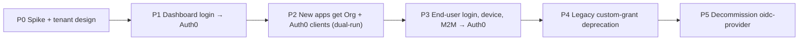

# RFC: Migrate PymtHouse identity from self-hosted `oidc-provider` to Auth0

- **Status:** Draft for review
- **Scope:** Design / architecture scoping only — no implementation in this RFC
- **Doc access date:** All Auth0 docs and pricing cited below were read on **2026-07-23**. Auth0 pricing and plan gating change frequently; re-verify before contract signature.

---

## 1. Executive summary

**Recommendation: migrate to a single Auth0 B2B tenant (per environment) with one Auth0 Organization per `developer_app` and a per-app Auth0 client pair (public + M2M), while retaining a slim PymtHouse Product Token Service (PTS) for signer-session JWTs, composite API keys, and programmatic user-token minting.** Auth0 becomes the system of record for *login, users, orgs, M2M credentials, and branding*; PymtHouse stays the system of record for *product-specific token issuance* (`sign:job`, signer sessions) and billing identity.

**This design deliberately avoids Auth0 Custom Token Exchange (CTE).** CTE is Public Early Access, gated to Professional+, and every use we had for it (wallet login, legacy-token bridging, device-flow `org_id` stamping) has a cleaner substitute: Auth0 passkeys replace wallet-as-login, per-app cutover re-authentication replaces the token bridge, and a custom claim carries org context on device-flow tokens. Interactive public-client login — **Authorization Code + PKCE and RFC 8628 Device Authorization** — is fully outsourced to Auth0; neither grant is plan-gated.

Plan-wise: start the spike on **Free**, run production on **B2B Essentials** ($150/mo at 500 MAU, $700/mo at 2,500 — unlimited Organizations included), and upgrade only when a concrete trigger fires: **B2B Professional** if we later want CTE, custom database (trickle) migration, M2M-for-Organizations, or enhanced attack protection; **Enterprise** at roughly **>45 live developer apps** (the 100-applications-per-tenant self-service entity limit, at 2 clients per app, is the first hard wall) or when white-label custom domains ship (Multiple Custom Domains is Enterprise-only).

### Why this wins

| Dimension | Today | After migration |
| --- | --- | --- |
| Custom OP code | ~8,900 LOC under `src/lib/oidc/` (6,893 non-test, 56 files) + 504-LOC Request↔Node adapter (`src/app/api/v1/oidc/[...oidc]/route.ts`) + ~1,545 LOC interaction/consent/device UI + JWKS seeding scripts | ~1,000–1,500 LOC PTS (signer JWTs + API-key exchange) + Management API provisioning module |
| Login features | Password + what we hand-roll | Universal Login, MFA, passkeys, social, enterprise SSO, bot detection, attack protection — checkbox features per app |
| Tenancy | `client_id` scoping in Postgres only | First-class Organizations: membership, invitations, per-org branding, per-org connections, org RBAC |
| Builder self-service | `POST /api/v1/apps` creates DB rows + local OIDC clients | Same API, now also provisions Org + client pair + connections via Management API |
| MCP auth | Hand-rolled bearer / M2M Basic paths | Auth0 "Auth for MCP" (GA) + Token Vault for third-party APIs |

### Biggest risks (detail in §7)

1. **Wallet-login users must re-enroll.** Without CTE there is no path from a Turnkey wallet attestation to an Auth0 session, so today's wallet-login builders enroll a passkey (or social/password) at migration. Wallets remain funding/signing resources keyed to the Auth0 user — funding flows don't change — but the login-credential switch is user-visible and needs comms.
2. **Bulk-import-only user migration.** Essentials lacks custom database connections, so there is no trickle/lazy migration: each app's end users move via a staged bulk import (`custom_password_hash` preserves bcrypt-compatible passwords; incompatible hashes force a reset at first login) and re-authenticate at their app's cutover.
3. **Device flow is incompatible with Auth0 Organizations** (no `org_id` in device-flow tokens; `organization_usage: require` rejects the device-code grant). Org context travels as a custom claim that our own consumers accept — there is no standard-claim fallback without CTE.
4. **MAU/M2M economics**: on B2B pricing every authenticated end user is an MAU and every client-credentials token is a metered M2M token. Essentials includes only ~1,000 M2M tokens/mo, and Auth0's own docs are contradictory about whether the M2M add-on is purchasable on Essentials — this must be verified with sales before commitment. Keeping programmatic user-JWT minting in PTS is a deliberate cost-control decision, not just a compatibility one.
5. **Per-app white-label login domains** don't exist per-Organization; they require Multiple Custom Domains (Enterprise, 20 domains base entitlement). Builder BYO-IdP is also capped on self-service: 3 enterprise SSO connections included, $100/mo each beyond, max 30 total.
6. **Migration blast radius**: the signer DMZ (Apache `mod_authnz_jwt`) verifies our JWKS today. The design keeps that JWKS under PymtHouse control permanently, so the DMZ never has to follow an Auth0 key rotation.

---

## 2. Target architecture

### 2.1 Tenancy layout decision

Three candidate models were evaluated:

| Model | Shape | Verdict |
| --- | --- | --- |
| **A (preferred): one Auth0 tenant, Org-per-app, clients-per-app** | Single B2B tenant per environment (dev/staging/prod). Each `developer_app` → 1 Organization + 1 public client + 1 M2M client, provisioned via Management API. | Best isolation-to-ops ratio. Orgs give membership/invites/branding/connection toggles per app. Entity math: 100k Orgs/tenant is a non-issue; **applications/tenant is the binding constraint** (100 self-service → ~45 apps; 100,000 on Enterprise). |
| **B: Auth0 tenant per app** | Each `developer_app` gets its own Auth0 tenant. | Rejected as the default. Professional includes only 12 tenants; per-tenant config drift, log streams, Actions, and Terraform state multiply; SSO across apps breaks. Reserve as an **escape hatch for a white-label tier** (an app that demands its own login domain + full isolation) until/unless Enterprise MCD covers it. |
| **C: one shared client pair for all apps, Org-switching only** | All apps share one public + one M2M Auth0 application; tenancy carried purely by `organization` parameter and org-scoped client grants. | Cheapest against entity limits, but integrators lose per-app credentials, per-app redirect URI allow-lists, and per-app grant configuration — a regression from today's `app_…`/`m2m_…` model. Rejected as primary; viable **fallback for a free/hobby tier** if app-count pressure arrives before Enterprise. |

**Decision: Model A**, with B held in reserve for white-label and C for a hobby tier. Auth0's own multi-tenant guidance endorses both "organization per customer" and "application per tenant" composition ([Multi-Tenant Best Practices](https://auth0.com/docs/get-started/auth0-overview/create-tenants/multi-tenant-apps-best-practices), [Organizations Overview](https://auth0.com/docs/manage-users/organizations/organizations-overview)).

### 2.2 Diagram

```mermaid
flowchart TB
    subgraph Auth0["Auth0 B2B tenant (per env)"]
        UL["Universal Login<br/>custom domain: login.pymthouse.com"]
        ORG1["Org: org_app1 ↔ developer_apps.id<br/>metadata: pmth_client_id, billing keys"]
        ORG2["Org: org_app2 ..."]
        PUB1["App client (SPA/RWA/Native)<br/>maps app_… public client"]
        M2M1["M2M client<br/>maps m2m_… confidential client"]
        API_B["API: pymthouse-builder<br/>scopes users:read/write/token ..."]
        API_MCP["API: pymthouse-mcp (Auth for MCP)"]
        ACT["Actions: post-login claims<br/>(pmth_client_id, external_user_id, org)"]
        ORG1 --- PUB1
        ORG1 --- M2M1
    end

    subgraph PYMT["PymtHouse (Next.js)"]
        DASH["Dashboard (builders)<br/>@auth0/nextjs-auth0 v4 replaces NextAuth"]
        BUILDER["Builder API /api/v1/apps/{clientId}/…<br/>validates Auth0 RS256 bearer"]
        PTS["Product Token Service (kept)<br/>sign:job JWTs, signer sessions,<br/>composite pmth_/app_ keys, mint"]
        PROV["Tenant Provisioner<br/>Management API: create Org + clients<br/>+ connections + invites"]
        JWKS_P["PymtHouse JWKS (kept)<br/>/.well-known + signer keys"]
        TURNKEY["Turnkey wallets + funding webhooks<br/>keyed to Auth0 user_id (unchanged flows)"]
    end

    subgraph EDGE["Runtime consumers"]
        SDK["Integrator app / SDK"]
        CLI["CLI / device"]
        MCPC["MCP clients / agents"]
        DMZ["Signer DMZ<br/>Apache mod_authnz_jwt"]
        GLP["go-livepeer remote-signer webhook"]
        OM["OpenMeter / Konnect billing"]
    end

    SDK -- "auth code + PKCE (org context)" --> UL
    CLI -- "RFC 8628 device flow" --> Auth0
    MCPC -- "OAuth 2.1 + DCR" --> API_MCP
    SDK -- "Auth0 access token" --> BUILDER
    BUILDER -- "mint / exchange" --> PTS
    PTS -- "sign:job JWT (PymtHouse-signed)" --> DMZ
    GLP -- "verify via" --> JWKS_P
    DASH -- "create app" --> PROV
    PROV -- "Management API" --> Auth0
    PTS -- "usage subject = client_id:external_user_id" --> OM
```

### 2.3 Mapping table

| PymtHouse concept | Auth0 construct | Notes |
| --- | --- | --- |
| `developer_apps` row | **Organization** (`org_…`) + org `metadata.pmth_client_id` | Org name/display/branding from app branding config. Public `app_…` id stays the external Builder API identifier; Auth0 org id is internal mapping only (constraint: don't rename the public API to Auth0 jargon). |
| Public OIDC client `app_…` | Auth0 Application (SPA / Regular Web / **Native** for device) per app, org-enabled (`organization_usage`) | Type chosen at creation by the builder ("web app" vs "CLI/device"). |
| M2M sibling `m2m_…` | Auth0 M2M Application + client grant on `pymthouse-builder` API | [M2M Access for Organizations](https://auth0.com/docs/manage-users/organizations) (org-scoped grants, `org_id` in client-credentials tokens) is B2B **Pro+** — on Essentials, Builder API tenancy is enforced by mapping the token's Auth0 `client_id` (`azp`) to the app row in Postgres, which we hold anyway. |
| `users` (developers/builders) | Auth0 users, members of the Orgs they own/admin | Dashboard login via Auth0. |
| `app_users` / `end_users` | Auth0 users (shared user pool) + Org membership; `external_user_id` in `app_metadata` keyed per org | Only *interactive* end users need Auth0 identities. Passive/programmatic subjects can stay PTS-only (cost control, §6). |
| `provider_admins` | Org **membership + org Roles** (RBAC per org), invitations via [Invite Organization Members](https://auth0.com/docs/manage-users/organizations/configure-organizations/invite-members) | Replaces bespoke `admin_invites` for app collaborators. |
| `allowed_scopes` per client | API scopes + client grants (M2M) / connection + scope config (public) | Enforced by Auth0 at token issuance; Builder-side checks remain for PTS-issued scopes. |
| Hashed client secrets monkey-patch | Deleted — Auth0 stores/rotates client secrets ([Management API rotate secret](https://auth0.com/docs/api/management/v2)) | Rotation endpoint `/api/v1/apps/{clientId}/credentials` proxies Auth0 rotate-secret. |
| `customLoginDomain` + DNS verify | Tenant custom domain (all plans ≥ Free include 1); per-app vanity domains need **Multiple Custom Domains** (Enterprise, 20 base) | §4/§7. |
| `customIssuerEnabled`/`customIssuerUrl` (reserved, unimplemented) | Superseded: issuer becomes the Auth0 (custom) domain | Delete the reserved columns at Phase 5. |

### 2.4 The Product Token Service (PTS) — what deliberately stays

The token endpoint today is "a product-specific grant dispatcher." The migration's core move is to **split standards-track OAuth (→ Auth0) from product token issuance (→ PTS)** instead of forcing everything through either side:

- **Signer session JWTs (`sign:job`)** — 300-second TTL (`mint-user-signer-token.ts`), minted per job, verified by the go-livepeer remote-signer webhook and by Apache `mod_authnz_jwt` (CLI paths; `jwks_to_pem.py` converts `{issuer}/jwks` → PEM) against **PymtHouse's JWKS**. These stay in PTS permanently:
  - The DMZ trust anchor never changes → no Apache cutover risk, ever.
  - Minting them from Auth0 would make every signer session an Auth0 token issuance (M2M quota + auth-endpoint rate limits + Action latency on a hot path).
  - `sub`/claims semantics (`app_users.id`, `external_user_id`, `user_type: app_owner`, balance-gate fields) are product-specific and shouldn't be contorted into Auth0 claims namespaces.
- **Composite API keys (`app_<24hex>_<secret>`)** and the app-scoped exchange `POST /api/v1/apps/{clientId}/oidc/token` — unchanged contract. Input `subject_token` gains one new accepted type: an Auth0-issued user access token (validated against the Auth0 JWKS), alongside PTS JWTs and `pmth_*` keys during transition.
- **Programmatic user JWT mint** (`POST …/users/{externalUserId}/token`, `sign:mint_user_token`) — stays, re-authenticated by Auth0 M2M bearer tokens instead of local Basic. This is also the MAU firewall: an end user who only ever exists via Builder upsert + mint never becomes an Auth0 MAU.

PTS is ~1,000–1,500 LOC: JWT signing + JWKS publication (`jwks.ts`, `local-signer-jwks.ts` lineage), API-key hashing/exchange, mint routes, balance-gate hook. Everything else in `src/lib/oidc/` — provider.ts, adapter, interaction/consent/device UI, grants plumbing, issuer/host resolution, client store, hashed-secret patching — is deleted in Phase 5.

### 2.5 Dashboard (builder) login path

Replace NextAuth with **`@auth0/nextjs-auth0` v4** (Regular Web App client, `/auth/*` routes auto-mounted via middleware/proxy; [quickstart](https://auth0.com/docs/quickstart/webapp/nextjs), [SDK repo](https://github.com/auth0/nextjs-auth0)). Turnkey coexistence:

- **Turnkey wallets are resources, not an IdP.** Wallet provisioning, funding webhooks, and signing stay keyed to the user record; the user record's primary key becomes the Auth0 `user_id` (or a stable internal id mapped to it). Funding is explicitly out of the OIDC blast radius (constraint honored).
- **Wallet-as-login is retired; Auth0 passkeys replace it.** Without CTE there is no supported path from a Turnkey attestation to an Auth0 session, and running a permanent parallel session system would forfeit much of the maintainability win. Decision: existing wallet-login users enroll an Auth0 credential (passkey preferred — same WebAuthn UX class they already know — or social/password) during Phase 1, after which their Turnkey wallet remains attached to the account for funding/signing only. Keep the legacy wallet-login path alive *only* during the Phase 1 enrollment window, then delete it.
- Admin `pmth_` operator tokens: keep short-term, target replacement with Auth0 roles (`platform:admin`) + Management-API-audited access.

### 2.6 Integrator end-user login path

Both interactive public-client grants are **fully outsourced to Auth0** — this is a hard requirement of the design and neither grant is plan-gated:

- **Authorization Code + PKCE** (browsers, mobile, and CLIs with a loopback redirect): `authorize` with `organization=org_…` (or org discovery prompt) → Universal Login with **per-org branding** (logo/colors override tenant defaults; [Create Your First Organization](https://auth0.com/docs/manage-users/organizations/create-first-organization)).
- **Device Authorization (RFC 8628)** (headless CLIs, TVs, SSH-only boxes): per-app **Native** Auth0 client with token-endpoint auth `none` and the Device Code grant enabled ([docs](https://auth0.com/docs/get-started/authentication-and-authorization-flow/device-authorization-flow/call-your-api-using-the-device-authorization-flow)). The user completes verification at Auth0's hosted `/activate` page on our custom domain — our device UI and the RFC 8693 device-bind grant are both deleted. Constraint: the device grant cannot carry the `organization` parameter, so the post-login Action resolves the user's org and stamps org context as a **custom claim** (`https://pymthouse.com/org`); Builder API and PTS accept that claim in lieu of standard `org_id`.

Common to both flows:

1. Connections per org: builders toggle database / Google / GitHub / enterprise SSO **per Organization** (max 10 connections/org — [Entity Limit Policy](https://auth0.com/docs/troubleshoot/customer-support/operational-policies/entity-limit-policy)).
2. Post-login Action injects `pmth_client_id`, `external_user_id`, org context, and billing subject claims from org/user metadata.
3. The app calls Builder/Usage APIs with the Auth0 access token; anything needing a signer session exchanges it at the (unchanged) app-scoped endpoint, which now accepts Auth0 tokens as `subject_token`.

---

## 3. Capability matrix

Legend: **A0** = Auth0 native · **A0+Act** = Auth0 + Actions · **PTS** = stays in PymtHouse · **Redesign** = replaced with a different mechanism. (Custom Token Exchange is deliberately out of scope — see §2.5/§6; it remains a documented Pro-plan upgrade path if a future need appears.)

| # | Current capability (where it lives) | Disposition | Notes |
| --- | --- | --- | --- |
| 1 | Auth code + PKCE (`provider.ts`) | **A0** | Universal Login; org context via `organization` param. |
| 2 | Refresh tokens | **A0** | Rotation + absolute lifetimes configurable per app. |
| 3 | Client credentials (M2M `m2m_…`) | **A0** | Metered as M2M tokens — cache tokens ~24h client-side; see §6. |
| 4 | Device flow RFC 8628 (`device.ts`, device UI) | **A0 (Redesign)** | Fully outsourced: per-app Native client, token auth `none`, Auth0-hosted verification page ([docs](https://auth0.com/docs/get-started/authentication-and-authorization-flow/device-authorization-flow/call-your-api-using-the-device-authorization-flow)); available on Essentials. **Not compatible with Organizations** — no `org_id` in tokens ([support article](https://support.auth0.com/center/s/article/missing-org-id-in-auth0-device-authentication-flow)); org context travels as a post-login-Action custom claim, which all our consumers (Builder API, PTS) accept. |
| 5 | Device-bind token exchange `urn:pmth:device_code:…` (`device-token-exchange.ts`) | **Redesign / deprecate** | Auth0 has no API to bind a pending device grant from a third-party backend. Replace NaaP "Option B" with Auth0-native device flow where the user authenticates at Universal Login via a **federated connection to the integrator's IdP** (integrator becomes an enterprise/custom connection instead of a device-approval backend). Keep the legacy grant alive on the old OP until Phase 4 exit. |
| 6 | Third-party `initiate_login_uri` device redirect | **Redesign** | Subsumed by #5's federated-connection pattern; Auth0 clients do support `initiate_login_uri` for IdP-initiated starts. |
| 7 | Signer session mint / gateway exchange (`signer-jwt-token-exchange.ts`, `gateway-token-exchange.ts`, `app-scoped-signer-token-exchange.ts`) | **PTS** | Contract unchanged (`POST /api/v1/apps/{clientId}/oidc/token`). Adds Auth0 access tokens as accepted `subject_token`. Gateway exchange output (90-day opaque `pmth_*` session) stays PTS. The *issuer-level* signer exchange is already deprecated with a published `Sunset: 2026-10-01` header. |
| 8 | Generic JWT exchange (RFC 8693, `token-exchange.ts` — validates external JWTs against the app's registered `jwks_uri`) | **Redesign / PTS** | Two homes, no CTE: (a) integrators with a real OIDC/SAML IdP **federate it as an org connection** (Essentials: 3 enterprise SSO connections included, $100/mo each additional, max 30; Okta connections unlimited; Self-Service SSO included) — their users become Auth0 users with full MFA/org membership; (b) apps whose issuer is a homegrown JWT signer keep exchanging at the **PTS** app-scoped endpoint — output is a PTS token (signer sessions work; those users never become Auth0 identities). If (b) populations later need Auth0 sessions, that is the trigger to buy Pro + [CTE](https://auth0.com/docs/authenticate/custom-token-exchange). |
| 9 | Programmatic user JWT mint (`programmatic-tokens.ts`, `mint-user-signer-token.ts`, `sign:mint_user_token`) | **PTS** | Deliberate: keeps passive end users out of MAU; keeps mint latency off Actions. |
| 10 | Composite API keys `app_…_secret` → session (`api_keys` table, exchange route) | **PTS** | Unchanged; API keys never produce Auth0 tokens in this design. |
| 11 | Hashed client secrets (oidc-provider monkey-patch) | **A0** (delete) | Auth0 owns storage + rotation. |
| 12 | Branded interaction / consent / device UI | **A0** | Universal Login + per-org branding; ACUL for deep customization. Delete our interaction pages. |
| 13 | userinfo / JWKS / introspection / revocation / logout | **A0** for Auth0-issued tokens; **PTS JWKS stays** for signer JWTs | Two issuers by design; consumers already resolve per-audience. |
| 14 | JWKS for Apache `mod_authnz_jwt` (signer DMZ) | **PTS** | Trust anchor unchanged forever — the single most migration-derisking decision in this RFC. |
| 15 | MCP bearer / M2M Basic → `create_signer_session` (`src/lib/mcp/*`) | **A0** ([Auth for MCP](https://auth0.com/ai/docs/mcp/intro/overview), GA) | MCP server registered as an Auth0 API; OAuth 2.1 metadata discovery + DCR; scoped tokens (`tool:*`); OBO exchange for downstream. Signer-session creation itself still calls PTS. |
| 16 | Dashboard NextAuth + Turnkey | **A0** | Passkeys/social/password via Universal Login; wallet-as-login retired, wallet-login users re-enroll in Phase 1 (§2.5). |
| 17 | App self-serve creation `POST /api/v1/apps` | **A0+Mgmt API** | Provisioner creates Org, clients, grants, enables connections, seeds branding. Watch write rate limits (self-service: create Org 25/min; Enterprise: 150/min — [rate limits](https://auth0.com/docs/troubleshoot/customer-support/operational-policies/rate-limit-policy/rate-limit-configurations/enterprise-public)). |
| 18 | `provider_admins` multi-admin | **A0** | Org membership + org roles + invitation emails. |
| 19 | Per-app branding / custom login domain | **A0** per-org branding on shared domain; **Enterprise MCD** for true vanity domains | [Multiple Custom Domains](https://auth0.com/docs/customize/custom-domains/multiple-custom-domains): Enterprise-only, 20 base, add-on beyond; per-org custom domains otherwise unsupported ([branding guidance](https://auth0.com/docs/get-started/architecture-scenarios/multiple-organization-architecture/single-identity-provider-organizations/branding)). |
| 20 | OpenMeter / billing attribution (`client_id:usage_subject`) | **PTS / unchanged** | Signer webhook + Kafka collector attribution derives from PTS JWT claims, which we still control. Auth0 `org_id` ↔ `client_id` mapping lives in org metadata; the wire format (`auth_id`) doesn't change. |
| 21 | Issuer/JWKS URL sprawl, key seeding scripts | **Deleted** | Auth0 rotates its own keys; PTS keys become one small, boring keypair with a documented rotation runbook. |

---

## 4. Builder experience turbocharges

Ranked by impact ÷ migration cost (1 = do first):

| Rank | Feature | What ships | Auth0 leverage | Cost |
| --- | --- | --- | --- | --- |
| 1 | **Self-serve "Create Application Tenant"** | `POST /api/v1/apps` provisions Org + public client + M2M client + default DB connection + branding in one call; dashboard shows org membership | Management API (create org / client / client grant / enable org connection) | Low — one provisioner module; already have the API surface |
| 2 | **Login-method toggles per app** | Dashboard checkboxes: email/password, passwordless, Google, GitHub, passkeys, "bring your own SAML/OIDC IdP" — zero PymtHouse code per IdP | Org-enabled connections (≤10/org); Self-Service SSO (included on current B2B plans, [B2B plans upgrade](https://auth0.com/blog/auth0-b2b-plans-upgraded/)) lets the *builder's customer* configure their own SSO | Low |
| 3 | **MFA / passkeys / attack protection as checkboxes** | Per-app MFA policy, passkeys, breached-password detection, suspicious-IP throttling | Pro MFA (Essentials+), Enhanced Attack Protection (Pro+), Bot Detection (Enterprise add-on) | Low |
| 4 | **Invite collaborators** | "Invite teammate to this app" → Auth0 org invitation email, roles (`app:admin`, `app:billing`) | Org invitations + org RBAC | Low–Med (replace `provider_admins` reads with org membership, or sync) |
| 5 | **MCP out of the box** | Every app can expose an Auth0-protected MCP server; agents onboard via standard discovery + DCR; Token Vault for third-party API tokens | Auth for MCP (GA), Token Vault; AI Agents add-on (+50% base) only if CIBA/unlimited-vault needed | Med |
| 6 | **Better SDK/quickstart story** | "Add PymtHouse login" = Auth0 SDK (Next.js/React/native/CLI quickstarts) + our thin claims/exchange wrapper; time-to-first-app measured in minutes | Auth0 SDK portfolio; our `@pymthouse/builder-sdk` shrinks | Med (docs + SDK rewrite) |
| 7 | **Per-app Universal Login branding** | Logo/colors per org on `login.pymthouse.com` today; email templates with org variables | Org branding, page/email templates | Low |
| 8 | **Dashboard SSO for builders** | Builders sign into PymtHouse dashboard with GitHub/Google/passkey; enterprise builders SSO with their IdP | Universal Login on our own dashboard client | Low (Phase 1 deliverable anyway) |
| 9 | **True white-label login domains** (`login.customer.com`) | Per-app vanity domain + ACUL themes keyed on `event.custom_domain` metadata | Multiple Custom Domains — **Enterprise only**, 20 base | High (plan upgrade + DNS/cert UX) — ship last |

---

## 5. Migration strategy

Guiding principles: **strangler pattern, both issuers live for the whole middle of the migration, PymtHouse-signed signer JWTs never cut over at all.** Every phase has a flag and a rollback.

### Phase 0 — Tenant design + spike (2–3 wk)

- Stand up dev/staging Auth0 tenants (Free is fine for the spike but note the **10-applications limit on free tenants** — a paid self-service tenant allows 100; [Entity Limit Policy](https://auth0.com/docs/troubleshoot/customer-support/operational-policies/entity-limit-policy)). Everything as code from day one: **Terraform provider** for tenant-level config (APIs, Actions, prompts, email), Management API at runtime for per-app entities ([Terraform provider docs](https://auth0.com/docs/deploy-monitor/auth0-terraform-provider) — note state-refresh rate-limit issues with thousands of dynamic clients; keep dynamic per-app clients *out* of Terraform state).
- Spike deliverables: org-per-app provisioning script; post-login Action stamping `pmth_client_id` + `external_user_id` + org custom claim; **end-to-end Device Authorization flow spike** (Native client → hosted `/activate` → custom-claim org context → Builder call) and an auth-code+PKCE CLI loopback spike, since device UX is the flow we redesign most; Builder API validating Auth0 RS256 bearer alongside today's auth. Verify with Auth0 sales in this phase: M2M add-on availability on Essentials (docs conflict) and MAU counting for B2B2C end users.
- Feature flags: `AUTH0_DASHBOARD_LOGIN`, `AUTH0_APP_PROVISIONING`, `AUTH0_END_USER_LOGIN` (per-app), `AUTH0_M2M` (per-app).
- **Exit criteria:** end-to-end demo (create app → org + clients → login → Builder call → signer session via PTS) on staging; pricing/plan decision memo signed off.

### Phase 1 — Dashboard/builder auth (2–4 wk)

- Swap NextAuth for `@auth0/nextjs-auth0` v4 behind `AUTH0_DASHBOARD_LOGIN`. Migrate `users` (builders — small population) via **bulk import with `custom_password_hash`** (bcrypt supported; [Bulk User Imports](https://auth0.com/docs/manage-users/user-migration/bulk-user-imports)) or invite-based re-registration.
- **Wallet-login re-enrollment window:** wallet-login builders sign in once via the legacy path, are prompted to enroll an Auth0 passkey (or social/password), and the account link to their Turnkey wallet is recorded against the Auth0 `user_id`. At window close the legacy wallet-login path is removed; unenrolled stragglers recover via email-based account recovery.
- Turnkey funding webhooks: re-key lookups by Auth0 `user_id` with a mapping table; **no changes to funding flows themselves**.
- **Exit:** 100% dashboard sessions on Auth0 for ≥2 wk; NextAuth code paths flagged off; funding webhook error rate unchanged.

### Phase 2 — New apps dual-run (3–5 wk)

- `POST /api/v1/apps` provisions Org + Auth0 client pair **in addition to** legacy local clients. `developer_apps` gains `auth0_org_id`, `auth0_client_id`, `auth0_m2m_client_id`.
- Builder API accepts Auth0 M2M bearer tokens (RS256, `aud=pymthouse-builder`; tenancy check maps the token's `azp`/`client_id` to the path app via the Postgres `developer_apps` mapping — no `org_id` claim on Essentials) alongside legacy Basic.
- Docs: `docs/builder-api.md` gains an "Auth0 credentials" section marked *recommended for new apps*; legacy section marked *frozen*.
- **Exit:** N new apps live purely on Auth0 credentials for Builder/M2M; zero regressions in usage attribution (OpenMeter subjects unchanged).

### Phase 3 — End-user login, device, M2M migration (6–10 wk, long tail)

- Per-app opt-in flag. Interactive end users: **staged bulk import per app** at its opt-in moment ([Bulk User Imports](https://auth0.com/docs/manage-users/user-migration/bulk-user-imports) with `custom_password_hash` where the algorithm is supported; incompatible hashes get a forced password reset at first login). No trickle migration on Essentials (custom database connections are Pro-gated) — so each app's cutover is a coordinated event: import users, flip the flag, users re-authenticate. Sessions/refresh tokens were never migrated anyway; the incremental UX cost vs. trickle is one re-login plus reset emails for the incompatible-hash subset.
- Device flow moves to Auth0-native RFC 8628 (per-app Native client, hosted verification page). Org association via post-login Action custom claim only; consumers were updated to accept it in Phase 0/2.
- MCP: register the MCP server as an Auth0 API; migrate bearer mode to Auth0 tokens; M2M Basic mode becomes Auth0 client-credentials. `create_signer_session` output unchanged (PTS).
- Backward-compatible token audiences: Builder API and signer exchange accept **both** legacy-OP and Auth0 user tokens as `subject_token` throughout this phase; PTS validates issuer per token (`iss` dispatch), so integrators migrate on their own schedule within the deprecation window.
- **Exit:** all opted-in apps ≥99.9% Auth0-issued interactive logins over 30 days; legacy OP `authorization_endpoint` traffic ≈ 0 for migrated apps.

### Phase 4 — Legacy custom-grant deprecation (3–4 wk)

- Announce deprecation of the legacy `POST /api/v1/oidc/token` custom-grant intercepts (device-bind, generic JWT exchange, gateway exchange at the *global* endpoint) with a published sunset date. Precedent already exists: the issuer-level signer exchange ships a `Sunset: 2026-10-01` header today — align the remaining custom grants to the same date or the next quarterly boundary after Phase 3 exit. The app-scoped exchange endpoint is the permanent home and is *not* deprecated.
- **No token bridge:** without CTE there is no old-OP-token → Auth0-token exchange; integrators still holding legacy tokens simply re-authenticate against Auth0 within the deprecation window. Extend the Phase 3 dual-run for any app that needs more runway rather than building a bridge.
- Apps whose users came via the generic JWT exchange either federate their IdP as an org connection (matrix #8a) or accept PTS-token-only operation (matrix #8b) before their sunset date.
- Signer DMZ: **no JWKS cutover** — verify Apache config references only the PymtHouse JWKS URL and delete legacy alias URLs (`issuer-urls.ts` sprawl) after confirming zero fetch traffic.
- **Exit:** zero traffic on deprecated grant variants for 30 days past sunset.

### Phase 5 — Decommission (2–3 wk)

- Delete `oidc-provider` dependency, Koa/Next adapter, interaction/consent/device UI, key-seeding scripts, `oidc_clients`/`oidc_payloads`/`oidc_signing_keys` tables (except PTS keys), hashed-secret patching, legacy aliases, `customIssuerEnabled`/`customIssuerUrl` columns. Target: `src/lib/oidc/` (~8.9k LOC) → PTS module (~1.5k LOC).
- Docs/SDK: `docs/builder-api.md` rewritten around Auth0 issuer + PTS exchange; `@pymthouse/builder-sdk` and `@pymthouse/clearinghouse-identity-webhook` releases; Mintlify pages updated.
- **Exit:** old issuer returns 410 on removed endpoints; discovery served only by Auth0 (+ PTS JWKS); on-call runbook updated.

### Data migration summary

| Data | Method |
| --- | --- |
| Builders (`users`) | Bulk import (`custom_password_hash`) or invite-based; small N. Wallet-login builders re-enroll a passkey during the Phase 1 window |
| End users (`app_users`/`end_users`) | Staged bulk import per app at opt-in (no trickle on Essentials); `custom_password_hash` where supported, forced reset otherwise; dedupe dual-identity rows during export — this is the forcing function to finally collapse the legacy dual tables |
| OIDC clients | Not migrated — freshly provisioned Auth0 apps; legacy `app_…`/`m2m_…` ids remain the *external* Builder identifiers, mapped internally |
| Client secrets | Never exported; integrators receive new Auth0 M2M secrets at opt-in (rotation ceremony documented) |
| API keys (`pmth_*`) | Untouched (PTS) |
| Refresh tokens / sessions | Not migrated; users re-authenticate at cutover (standard practice) |

---

## 6. Pricing & packaging recommendation

Source: [auth0.com/pricing](https://auth0.com/pricing) (2026-07-23). Yearly = 11× monthly. **Use the B2B track** — B2C plans cap Organizations at 10; B2B Essentials+ has unlimited orgs.

### Plan target: B2B Essentials

Everything this design needs is on **B2B Essentials**: unlimited Organizations, org RBAC, Pro MFA factors (passkeys included on all plans), 3 enterprise SSO connections (+$100/mo each, max 30), Self-Service SSO, home realm discovery, custom domain, audit-log streaming, dev+prod tenant configuration. Auth Code + PKCE and Device Authorization are core grants available on every plan.

What we consciously give up by not buying **Professional**, and the trigger that would change the decision:

| Pro-only feature | Impact of not having it | Upgrade trigger |
| --- | --- | --- |
| Custom Token Exchange (Early Access) | No wallet-as-login via Auth0; no legacy-token bridge; no standard `org_id` on device tokens (custom claim instead) | A future population that must exchange non-Auth0 credentials into Auth0 sessions |
| Custom database connections | Bulk-import-only migration (per-app cutover re-login; forced reset for unsupported hashes) | Only relevant pre-cutover; moot afterward |
| M2M Access for Organizations | No `org_id` in client-credentials tokens; tenancy via `azp`→app mapping in Postgres (we hold it anyway) | Third parties needing to validate org from the token alone |
| Enhanced attack protection, Security Center, breached-password detection | Basic attack protection only (brute force, suspicious IP throttling still included) | Credential-stuffing incidents or a compliance ask |
| 5,000 M2M tokens included (vs 1,000) | Tight M2M budget; see caveat below | Sustained M2M > ~1,000/mo without add-on relief |

**M2M caveat (verify with sales before commitment):** the pricing page's add-ons section and the [B2B plans upgrade post](https://auth0.com/blog/auth0-b2b-plans-upgraded/) say the M2M token add-on is available on Essentials ($10/mo per 2,500 up to 300k), but the feature-comparison table on the same page marks the M2M add-on "No" for Essentials. If the add-on truly isn't purchasable on Essentials, sustained M2M growth beyond 1,000 tokens/mo (~33 daily-caching backends) forces Professional — that alone could flip the plan decision.

Enterprise remains the ceiling for: >100 applications/tenant, Multiple Custom Domains, Bot Detection, Adaptive MFA, 99.99% SLA, enterprise rate limits.

### Scenarios

Assumptions: 2 Auth0 applications per developer app; "MAU" counts only *interactive* end users (PTS mint keeps programmatic subjects out — this is why §2.4 matters financially); each integrator backend caches M2M tokens 24 h (~30 tokens/app/mo + MCP/CI overhead).

| Scenario | Shape | Plan | Est. cost |
| --- | --- | --- | --- |
| **Hobby / dev** | ≤4 dev apps (10-app free-tenant limit!), ≤25k MAU, ≤1k M2M | Free | **$0** |
| **Early production** | 15–40 apps (30–80 Auth0 applications), 500–2,500 interactive MAU, ~1–2k M2M tokens | **B2B Essentials** | **$150–$700/mo** ($1.65k–$7.7k/yr) + M2M add-on if needed and available (~$10–20/mo) + Enterprise MFA add-on $100/mo only if a builder needs advanced factors |
| **Scale-up** | 5k–10k interactive MAU, or an attack-protection/CTE/M2M trigger from the table above fires | B2B Essentials $1.3k–$2.1k/mo — compare Professional ($1.5k–$2.4k/mo), which is nearly price-equal at these tiers and adds CTE + attack protection + 5k M2M; **switch to Pro around 5k MAU** | **$1.3k–$2.4k/mo** |
| **Growth** | >45 apps or >10–20k MAU or white-label domains or bot detection | Enterprise (quote) | Anchor: B2B Essentials at 20k MAU = $3.8k/mo ("Contact us" at 30k); budget **$40k–$100k+/yr** and negotiate application/org entity limits + MCD in the contract |
| Optional | AI Agents add-on (unlimited Token Vault + CIBA) | +50% of base | e.g. +$75/mo on $150 Essentials |

Note the B2B price curves converge: at 5,000 MAU Essentials is $1,300/mo vs Professional $1,500/mo. Essentials is the clear choice at ≤2,500 MAU; above ~5k MAU the Pro delta is small enough that its extras (attack protection, CTE option, 5k M2M included) are effectively free — plan the upgrade there.

**Upgrade trigger points (watch these):** ① live developer apps × 2 approaching 100 applications (Enterprise); ② interactive MAU crossing ~5k (Pro becomes near-free delta) and ~20–30k (Enterprise); ③ first white-label domain commitment (Enterprise); ④ M2M tokens approaching 1,000/mo with the Essentials add-on unavailable (Pro); ⑤ builders' enterprise SSO connections approaching 30 (Enterprise); ⑥ Management API write bursts during provisioning spikes (self-service create-Org 25/min vs Enterprise 150/min).

### TCO vs status quo

Status quo carries: ~8.9k LOC of security-critical OP code, key ceremony/seeding ops, issuer-URL sprawl, and solo-maintainer bus factor. At a conservative 0.25–0.4 FTE of senior engineering (~$50k–$90k/yr fully loaded) plus incident/compliance risk that a managed IdP absorbs (SOC2/ISO artifacts, attack protection, patching node-oidc-provider CVEs), **B2B Essentials (~$1.7k–$7.7k/yr) is an order of magnitude cheaper than the status quo's carrying cost; even the eventual Pro/Enterprise upgrade stays comfortably below it** — provided MAU stays in the low tens of thousands. If interactive MAU grows into the hundreds of thousands, revisit (that's the regime where self-hosting or per-seat pass-through pricing wins).

### Packaging implications (what PymtHouse charges builders)

- **Free tier** (PymtHouse): shared branding on `login.pymthouse.com`, email/password + 2 social connections, no SSO — costs us ~$0 marginal (MAU pooled).
- **Pro tier**: per-org branding, MFA/passkeys, collaborator invites, MCP — price to cover blended Auth0 MAU cost (~$0.19–$0.30/interactive MAU at Essentials rates) with margin.
- **White-label / Enterprise tier**: vanity login domain (MCD slot — only 20 base per tenant, so **price each domain as a scarce SKU**, e.g. $200–500/mo), enterprise SSO connection pass-through ($100/mo/connection above included — pass through with margin), custom claims/SLAs.
- OpenMeter attribution is unchanged (`client_id` remains the tenant key), so billing plumbing doesn't move; only the *identity* of who we pay (Auth0) changes.

---

## 7. Risks & open questions

### Risks

| Risk | Severity | Mitigation |
| --- | --- | --- |
| **Wallet-login re-enrollment friction** (builders lose wallet-as-login; some churn/lockout risk) | High | Passkey enrollment prompt during Phase 1 window with legacy fallback until close; email recovery for stragglers; comms plan; measure enrollment completion before closing the window |
| **Device flow × Organizations gap** (custom claim only — no CTE fallback on Essentials) | High | Custom-claim org attribution in all our consumers from Phase 0; document the claim for integrators; track Auth0 backlog item; keep legacy device grant until Phase 4 exit |
| **Essentials M2M budget** (1,000 tokens/mo included; add-on availability on Essentials is contradicted within Auth0's own pricing page) | High | Verify in writing during Phase 0; SDK-mandated 24h token caching; if add-on unavailable, either upgrade to Pro or keep legacy Basic auth on Builder routes longer |
| **Applications-per-tenant = 100 (self-service)** | High | Instrument app count from day 1; Enterprise raises to 100k; Model C fallback for hobby tier if growth outruns the contract |
| **Bulk-import-only migration** (per-app cutover re-login; forced resets for unsupported hashes; import job coordination) | Med–High | Stage per app; pre-notify users; dry-run imports on staging tenant; keep dual-run until each app's error rate is clean |
| **MAU/M2M bill shock** (B2B2C end users all become MAU; naive M2M usage burns token quota) | Med–High | PTS mint firewall (§2.4); mandate token caching in SDK docs; monthly cost-per-app dashboards from Auth0 usage export |
| **Enterprise SSO connection cap** (3 included, max 30 on self-service) limits "builders bring own IdP" | Med | Unlimited Okta connections + Self-Service SSO soften it; count connections in the provisioner; Enterprise lifts the cap |
| Actions latency/limits (20 s cap, 100 kB, Mgmt-API-rate-limited from inside Actions) | Med | Keep hot paths (signer mint) out of Actions entirely; cache JWKS in Action `api.cache`; budget p95 |
| Lock-in: Auth0 user store; password-hash export requires an Auth0 support process (verify contractually) | Med | Keep authoritative `app_users` mirror (id, email, external_user_id, org) in Postgres via Event Streams/log streaming; negotiate hash-export rights in the Enterprise contract |
| `sign:job` short-TTL semantics accidentally coupled to Auth0 token lifetimes | Med | PTS owns TTL/claims; contract tests on JWT shape consumed by go-livepeer webhook + Apache |
| OpenMeter subject drift during dual-run | Med | `auth_id` wire format frozen; collector tests asserting subjects for both issuer paths |
| Custom domains at org scale (white-label demand > 20 domains) | Med | MCD add-on SKU or tenant-per-app escape hatch (Model B); price domains as scarce |
| Multi-region / residency (Auth0 tenant is single-region; EU builders may ask) | Low–Med | Choose prod tenant region deliberately; Enterprise private deployment if it ever becomes contractual |
| Management API rate limits during provisioning bursts or Terraform refresh | Low | Runtime provisioning with queue + backoff; per-app entities excluded from Terraform state |
| Compliance (HIPAA/BAA, FAPI are Enterprise add-ons) | Low | Not currently required; note for sales conversations |

### Open questions for product/engineering

1. **M2M add-on on Essentials (Phase 0 blocker):** Auth0's pricing page contradicts itself — add-ons section says Essentials can buy M2M tokens, feature table says it can't. Get written confirmation; if unavailable, the plan decision may flip to Pro.
2. **MAU definition check with Auth0 sales:** confirm B2B MAU counting for B2B2C end users of builder apps (any authenticated non-employee user in the month, per the pricing page's definition — verify there's no per-org nuance).
3. Do any current integrators depend on NaaP **Option B** device-bind semantics in a way the federated-connection / hosted-device-flow redesign can't serve? (Inventory needed before Phase 3.)
4. Which current integrators use the **generic JWT exchange** with a homegrown (non-OIDC/SAML) issuer, and is PTS-token-only operation acceptable for their users (matrix #8b), or do they need to stand up a real IdP to federate?
5. Do we collapse `app_users` vs `end_users` **before** the bulk-import export (recommended) or map both into Auth0 and dedupe later?
6. Is a **single shared end-user pool** (one DB connection, users shared across orgs) acceptable, or do any apps require hard user isolation (per-org DB connection, eats into 10-connection/org and 100-connection/tenant budgets)?
7. What is the contractual deprecation window we owe existing integrators for `POST /api/v1/oidc/token` custom grants — 90 days assumed above; confirm.
8. Free-tier packaging: are we comfortable pooling all hobby apps' end users into our MAU count, or should the hobby tier stay on PTS-only auth (no Auth0 login) indefinitely?
9. Wallet-login re-enrollment: what completion rate do we require before closing the legacy window, and what's the comms plan for the tail?
10. Which environment gets migrated first — is there a low-traffic production app willing to be the Phase 3 pilot?
11. Budget approval threshold: at what MAU/app count do we preemptively open the Pro conversation (recommend: ~5k MAU, where the price delta collapses) and the Enterprise conversation (recommend: 30 live apps)?

---

## 8. Success metrics

| Metric | Baseline | Target |
| --- | --- | --- |
| Custom auth LOC (`src/lib/oidc/` + adapter + interaction UI) | ~8,900 LOC / 56 files | ≤1,500 LOC (PTS + provisioner) by Phase 5 |
| Key-management ops (seeding, rotation runbooks, issuer aliases) | Manual scripts + alias sprawl | 1 PTS keypair runbook; Auth0 self-rotates |
| Time-to-first-app for a new builder (signup → working login + Builder call) | ~hours (manual scope wrangling) | <15 min via quickstart |
| New login method for an app (e.g. add Okta SSO) | New PymtHouse code, days | <1 day, zero code (connection toggle) |
| Auth incidents / pages attributable to OP code | (current on-call record) | 0 attributable to deleted components; Auth0 SLA covers the rest |
| Auth cost visibility | None | $/interactive-MAU and $/org monthly dashboard; alert at 80% of plan tier |
| Migration safety | — | 0 signer DMZ auth failures during entire migration (JWKS never moves); 0 OpenMeter attribution regressions |
| Deprecation hygiene | Legacy aliases live indefinitely | Legacy custom grants at 0 traffic ≥30 days before deletion; sunset dates published in `docs/builder-api.md` |

---

## Appendix A — Why Auth0 (brief competitor context)

Staying on `oidc-provider` fails the maintainability mandate outright (the 8.9k-LOC dispatcher *is* the problem statement). Among managed options: **Clerk** is excellent for first-party app auth but is not built to be a multi-tenant *issuer platform* with org-per-customer M2M and device flow. **WorkOS** is enterprise-SSO-first; it would still leave us running most of the OP surface. **Cognito** is cheap at scale but its extensibility (triggers), org story, and DX are materially worse for a builder-facing product. **Keycloak** solves licensing but *increases* ops surface — the opposite of the goal. Auth0 is the only option that simultaneously offers Organizations, RFC 8628 device flow, per-org connections/branding, MCP-native auth, and a Management API mature enough to hide behind our Builder API — with RFC 8693 Custom Token Exchange available as a paid upgrade path if we ever need it. No hard requirement fails, so no bake-off is warranted.

## Appendix B — Cited sources

- Pricing: https://auth0.com/pricing · B2B plan changes: https://auth0.com/blog/auth0-b2b-plans-upgraded/
- Entity limits: https://auth0.com/docs/troubleshoot/customer-support/operational-policies/entity-limit-policy
- Organizations: https://auth0.com/docs/manage-users/organizations/organizations-overview · invitations: https://auth0.com/docs/manage-users/organizations/configure-organizations/invite-members · connections: https://auth0.com/docs/manage-users/organizations/configure-organizations/enable-connections · first org/branding: https://auth0.com/docs/manage-users/organizations/create-first-organization
- Multi-tenant guidance: https://auth0.com/docs/get-started/auth0-overview/create-tenants/multi-tenant-apps-best-practices · org branding limits: https://auth0.com/docs/get-started/architecture-scenarios/multiple-organization-architecture/single-identity-provider-organizations/branding
- Custom Token Exchange: https://auth0.com/docs/authenticate/custom-token-exchange · flow: https://auth0.com/docs/get-started/authentication-and-authorization-flow/token-exchange-flow · use cases: https://auth0.com/docs/authenticate/custom-token-exchange/cte-example-use-cases
- Device flow: https://auth0.com/docs/get-started/authentication-and-authorization-flow/device-authorization-flow/call-your-api-using-the-device-authorization-flow · org gap: https://support.auth0.com/center/s/article/missing-org-id-in-auth0-device-authentication-flow
- Custom domains (MCD): https://auth0.com/docs/customize/custom-domains/multiple-custom-domains · GA post: https://auth0.com/blog/unlimited-brand-experiences-auth0-multiple-custom-domains/
- Auth for MCP / AI Agents: https://auth0.com/ai/docs/mcp/intro/overview · GA post: https://auth0.com/blog/auth0-auth-for-mcp-servers-generally-available/ · https://auth0.com/docs/get-started/auth0-for-ai-agents
- Migration: https://auth0.com/docs/manage-users/user-migration/bulk-user-imports · https://auth0.com/docs/manage-users/user-migration/configure-automatic-migration-from-your-database · custom DB: https://auth0.com/docs/authenticate/database-connections/custom-db/overview-custom-db-connections
- Next.js SDK v4: https://auth0.com/docs/quickstart/webapp/nextjs · https://github.com/auth0/nextjs-auth0
- Rate limits: https://auth0.com/docs/troubleshoot/customer-support/operational-policies/rate-limit-policy/rate-limit-configurations/enterprise-public
- Actions limits: https://auth0.com/docs/customize/actions/limitations · Terraform: https://auth0.com/docs/deploy-monitor/auth0-terraform-provider
