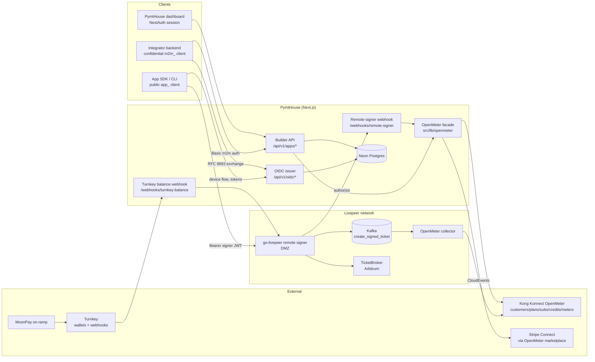
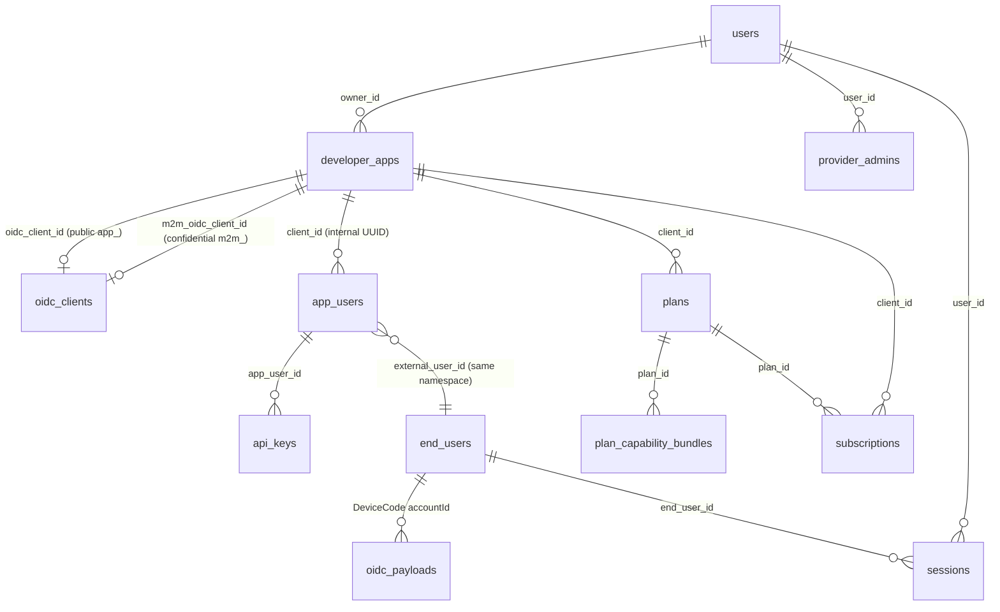
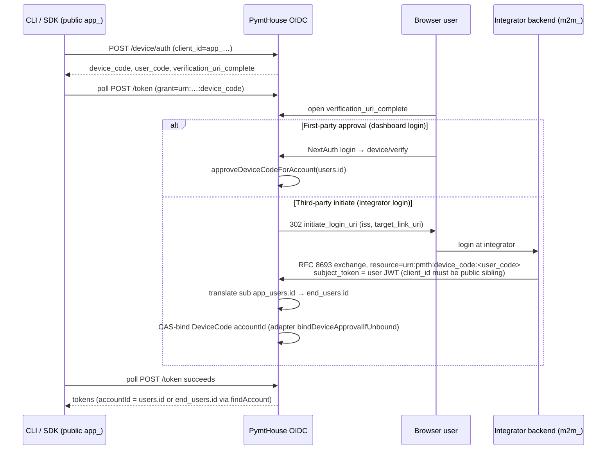
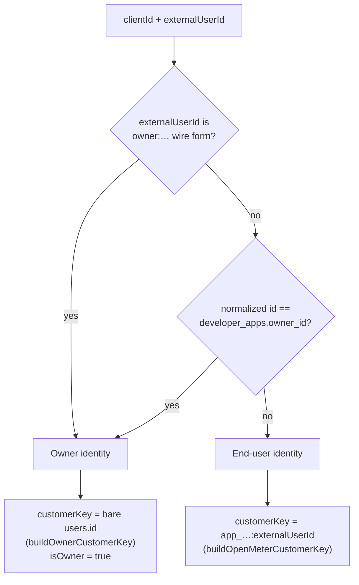
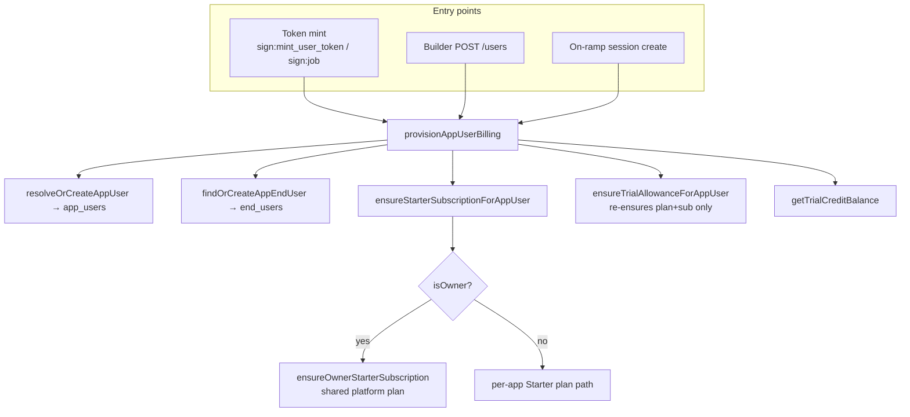
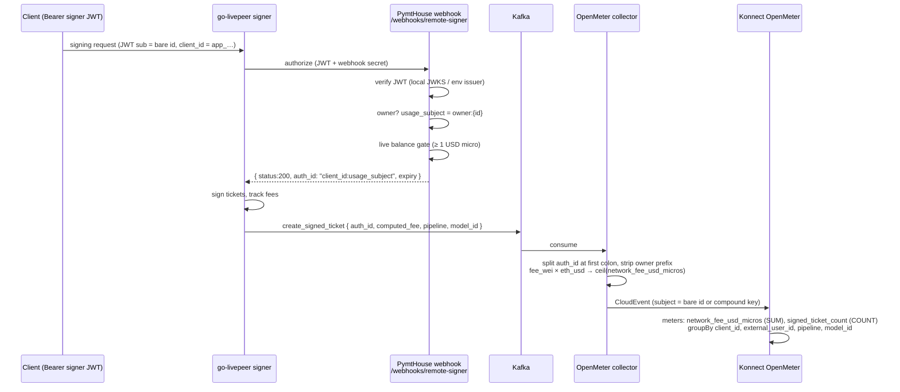
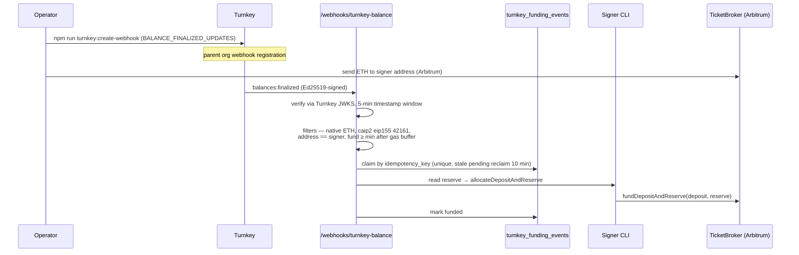
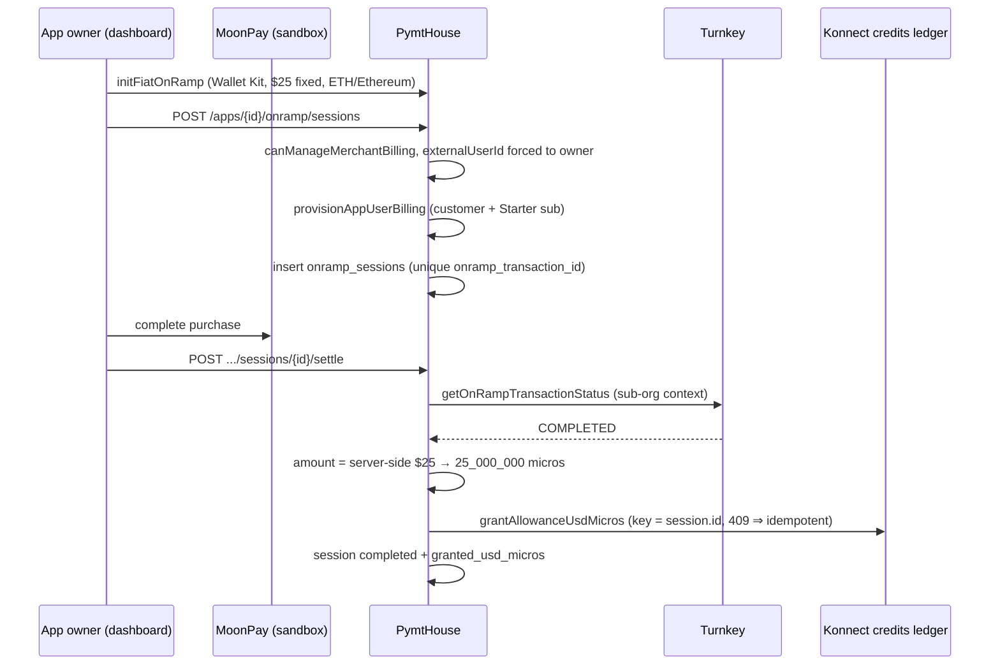
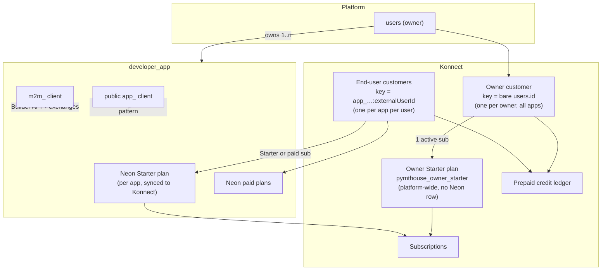

# PymtHouse System Architecture

> **Audience:** engineers and security reviewers. This document describes the OIDC issuer,
> the identity/role model, the OpenMeter (Kong Konnect) billing subsystem, the Turnkey
> payment flows, and the usage metering/enforcement pipeline — including every automatic
> customer-creation and subscription flow, the exact logic applied per client/role type,
> known RFC-compliance gaps, and consolidation opportunities.
>
> **Status:** describes the codebase as of July 2026 (post owner-customer migration to bare
> `users.id` keys, Kafka-only metering ingest, Konnect-hosted OpenMeter).

Related docs: [`builder-api.md`](./builder-api.md) (integrator contract),
[`turnkey-ticket-funding.md`](./turnkey-ticket-funding.md),
[`moonpay-onramp-demo.md`](./moonpay-onramp-demo.md),
[`openmeter-entitlements-cutover.md`](./openmeter-entitlements-cutover.md),
[`openmeter-railway.md`](./openmeter-railway.md),
[`signer-deployment-options.md`](./signer-deployment-options.md).

---

## Table of contents

1. [System overview](#1-system-overview)
2. [Identity model and custom data](#2-identity-model-and-custom-data)
3. [Role-based design](#3-role-based-design)
4. [OIDC issuer: clients, grants, and token surfaces](#4-oidc-issuer-clients-grants-and-token-surfaces)
5. [Billing identity: how OIDC principals map to OpenMeter customers](#5-billing-identity-how-oidc-principals-map-to-openmeter-customers)
6. [Automatic customer-creation and subscription flows](#6-automatic-customer-creation-and-subscription-flows)
7. [Usage metering and enforcement pipeline](#7-usage-metering-and-enforcement-pipeline)
8. [Usage queries](#8-usage-queries)
9. [Payment flows (Turnkey, on-ramp, credits, settlement)](#9-payment-flows-turnkey-on-ramp-credits-settlement)
10. [Relationships: apps, owners, end users, plans](#10-relationships-apps-owners-end-users-plans)
11. [Security review: RFC-compliance gaps and risks](#11-security-review-rfc-compliance-gaps-and-risks)
12. [Consolidation opportunities and API improvements](#12-consolidation-opportunities-and-api-improvements)
13. [Key design decisions and trade-offs](#13-key-design-decisions-and-trade-offs)
14. [Implementation tasks](#14-implementation-tasks)

---

## 1. System overview

PymtHouse is the **sole OIDC issuer** and **billing clearinghouse** for integrator apps
that consume the Livepeer network through a remote signer. It combines:

- an **OIDC Provider** (`node-oidc-provider` with a Postgres adapter) exposed at
  `/api/v1/oidc/*`, with custom token-endpoint intercepts layered on top;
- a **Builder API** (`/api/v1/apps/{clientId}/...`) authenticated by confidential
  M2M clients;
- an **OpenMeter facade** (`src/lib/openmeter/*`) targeting Kong Konnect's hosted
  OpenMeter for customers, plans, subscriptions, credits, and meters;
- a **usage pipeline**: go-livepeer signer → Kafka `create_signed_ticket` →
  OpenMeter collector → Konnect meters;
- **Turnkey** embedded wallets for developer sign-in, TicketBroker funding, and the
  MoonPay on-ramp that grants prepaid credits.



### Money flow at a glance

| Flow | Asset | Destination | Grants OpenMeter credits? |
|---|---|---|---|
| Turnkey balance webhook → TicketBroker | Native ETH (Arbitrum) | Signer deposit/reserve | **No** |
| MoonPay on-ramp settle | Fiat USD | Konnect prepaid credit ledger | **Yes** (USD micros) |
| Stripe checkout (paid plans) | Card | Stripe via OpenMeter tenant profile | No (invoice settlement) |
| Plan included allowance | — | `discounts.usage` on plan rate card | No (discount, not credit) |

---

## 2. Identity model and custom data

### 2.1 Postgres tables (custom data the issuer stores)

Source of truth: `src/db/schema.ts`. Identity-relevant tables:

| Table | PK / uniques | Represents | Key relationships |
|---|---|---|---|
| `users` | `id` (UUID); unique `turnkey_user_id` | Platform accounts: app owners, admins, operators, developers | `developer_apps.owner_id → users.id`; NextAuth session subject |
| `developer_apps` | `id` (UUID) | A registered integrator app | `owner_id → users.id`; `oidc_client_id → oidc_clients.id` (public); `m2m_oidc_client_id → oidc_clients.id` (confidential sibling); `jwks_uri` for RFC 8693 Pattern B |
| `oidc_clients` | `id` (UUID); unique `client_id` | OAuth clients, both public `app_…` and confidential `m2m_…` | `client_secret_hash` null ⇒ public; `token_endpoint_auth_method` ∈ `none` \| `client_secret_basic` \| `client_secret_post`; `allowed_scopes`, `grant_types`, device third-party-initiate flags |
| `oidc_payloads` | composite `(id, model)` | node-oidc-provider adapter store (Grant, Session, AccessToken, AuthorizationCode, RefreshToken, DeviceCode, …) | secondary lookups by `uid`, `user_code`, `grant_id` |
| `oidc_signing_keys` | `id`; unique `kid` | RS256 signing keys (PEM in DB) | JWKS endpoint + local verification |
| `app_users` | `id` (UUID); unique `(client_id, external_user_id)` | Provider-provisioned application users | `client_id → developer_apps.id` (internal UUID, *not* `app_…`); programmatic JWT `sub` |
| `end_users` | `id` (UUID); unique `(app_id, external_user_id)` | Runtime billing/usage principal; OIDC device-grant account | `app_id` is text without FK; `turnkey_user_id` for wallet users |
| `sessions` | `id`; unique `token_hash` | Opaque `pmth_*` bearer sessions (gateway exchange output, programmatic refresh) | `user_id → users`, `end_user_id → end_users`, `app_id` text |
| `api_keys` | `id`; unique `key_hash` | Per-app-user `pmth_*` API keys | `app_user_id → app_users`, `client_id → developer_apps`, optional `subscription_id` |
| `provider_admins` | unique `(user_id, client_id)` | App team admins | `user_id → users`, `client_id → developer_apps` |
| `plans` / `plan_capability_bundles` | `id` | Per-app billing plans + capability (pipeline/model) bundles | `client_id → developer_apps.id`; `openmeter_plan_id`, `openmeter_plan_version`, `sync_error` |
| `subscriptions` | `id` | Local mirror of checkout-created subscriptions | `client_id`, `plan_id`, `external_user_id`, OpenMeter/Stripe pointers |
| `app_billing_config` / `app_openmeter_config` / `app_billing_oauth_states` / `app_billing_oracle_config` | keyed by `client_id` | Merchant billing config (Stripe Connect status, billing profile ids, BYO OpenMeter) | |
| `onramp_sessions` | unique `onramp_transaction_id` | MoonPay/Turnkey on-ramp sessions and granted credits | `client_id` text, `external_user_id`, `granted_usd_micros` |
| `turnkey_funding_events` | unique `idempotency_key` | TicketBroker funding claims from Turnkey balance webhooks | status: pending/funded/skipped/failed |
| `auth_audit_log` | `id` | Builder/OIDC audit events | `client_id → developer_apps.id`, `actor_user_id`, `correlation_id` |
| `app_allowed_domains` | | CORS / custom-login origins for OIDC | consumed in `provider.ts` |
| `admin_invites` | | Platform-admin bootstrap invites | |

### 2.2 Identifier formats

| Identifier | Format | Generator / storage |
|---|---|---|
| Public OAuth client | `app_` + 24 hex | `src/lib/oidc/clients.ts` |
| Confidential OAuth client | `m2m_` + 24 hex | `src/lib/oidc/clients.ts` |
| Client secret | `pmth_cs_` + 64 hex, stored hashed | `rotateClientSecret` → `oidc_clients.client_secret_hash` |
| Session / API key token | `pmth_` + 64 hex, stored hashed | `src/lib/auth.ts`, `app-api-keys.ts` |
| Composite API key | `app_<24hex>_<secret>` | presentation form, `app-api-keys.ts` |
| Device binding resource | `urn:pmth:device_code:<user_code>` | `device-token-exchange.ts` |
| OpenMeter owner customer key | bare `users.id` (canonical) | `buildOwnerCustomerKey` |
| OpenMeter owner wire subject | `owner:{users.id}` (transport only) | `buildOwnerWireSubject` |
| OpenMeter end-user customer key | `app_…:{externalUserId}` | `buildOpenMeterCustomerKey` |
| go-livepeer `auth_id` | `{client_id}:{usage_subject}` | remote-signer webhook response |

### 2.3 The three user tables and how they map



- **`users`** — dashboard principals. An *app owner* is `developer_apps.owner_id`.
  Turnkey wallet sign-in upserts here (`oauth_provider = "turnkey-wallet"`).
- **`app_users`** — created by the Builder API (`POST .../users`) or lazily at
  provision time. `external_user_id` is the app's own user id; programmatic user
  JWTs carry `sub = app_users.id`.
- **`end_users`** — the runtime principal used by `findAccount` (OIDC device grants)
  and stream/transaction attribution. `findOrCreateAppEndUser` bridges an
  `app_users.external_user_id` into `end_users` on demand.

`external_user_id` is the **stable cross-system key**; the three UUID namespaces
(`users.id`, `app_users.id`, `end_users.id`) are internal and translated at well-known
boundaries (see §7 identifier chain).

---

## 3. Role-based design

| Role | How it is established | What it can do | Enforcement point |
|---|---|---|---|
| **Platform admin** | `users.role === "admin"` via NextAuth session, or Bearer with `admin` scope AND DB role | Everything, incl. all apps' merchant billing | `src/lib/admin-auth.ts` |
| **App owner** | `developer_apps.owner_id === users.id` | Manage the app, merchant billing, on-ramp funding; billed against shared **owner wallet** | `canManageMerchantBilling` (`src/lib/billing.ts`); billing identity owner branch |
| **Provider admin** | Row in `provider_admins` for `(user, app)` with role `owner`/`admin` | Edit app settings; *not* merchant billing | `src/lib/provider-apps.ts` |
| **App end user (M2M-provisioned)** | `app_users` row upserted via Builder API | Consume the app; billed against per-app compound customer (unless resolved as owner) | scope checks in Builder routes, mint gates |
| **App end user (interactive/device)** | `end_users` row via device flow / token exchange | Sign jobs with short-lived signer JWTs | device grant binding, webhook JWT verification |
| **Operator / developer** | `users.role` values | Broader dashboard visibility | UI-level |

Two properties worth calling out for the security review:

1. **Merchant billing is stricter than app editing.** `canManageMerchantBilling`
   allows only the platform admin or the literal owner — provider admins cannot touch
   Stripe/on-ramp/billing profiles.
2. **`checkAppAccess` (`src/lib/oidc/app-access.ts`) is permissive.** Any registered
   public client linked to a developer app passes; the `userId` parameter is unused.
   There is no per-app "approval" gate at token issuance.

---

## 4. OIDC issuer: clients, grants, and token surfaces

### 4.1 Two clients per app: exact logic

Every interactive app has **two sibling OIDC clients** linked from `developer_apps`:

| Aspect | Public `app_…` | Confidential `m2m_…` |
|---|---|---|
| `token_endpoint_auth_method` | `none` | `client_secret_basic` |
| Secret | none (`client_secret_hash` null) | `pmth_cs_…` (hashed) |
| PKCE | **required** (enforced in `provider.ts` when auth method is `none`) | n/a |
| Grant types | `refresh_token`; `authorization_code` only when redirect URIs exist; device code | `client_credentials` only |
| `allowed_scopes` drives | end-user JWT claims + **billing pattern** | Builder API access gates |
| Billing pattern | `users:token` present ⇒ `per_user`, else `app_level` (`src/lib/allowed-scopes.ts`) | — |
| Auto-granted scopes | `openid` always normalized in | `users:token`, `users:write`, `device:approve` always; inherits `sign:job`/`users:read` from public; `sign:mint_user_token` iff public has `sign:job` (`backend-m2m-scopes.ts`) |
| Demotion rule | when an M2M sibling exists, the public client is stripped of secret + `client_credentials` | — |

Sibling resolution (`src/lib/oidc/client-sibling.ts`, `src/lib/auth.ts
authenticateAppClient`): a Basic-authenticated `m2m_…` client resolves its
`developer_apps` row via either FK column, then loads the **public** `app_…` id as
`appId`. Builder routes therefore always operate on the public client id in paths while
authenticating the confidential sibling.

### 4.2 Provider configuration highlights (`src/lib/oidc/provider.ts`)

- `node-oidc-provider` with `PostgresOidcAdapter` over `oidc_payloads`.
- Client secrets are stored **hashed**; a prototype patch makes the provider's secret
  comparison hash the presented secret first.
- Redirect-less clients get `authorization_code`/`implicit` stripped at load so
  device-only clients remain valid (RFC 6749 §3.1.2 requires redirect URIs for the
  auth-code grant).
- Features enabled: device flow (RFC 8628; charset `base-20`, mask `****-****`),
  client credentials, revocation, **introspection** (RFC 7662), resource indicators
  (RFC 8707) with JWT access tokens (`typ: at+jwt`, RFC 9068), userinfo, logout.
- `findAccount` resolves `users.id` first, then `end_users.id`; it deliberately does
  **not** resolve `app_users.id` (device binding translates first).

### 4.3 Token surfaces and custom intercepts

`POST /api/v1/oidc/token` is intercepted **in order** before falling through to
node-oidc-provider (`src/app/api/v1/oidc/[...oidc]/route.ts`):

1. **Programmatic refresh** — rotate `pmth_*` refresh sessions labeled
   `app_user_refresh:{appUserId}`.
2. **`client_credentials` + `scope=sign:mint_user_token`** → mint a short-lived
   (300 s) signer JWT for a named `external_user_id` (`mint-user-signer-token.ts`).
   Gated by the spendable-balance check (§7.2).
3. **`client_credentials` + `sign:job`** (no external user) → owner-level signer JWT.
4. **RFC 8693 token exchange**, tried in order:
   a. **Device approval binding** — `resource=urn:pmth:device_code:<user_code>`
      (`device-token-exchange.ts`);
   b. deprecated signer JWT exchange;
   c. **Gateway opaque session** exchange (`gateway-token-exchange.ts`) — subject
      user JWT → 90-day opaque `pmth_*` session;
   d. **Pattern B** third-party JWT exchange (verify against the app's `jwks_uri`).
5. Fall through to the provider (auth code, device code, refresh, client creds).
6. If `resource` is missing on device/auth-code/refresh grants, the route **injects
   `resource=<issuer>`** so RFC 8707-strict mode still issues JWT access tokens.

The canonical app-scoped exchange lives at
`POST /api/v1/apps/{clientId}/oidc/token` (`app-scoped-signer-token-exchange.ts`):
subject may be a user JWT **or** a `pmth_*` / composite API key (never `pmth_cs_*`),
optionally with M2M Basic auth, returning a short-lived signer JWT.

### 4.4 Device flow (RFC 8628) with third-party binding (RFC 8693)



Key safeguards: the M2M caller needs `device:approve` (or `users:token`); the subject
JWT's `client_id`/`azp` must equal the **public sibling**; the public client must have
`device_third_party_initiate_login` enabled; the adapter bind is compare-and-swap so
concurrent approvals cannot double-bind.

### 4.5 JWT claim cheat sheet

| Token | `sub` | `client_id` | Notable claims | TTL |
|---|---|---|---|---|
| Provider access token (JWT) | `users.id` or `end_users.id` | requesting client | `aud` = issuer (RFC 8707 resource), `typ: at+jwt` | provider default |
| Programmatic user JWT | `app_users.id` | public `app_…` | `external_user_id`, `user_type: "app_user"`, `scope`/`scp` | 15 min |
| Signer mint JWT | provision id (owner bare id or external id) | public `app_…` | `external_user_id`, `user_type: app_owner\|external_user`, `scope: sign:job` | 300 s |
| Gateway exchange output | — (opaque `pmth_*`) | session `app_id` | scopes `sign:job` | 90 days |
| Device-binding 8693 response | passthrough of subject JWT | (unchanged) | mirrors subject | subject's |

---

## 5. Billing identity: how OIDC principals map to OpenMeter customers

`resolveOpenMeterBillingIdentity({ clientId, externalUserId })`
(`src/lib/openmeter/billing-identity.ts`) is the **single translation point** between
OIDC-land and Konnect-land:



**Owner (app owner / m2m acting for the owner):**
- One shared Konnect customer per platform user, key = **bare `users.id`** — regardless
  of how many apps they own.
- Wire transport (`auth_id`, webhook `usage_subject`) uses `owner:{users.id}`; the
  collector strips the prefix so meter subjects are bare again.
- Dual-read meter subjects during migration: bare, `owner:`, `app_…:{id}`,
  `app_…:owner:{id}` (`buildOwnerMeterSubjects`).

**End user (public-client interactive user or M2M-provisioned app user):**
- One Konnect customer **per app per user**, key = `app_…:{externalUserId}` — this key
  doubles as the meter subject and the analytics `auth_id` suffix.

**Public vs confidential client is not what decides billing.** Billing branches on
*who the external user is* (owner vs not). The public client's `allowed_scopes` decides
the **billing pattern** (`per_user` iff `users:token` present), which gates programmatic
tokens and the gateway/Pattern-B exchanges — i.e., whether per-user identities can exist
at all for that app.

---

## 6. Automatic customer-creation and subscription flows

All entry points converge on `provisionAppUserBilling`
(`src/lib/billing/provision-app-user.ts`). Its callers: signer-token mint
(`mint-user-signer-token.ts`), Builder user upsert (`POST .../users`), on-ramp session
creation, migration scripts.



### 6.1 Owner first-provision (step by step)

1. `resolveOpenMeterBillingIdentity` → `isOwner: true`, `customerKey` = bare `users.id`.
2. `ensureOwnerCustomer` (`customers.ts`):
   - lookup by exact key (Konnect `customers.list` is a partial match, so the code
     re-filters for exact equality);
   - **create** with `subjectKeys: [bareId]` + metadata
     (`pymthouse_owner_user_id`, `pymthouse_owned_client_ids`), then best-effort attach
     transitional subjects (`owner:…`, compound forms) *before any subscription locks
     subject keys*;
   - **existing** customer: ensure only the bare settlement key; if subject keys are
     missing but a subscription with status `active|scheduled|pending` exists, the
     update is **skipped silently** (Konnect would reject it with a 400).
3. `ensureOwnerStarterPlanSynced` (`owner-starter-plan.ts`): ensure the Konnect tenant
   catalog (meters + `network_spend` feature), then the shared platform plan
   `pymthouse_owner_starter` (**not** a Neon `plans` row), with a `discounts.usage`
   rate card and `settlement_mode: credit_then_invoice`. Publish only when the plan
   status is `draft`/`scheduled`.
4. `applyFreeBillingProfileToCustomer` — Starter always uses the sandbox/free billing
   profile so Konnect never requires Stripe data for trials.
5. `ensureOwnerStarterSubscription` — reuse any active/scheduled/pending/trialing sub
   (including a legacy per-app Starter, which migration scripts later replace);
   otherwise `subscriptions.create({ plan: { key } })` with 404→resync and
   409→re-find recovery.

### 6.2 End-user first-provision

1. Identity → compound `customerKey = app_…:{externalUserId}`.
2. `ensureStarterPlanSynced` — Neon per-app Starter row (`starter-default-plan.ts`) is
   synced to Konnect via `syncPlanToOpenMeter` (`plans-sync.ts`): create/update →
   publish → write back `openmeter_plan_id`/`version`/`sync_error`.
3. `ensureOpenMeterCustomer(compoundKey)` — get-or-create with
   `subjectKeys: [customerKey]`.
4. Free billing profile, then find-or-create the subscription by plan key
   (`resolveOpenMeterStarterSubscription` → `createStarterSubscriptionWithRecovery`
   with 404 plan-resync and 409 conflict recovery).

### 6.3 Paid subscription (checkout)

`createEndUserCheckout` (`subscriptions-billing.ts`), from
`POST /api/v1/apps/{id}/billing/checkout`:

1. Neon plan must be synced (`openmeter_plan_id` present); app must have
   `stripeConnectStatus === "connected"`.
2. Ensure customer → apply **tenant Stripe billing profile** (not the free one).
3. `subscriptions.create` on the plan key — **no reuse check** (see §12).
4. Create Stripe Checkout session; upsert a local `subscriptions` row (`pending`,
   `stripe_checkout_session_id`).

### 6.4 Credit grant (transaction flow)

`grantAllowanceUsdMicros` (`grant-allowance.ts`), called from the on-ramp settle and
`POST .../users/{externalUserId}/allowances`:

1. Resolve identity (owner or end-user), run the provision path (app user, Starter
   sub, trial allowance ensure).
2. `ensureOpenMeterCustomer(customerKey)`.
3. Konnect: `POST /customers/{ulid}/credits/grants` with
   `amount = usdMicrosToDecimalDollars(micros)`, `key = idempotencyKey`
   (409 ⇒ already granted, treated as success), `expires_after: P1Y`, optional
   `filters.features = [network_spend]`.
4. Return the live balance (`getTrialCreditBalance`).

> Note: the Starter *included allowance* is **not** a credit grant — it is a
> `discounts.usage` entry on the plan's rate card. Credits and discounts are summed
> only at gate time (§7.2).

---

## 7. Usage metering and enforcement pipeline

### 7.1 End-to-end event flow



**Identifier chain (three hops):** JWT bare `sub` → wire `owner:{id}` inside
`auth_id` → bare Konnect subject at the collector. End users skip the middle hop
(their compound key is already the subject).

### 7.2 Enforcement points and exact thresholds

The spendable balance (`getSpendableUsdMicros`, `spendable-allowance.ts`):

```
spendable = prepaid_credits (Konnect live balance)
          + max(0, plan_included_usd_micros − calendar_month_meter_usage)
```

- Included micros: Owner Starter env value, else Neon `plans.included_usd_micros`,
  fallback `OPENMETER_DEFAULT_STARTER_INCLUDED_USD_MICROS` default **5,000,000** ($5).
- Month usage is queried over the owner dual-read subjects (or the single compound
  key for end users).

| Gate | Where | Failure behavior |
|---|---|---|
| **Mint gate** | `mint-user-signer-token.ts` (also app-scoped exchange) | provision failure or null allowance → **HTTP 402 `billing_unavailable`**; `spendable < 1` micro → **402 `trial_credits_exhausted`** |
| **Webhook live gate** | `signer-balance-gate.ts` via `@pymthouse/clearinghouse-identity-webhook` `createBalanceGate` | HTTP 200 with body `status: 483, code: insufficient_balance` (balance < 1 micro) or `status: 503, code: billing_unavailable` (lookup failure); **fail-closed**; balance cache 20 s, reauth TTL 60 s |
| **Gateway exchange** | `gateway-token-exchange.ts` | **no balance gate** — issues 90-day opaque sessions (see §11) |

The mid-stream gate means a session minted with balance can still be cut off within
~60 s of exhaustion.

### 7.3 Consistency auditing

`npm run openmeter:audit-billing` (`billing-consistency.ts`) checks, per owner:
Starter plan sync integrity (ids/keys/discounts), bare-key customer existence,
exactly-one active subscription, plan-version staleness, and two spend invariants —
`spendable_sum_mismatch` (credits + discount ≠ spendable) and
`spendable_gate_blocks_with_unused_allowance` (would 483 despite unused allowance).
Remediation scripts: `openmeter:fix-starter-allowance`,
`openmeter:dedupe-owner-subscriptions`, `openmeter:migrate-owner-customers`,
`openmeter:repair-owner-subject-keys`.

---

## 8. Usage queries

### 8.1 Query surfaces

| Route | Auth | Backing functions |
|---|---|---|
| `GET /api/v1/apps/{id}/usage` | app client / provider session | `queryOpenMeterUsage`, `queryOpenMeterAppDashboardUsage`, per-user pipeline/daily helpers (`usage-read.ts`) |
| `GET /api/v1/apps/{id}/usage/balance?externalUserId=` | same | `getTrialCreditBalance` |
| `GET /api/v1/billing/dashboard` | NextAuth | `getBillingUsageDashboardData` + `listOwnerActiveSubscriptions` |
| `GET /api/v1/me/credits` | NextAuth | `getOwnerPrepaidCreditBalance` (single Konnect customer lookup) |
| `GET /api/v1/dashboard/usage` | NextAuth | `getDashboardUsageSummary` |
| `GET /api/v1/me/usage/requests` | NextAuth | `listViewerSignedTicketRequests` (event-level, dual-read subject filters) |

### 8.2 Query mechanics

1. `resolveOpenMeterMeterClientId` maps the internal app UUID to the public `app_…`
   id used in meter `groupBy.client_id`.
2. `resolveUsageMeterSubjects`: owners → 4-subject dual-read set; end users → single
   compound key.
3. Meters `network_fee_usd_micros` and `signed_ticket_count` are queried in parallel
   with `MONTH`/`DAY` windows; rows are merged with
   `buildExternalUserIdMatchKeys`/`canonicalizeFilteredExternalUserId` so transitional
   subject forms collapse onto the canonical user id.
4. Konnect API differences are absorbed by `konnect-routes.ts` (path rewrites, GET
   meter query → POST body, `data` → `items`, snake_case bodies).

---

## 9. Payment flows (Turnkey, on-ramp, credits, settlement)

> **Conceptual model.** Turnkey provides *embedded wallets* under a parent
> organization; each end user authenticates through the Wallet Kit / Auth Proxy and
> receives a **sub-organization** with an EVM wallet. PymtHouse consumes three Turnkey
> surfaces: (1) session JWTs for sign-in, (2) balance webhooks for deposit detection,
> (3) the on-ramp (MoonPay) transaction status API. There are **two independent money
> pipelines** today — chain deposits fund the network-side TicketBroker; fiat on-ramp
> funds OpenMeter prepaid credits. A unified "wallet deposit → credits" pipeline is
> documented Phase-2 intent, not implemented.

### 9.1 Wallet sign-in (identity bridge)

```
Wallet Kit auth (sub-org + embedded wallet)
  → bridgeTurnkeySessionToNextAuth (client captures session JWT)
  → NextAuth CredentialsProvider "turnkey-wallet"
  → verifyTurnkeySessionJwt (@turnkey/crypto signature + expiry + optional org allowlist)
  → findOrCreateDeveloperUser → users row
      { turnkey_user_id (unique), oauth_provider: "turnkey-wallet",
        wallet_address, role: "developer" }
```

A separate path (`POST /api/v1/end-users` with a Turnkey JWT) upserts `end_users`
instead — wallet identity for runtime users, not app ownership.

### 9.2 Deposit → TicketBroker funding (network side, no credits)



Allocation: fill the reserve shortfall up to `RESERVE_AMOUNT` (default 0.25 ETH)
first, remainder to deposit; if the reserve is already full, 100% to deposit.
Config: `TURNKEY_FUNDING_CAIP2`, `TICKET_FUNDING_GAS_BUFFER_WEI`,
`TICKET_FUNDING_MIN_WEI`, `RESERVE_AMOUNT`, `SIGNER_CLI_URL`.

**This path never grants OpenMeter credits.**

### 9.3 On-ramp → prepaid credits (billing side)



Security posture: owner-only (`canManageMerchantBilling`), server-fixed amount (the
Turnkey status API is *not* trusted for the amount), idempotent at both the session
(`onramp_transaction_id` unique, early-return when `completed`) and the grant
(Konnect grant `key`).

### 9.4 Subscription usage, billing and settlement

Settlement is delegated to Konnect via **`settlement_mode: credit_then_invoice`** on
every synced plan (per-app plans in `plans-sync.ts`, the shared Owner Starter in
`owner-starter-plan.ts`):

1. **Plan discount first.** Included allowance is a `discounts.usage` rate-card entry —
   usage up to the included USD micros is discounted to zero.
2. **Prepaid credits second.** Konnect burns the customer's credit ledger (funded by
   on-ramp / manual grants) against metered `network_spend`.
3. **Invoice remainder.** Overage becomes an OpenMeter invoice; if the app has Stripe
   Connect (via the OpenMeter marketplace OAuth, `stripe-connect.ts` → tenant billing
   profile), the invoice settles by card. `listTenantInvoices` (`invoices.ts`) is a
   read-only aggregation for the UI (end-user customers + owner wallet).

Starter/trial subscriptions always sit on the **free sandbox billing profile** so
Konnect never demands Stripe data for them; paid checkout switches the customer to the
tenant Stripe profile.

---

## 10. Relationships: apps, owners, end users, plans



Invariants the code (and the audit script) maintain:

- an **owner has exactly one Konnect customer** regardless of app count, and at most
  one active subscription (Owner Starter);
- an **end user has one customer per app** they use;
- the **per-app Neon Starter plan** exists even for owners (callers cache the local
  `planId`), but owners are *subscribed* to the shared platform plan;
- discovery/network-default plans are Neon-only and never synced.

---

## 11. Security review: RFC-compliance gaps and risks

This section enumerates deviations from IETF specifications and other findings a
security review should weigh. References: RFC 6749 (OAuth 2.0), RFC 6750 (Bearer),
RFC 7662 (Introspection), RFC 8628 (Device Grant), RFC 8693 (Token Exchange),
RFC 8707 (Resource Indicators), RFC 9068 (JWT AT profile), RFC 8414 (AS Metadata).

### 11.1 RFC deviations

| # | Finding | Spec | Details / risk | Suggested direction |
|---|---|---|---|---|
| 1 | **Device-binding exchange returns the subject token passthrough** | RFC 8693 §2.2 | `device-token-exchange.ts` responds with the *subject* JWT as `access_token` instead of issuing a newly-minted token. The response therefore does not reflect issuer-side policy (TTL, audience) beyond the original token, and `issued_token_type` semantics are stretched. | Mint a fresh token (or a narrow confirmation response) on successful binding. |
| 2 | **Proprietary resource URN for device binding** | RFC 8693 / 8707 | `resource=urn:pmth:device_code:<user_code>` overloads the resource parameter as a command channel. Interoperable clients cannot discover this. It also embeds the *user_code* (user-facing secret) in a parameter that may be logged by proxies. | Document it as a private-use extension; consider a dedicated `actor_token`/parameter or a first-class endpoint; avoid logging `resource` on this path. |
| 3 | **Auto-injection of `resource=<issuer>`** | RFC 8707 | The token route injects a default resource when absent to keep strict-mode JWT ATs working. Clients never see that their request was rewritten; audience-restriction intent of 8707 is weakened (everything falls back to the issuer audience). | Prefer provider-level `defaultResource` handling only, and reject rather than rewrite where audience matters. |
| 4 | **Custom device verification UI + endpoint** | RFC 8628 §3.3 | Approval happens via `/api/v1/oidc/device/verify` and a React page rather than provider-rendered interaction. Functionally fine, but the user-code entry, rate limiting, and brute-force lockout live in custom code and need explicit review (8628 §5.1 user-code entropy/brute-force guidance). | Verify rate limiting + lockout on user_code attempts; keep charset/mask entropy (base-20, 8 chars) documented. |
| 5 | **Non-standard grant parameters on `client_credentials`** | RFC 6749 §4.4 | `external_user_id` form parameter on the mint path, and scope-based dispatch (`sign:mint_user_token`) implemented as route intercepts *in front of* the provider. Introspection/revocation for these minted JWTs bypasses provider bookkeeping (they are not adapter-stored tokens). | Register custom grant types (e.g. `urn:pmth:params:grant-type:mint`) instead of overloading CC; or document explicitly as private-use. |
| 6 | **Opaque 90-day gateway sessions outside provider storage** | RFC 6749/7009/7662 | `gateway-token-exchange.ts` issues `pmth_*` sessions stored in the `sessions` table — not `oidc_payloads`. They are not revocable/introspectable via the standard endpoints; token revocation (RFC 7009) does not apply to them. | Add revocation + introspection coverage for `pmth_*` sessions, or migrate to provider-managed refresh tokens. |
| 7 | **Hashed-secret comparison via prototype patch** | RFC 6749 §2.3.1 | Secure at rest (hashes only), but the mechanism monkey-patches the provider's secret comparison. Provider upgrades can silently break constant-time comparison assumptions. | Pin/regression-test the patch; consider `client_secret_jwt`/`private_key_jwt` for M2M longer-term. |
| 8 | **Composite API keys in URL-ish formats** | RFC 6750 | `app_<id>_<secret>` composite keys are convenient but easy to paste into logs/URLs; only the hash is stored, which is good. | Keep hashing; add detection/redaction in logs. |

### 11.2 Non-RFC security observations

| # | Finding | Risk | Notes |
|---|---|---|---|
| 1 | **`checkAppAccess` ignores the user** | Any registered public client passes; per-user app authorization is absent | Deliberate (no approval gate), but should be a documented trust decision |
| 2 | **No balance gate on the gateway exchange** | A 90-day opaque session can be minted while balance exists, then used; only the *webhook* gate (60 s reauth) limits spend afterwards | Acceptable given the webhook gate is fail-closed; confirm all signing paths hit the webhook |
| 3 | **Fail-open on subscription list during subject-key pre-check** | `customerHasSubjectKeyLockingSubscription` returns `false` on listing errors and proceeds to PUT | Konnect's own 400 still backstops; benign |
| 4 | **Secrets in env files** | `.env` / `.env.local` contain live `DATABASE_URL`, `OPENMETER_API_KEY` (`spat_…`) — and a connection string was pasted into a terminal this week | Rotate Neon + Konnect tokens; keep env out of chat/logs |
| 5 | **Webhook trust boundaries** | Remote-signer webhook: JWT + shared secret, fail-closed balance gate — good. Turnkey webhook: Ed25519 JWKS + 5-min replay window + DB idempotency — good | The 10-min stale-pending reclaim could double-fund if a slow first attempt succeeds *after* reclaim; verify signer CLI idempotency |
| 6 | **Konnect `customers.list` partial-match** | Code must re-filter for exact key equality (`findOpenMeterCustomerByKey`); any new call site that forgets this could attach subjects to the wrong customer | Centralize lookups through the existing helper |
| 7 | **Owner wire prefix stripping in the collector** | Collector trusts `auth_id` composition from the signer; a forged `owner:` prefix inside `usage_subject` would mis-attribute usage to an owner wallet | `auth_id` originates from the webhook response (server-side), so the trust chain holds — but document it |
| 8 | **Amount trust on on-ramp** | Server fixes $25; Turnkey status only proves completion | Correct posture; keep when amounts become dynamic (read amount from a signed source, not the client) |

---

## 12. Consolidation opportunities and API improvements

### 12.1 Identifier consolidation

The single biggest maintainability burden is **four ways to say "this user"** on
meters (bare, `owner:…`, `app_…:{id}`, `app_…:owner:{id}`) plus three UUID namespaces.
Current mitigations (dual-read, `canonicalizeFilteredExternalUserId`) work but spread
translation logic across `customer-key.ts`, `usage-read.ts`, `signed-ticket-events.ts`,
`credit-allowance-summary.ts`, and the collector YAML.

- **Finish the subject cutover**: once dual-read windows age out (deprecation pinned
  2026-09-10 for micros emit), collapse to bare owner ids + compound end-user keys and
  delete the transitional forms.
- **One `BillingSubject` module**: fold `buildOwnerMeterSubjects`,
  `buildUsageMeterSubjects`, `buildExternalUserIdMatchKeys`, and the viewer/event
  subject filters into one exported surface with an explicit
  `{ canonical, transitional[] }` shape.
- **`app_users.client_id` vs path `clientId`**: the Builder path parameter is the
  public `app_…` id while `app_users.client_id` is the internal `developer_apps.id`
  UUID. Every route translates. Consider storing the public id (or exposing the
  internal id consistently) to remove a whole class of confusion.

### 12.2 Logic consolidation

| Opportunity | Files | Rationale |
|---|---|---|
| Merge `ensureTrialAllowanceForAppUser` into `ensureStarterSubscriptionForAppUser` | `trial-allowance.ts`, `starter-subscription.ts` | Trial-allowance is now a re-ensure of the same plan/sub; `provisionAppUserBilling` calls both back-to-back |
| Unify Starter create/recovery machinery | `starter-subscription.ts` `createStarterSubscriptionWithRecovery` vs `owner-starter-plan.ts` create/conflict recovery | Two parallel implementations of "create sub; on 404 resync plan; on 409 re-find" |
| Deduplicate customer ensure on the mint path | `mint-user-signer-token.ts` calls `ensureAppUserKonnectCustomer` and then `provisionAppUserBilling` (which ensures again inside starter) | One ensure per request is enough |
| One "remaining discount" computation | `spendable-allowance.ts` vs `owner-billing-data.ts` | Both compute `included − month usage`; drift risk in cycle-boundary and subject-set handling |
| Rename `getTrialCreditBalance` | `entitlements.ts` | It returns the *prepaid Konnect balance*, not a trial entitlement; conceptually overlaps `getOwnerPrepaidCreditBalance` |
| Fix comment drift on owner keys | `billing-identity.ts`, `customer-key.ts`, mint JWT comments | Several comments still describe `owner:{id}` as the customer key; canonical is bare `users.id` |
| Checkout `customerKey` accuracy | `subscriptions-billing.ts` | The Neon `subscriptions` row stores the compound key even when the resolved customer is the owner wallet |

### 12.3 API improvements

1. **Reuse-before-create on checkout.** `createEndUserCheckout` should check for an
   existing active subscription on the target plan (mirroring the Starter ensure
   helpers) before `subscriptions.create`, to avoid duplicate subs from double-clicks.
2. **Hint-id status validation.** `verifyOpenMeterSubscriptionId` returns any sub the
   id resolves to, regardless of status; callers treat it as "existing". Filter to
   active statuses.
3. **Expose a single provisioning endpoint.** Builder integrators currently trigger
   provisioning as a side effect of user upsert or token mint. A first-class
   `POST .../users/{id}/provision` (idempotent) would make the contract explicit and
   allow the side-effectful paths to slim down.
4. **Introspection/revocation for `pmth_*` sessions** (see §11.1-6).
5. **Machine-readable error contract for the gates.** The mint gate's 402 codes and
   the webhook's in-body 483/503 are product-specific; document them in
   `builder-api.md`/OpenAPI so SDKs can branch reliably.

---

## 13. Key design decisions and trade-offs

| Decision | Trade-off accepted |
|---|---|
| **Two OIDC clients per app** (public + M2M sibling) | Extra registration complexity in exchange for clean separation of browser-grade and server-grade credentials; demotion rules keep legacy single-client apps working |
| **Bare `users.id` as the owner customer key** (one wallet across apps) | Requires wire-form `owner:` prefixes and a dual-read migration window, but eliminates per-app owner wallet fragmentation and double-billing |
| **Included allowance as `discounts.usage`, not entitlements/credits** | Simpler plan sync and no grant lifecycle management; cost is a two-source spendable computation (credits + discount) that must be summed consistently everywhere (audit script guards this) |
| **`credit_then_invoice` settlement delegated to Konnect** | PymtHouse never moves money for usage itself; correctness depends on Konnect's ledger and on plans being synced with the right discounts |
| **Kafka-only metering ingest** | No synchronous billing writes on the request path (latency, availability), at the cost of eventual consistency between the webhook's live gate and metered truth (bounded by the 20 s/60 s cache TTLs) |
| **Custom token-route intercepts in front of node-oidc-provider** | Enables mint/exchange flows the provider does not model, at the cost of RFC purity (§11) and provider-upgrade risk |
| **Fail-closed webhook balance gate; no gate on long-lived gateway sessions** | Mid-stream enforcement is authoritative; token issuance is optimistic. Spend exposure is bounded by the reauth TTL |
| **Two disjoint Turnkey money pipelines** | Chain deposits fund network collateral (TicketBroker) while fiat on-ramp funds billing credits; simpler to secure independently, but users must understand the difference until Phase 2 unifies them |

---

## 14. Implementation tasks

Actionable follow-ups distilled from this document, roughly ordered by risk:

1. **[security] Rotate exposed secrets** — Neon `DATABASE_URL` password and Konnect
   `OPENMETER_API_KEY` that appear in local env files / terminal history.
2. **[security] Add revocation + introspection for `pmth_*` opaque sessions**, or
   migrate gateway-exchange output to provider-managed tokens (§11.1-6).
3. **[security] Mint a fresh token on device-binding success** instead of subject
   passthrough (§11.1-1); avoid logging the `resource` URN containing `user_code`.
4. **[security] Review rate limiting / lockout on device `user_code` verification**
   (RFC 8628 §5.1) in the custom verify route.
5. **[security] Verify signer-CLI idempotency under Turnkey stale-pending reclaim**
   (double-funding window, §11.2-5).
6. **[correctness] Reuse-before-create in `createEndUserCheckout`**; validate
   subscription status on hint ids (§12.3-1/2).
7. **[consolidation] Merge trial-allowance into the Starter ensure path**; single
   Starter create/recovery helper shared by owner and end-user branches (§12.2).
8. **[consolidation] Single `BillingSubject` module** for all subject/dual-read
   translation; plan the post-cutover deletion of transitional subject forms (§12.1).
9. **[consolidation] Deduplicate the remaining-discount computation** between
   `spendable-allowance.ts` and `owner-billing-data.ts` (§12.2).
10. **[docs/API] Document gate error contracts** (402 codes, in-body 483/503) in
    `builder-api.md` + OpenAPI; add a first-class idempotent provision endpoint
    (§12.3-3/5).
11. **[hygiene] Fix owner-key comment drift**; rename `getTrialCreditBalance` to
    reflect prepaid semantics (§12.2).
12. **[hardening] Centralize Konnect customer lookups** through
    `findOpenMeterCustomerByKey` to preserve exact-key matching (§11.2-6).
