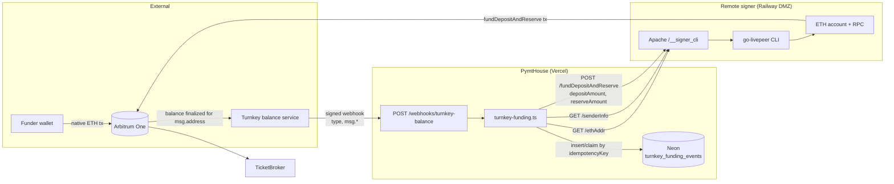
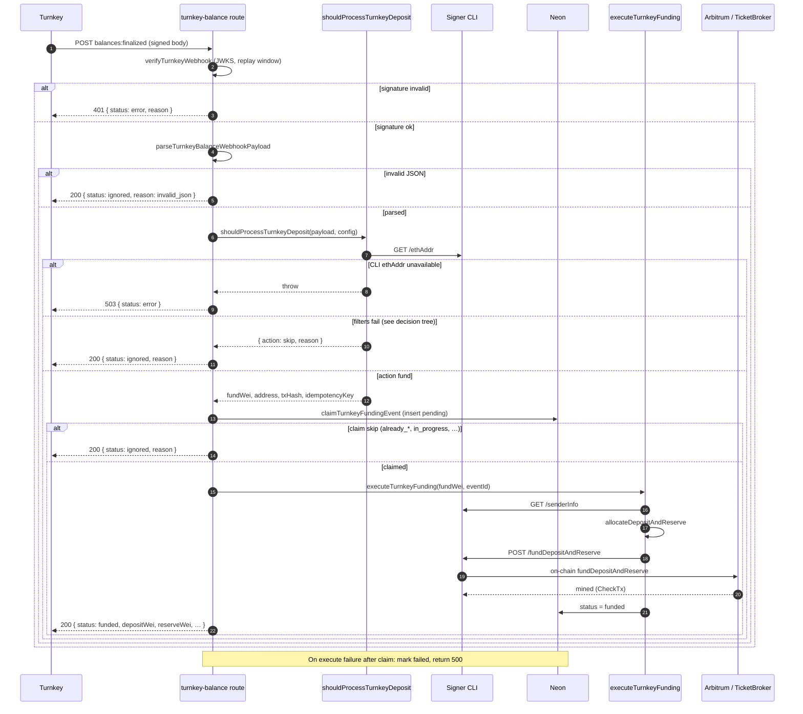
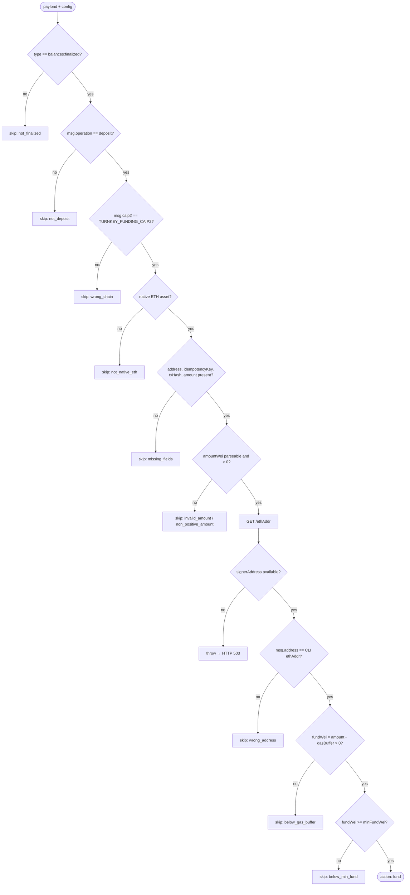
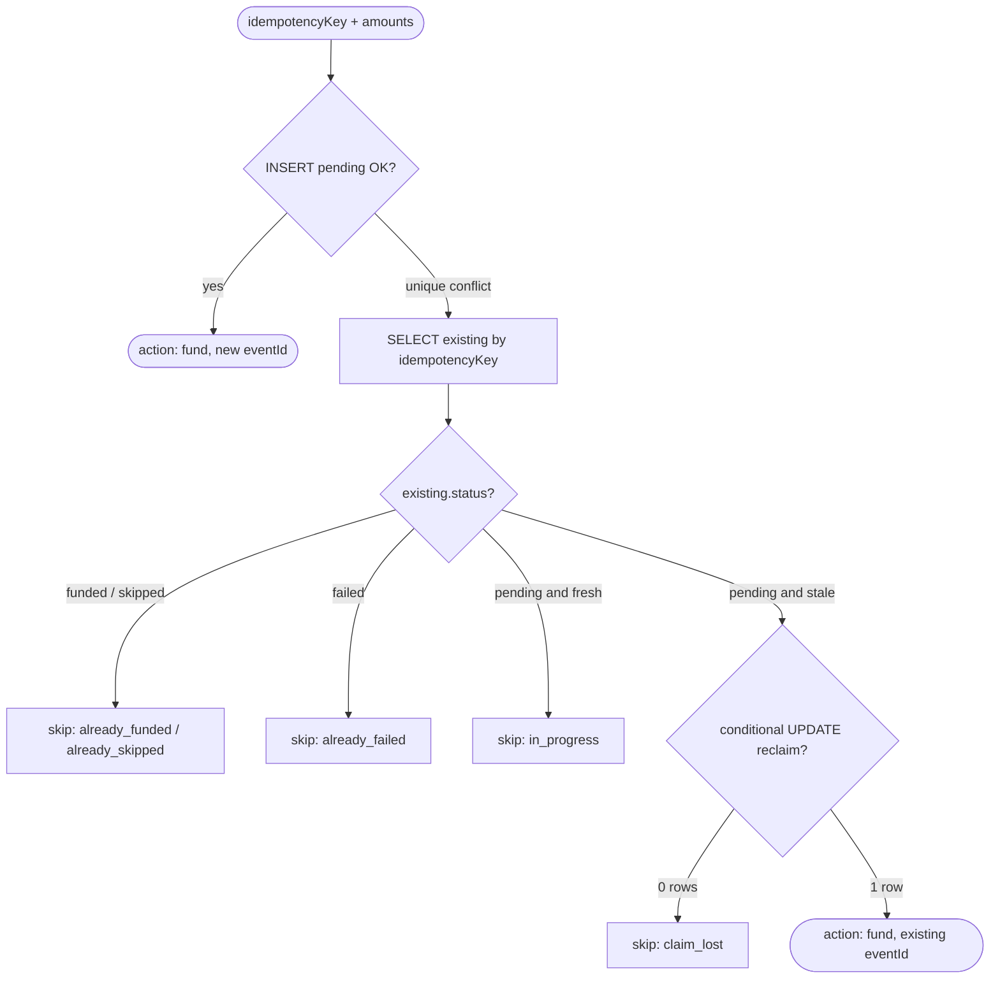
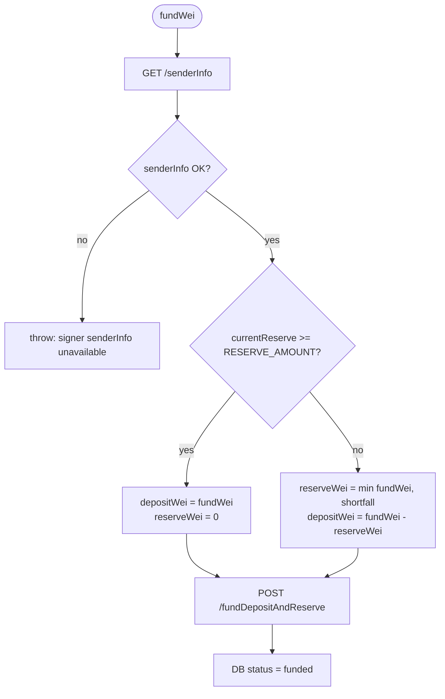

# Turnkey balance → TicketBroker auto-funding

When ETH lands in the remote signer wallet on Arbitrum, Turnkey delivers
`balances:finalized` webhooks to `POST /webhooks/turnkey-balance`. PymtHouse
verifies the webhook (HTTP message authentication), decides whether the deposit
belongs to this signer and clears funding thresholds, then calls the protected
signer CLI `POST /fundDepositAndReserve` so go-livepeer submits an on-chain
TicketBroker funding transaction.

This document covers **architecture and flows** for that path, then operational
thresholds, env vars, and verification. It does **not** cover the identity
authorization webhook (`POST /webhooks/remote-signer`), which authenticates
end-user JWTs before ticket signing and never moves deposit ETH.

Register the deposit webhook:

```bash
npm run turnkey:create-webhook
# or with an explicit URL:
npm run turnkey:create-webhook -- --url https://staging.pymthouse.com/webhooks/turnkey-balance
```

Requires a Turnkey billing org on Pay As You Go, Pro, or Enterprise. Balance
webhooks must be registered from the parent billing organization.

---

## Scope and participants

| Participant | Role |
| --- | --- |
| Funder / operator | Sends native ETH to the signer address on Arbitrum One |
| Arbitrum One | Settlement chain for the deposit and TicketBroker tx |
| Turnkey | Observes wallet balance changes; signs and delivers webhooks |
| PymtHouse (Vercel) | `POST /webhooks/turnkey-balance` — verify, filter, claim, allocate, invoke CLI |
| Neon (`turnkey_funding_events`) | Idempotency ledger for webhook deliveries |
| Signer DMZ (Railway) | Apache JWT gate + go-livepeer remote signer (CLI on `/__signer_cli`) |
| TicketBroker (on-chain) | Livepeer deposit + reserve balances used for ticket payments |

Primary source files:

| Concern | Path |
| --- | --- |
| HTTP handler | `src/app/webhooks/turnkey-balance/route.ts` |
| Decision + claim + execute | `src/lib/turnkey-funding.ts` |
| CLI client (`/ethAddr`, `/senderInfo`, `/fundDepositAndReserve`) | `src/lib/signer-cli.ts` |
| Webhook JWKS / signature keys | `src/lib/turnkey-webhook-jwks.ts` |
| Event table | `turnkey_funding_events` in `src/db/schema.ts` |

---

## Data flow diagram

System-context view of how deposit data moves from chain observation to
TicketBroker credit. Edges are labeled with the data carried.



### Data objects on the critical path

| Stage | Data | Source of truth |
| --- | --- | --- |
| Chain deposit | `txHash`, destination `address`, `amount` (wei), `caip2` | Arbitrum / Turnkey `msg` |
| Webhook auth | Signature headers + body + JWKS keys | Turnkey + PymtHouse key cache |
| Signer identity check | Live CLI `GET /ethAddr` vs webhook `msg.address` | go-livepeer account, not env alone |
| Funding decision | `fundWei = amountWei - gasBuffer` | Config + payload |
| Idempotency claim | `idempotencyKey` → row `pending` / terminal status | Neon unique index |
| Allocation | `depositWei`, `reserveWei` from current reserve + `RESERVE_AMOUNT` | CLI `senderInfo` + config |
| On-chain credit | TicketBroker deposit / reserve | go-livepeer `CheckTx` |

### Trust boundaries

1. **Turnkey → PymtHouse:** Untrusted until `verifyTurnkeyWebhookSignature` succeeds
   (replay window 5 minutes). Failed auth returns HTTP 401; no DB write, no CLI call.
2. **PymtHouse → Signer CLI:** Authenticated with a short-lived admin-scope JWT
   (unless `SIGNER_DMZ_FORWARD_JWT=false`). CLI is not a public funding API.
3. **Address binding:** Before claiming, PymtHouse compares webhook `msg.address`
   to the **live** remote-signer CLI eth account. A mismatch skips with
   `wrong_address` so a shared webhook never funds the wrong signer process.
4. **Idempotency:** Neon unique constraint on `idempotency_key` is the
   single-flight gate for concurrent or retried deliveries of the same Turnkey event.

---

## Transaction flow with decisions

End-to-end sequence for one webhook delivery. Decision diamonds map 1:1 to
`shouldProcessTurnkeyDeposit`, `claimTurnkeyFundingEvent`, and
`executeTurnkeyFunding`.



### Decision tree — `shouldProcessTurnkeyDeposit`

Evaluated in order. First matching skip wins. Address check uses live CLI
`GET /ethAddr` (case-insensitive hex compare).



### Decision tree — `claimTurnkeyFundingEvent`

Idempotency uses a unique index on `idempotency_key`. Insert-first; on conflict,
inspect the existing row. Stale `pending` rows (≥ 10 minutes) may be reclaimed.



### Decision tree — deposit vs reserve allocation

After a successful claim, `executeTurnkeyFunding` reads live TicketBroker state
and splits `fundWei` so reserve fills to `RESERVE_AMOUNT` before surplus goes to
deposit. Invariant: `depositWei + reserveWei === fundWei`.



---

## Minimum deposit requirements

Funding uses two wei thresholds (see `src/lib/turnkey-funding.ts`):

| Env var | Default (wei) | Default (ETH) | Purpose |
| --- | --- | --- | --- |
| `TICKET_FUNDING_GAS_BUFFER_WEI` | `100000000000000` | 0.0001 | Held back so the signer keeps ETH for the on-chain `fundDepositAndReserve` tx |
| `TICKET_FUNDING_MIN_WEI` | `1000000000000000` | 0.001 | Minimum amount credited to TicketBroker after the buffer |
| `RESERVE_AMOUNT` | `250000000000000000` | 0.25 | Target TicketBroker reserve balance. Incoming `fundWei` fills reserve until this amount; once reserve ≥ target, 100% goes to deposit |

Computation:

```
fundWei = depositAmountWei - TICKET_FUNDING_GAS_BUFFER_WEI
```

A deposit is funded only when `fundWei > 0` and `fundWei >= TICKET_FUNDING_MIN_WEI`.

**Minimum incoming deposit (defaults):**

```
TICKET_FUNDING_GAS_BUFFER_WEI + TICKET_FUNDING_MIN_WEI + 1 wei
= 100000000000000 + 1000000000000000 + 1
= 1100000000000001 wei  (~0.0011 ETH)
```

Practical recommendation: send **≥ 0.002 ETH** on Arbitrum One so small rounding
or companion events do not land near the threshold.

Example with defaults for a **0.01 ETH** deposit:

- Deposit: `10000000000000000` wei (0.01 ETH)
- Buffer: `100000000000000` wei (0.0001 ETH)
- Funded to TicketBroker: `9900000000000000` wei (0.0099 ETH)

---

## Deposit vs reserve allocation

After computing `fundWei`, the webhook reads current TicketBroker reserve via
`getSenderInfo` and splits funds using `RESERVE_AMOUNT` (wei, loaded at config
startup):

```
reserveShortfall = max(0, RESERVE_AMOUNT - currentReserveWei)
reserveWei       = min(fundWei, reserveShortfall)
depositWei       = fundWei - reserveWei
```

- While reserve is below `RESERVE_AMOUNT`, incoming funds fill the shortfall
  first; any remainder goes to deposit.
- Once `currentReserveWei >= RESERVE_AMOUNT`, `reserveWei` is `0` and 100% of
  `fundWei` goes to deposit.
- Default `RESERVE_AMOUNT` is `0.25 ETH` (`250000000000000000` wei). Set `RESERVE_AMOUNT=0` for all-to-deposit behavior.

---

## Environment variables

Set on **Vercel** (the webhook handler). Vercel builds skip `db:migrate`; apply
migrations to the Preview/Production Neon branch separately.

```bash
# Chain for incoming deposits (Arbitrum One mainnet)
TURNKEY_FUNDING_CAIP2=eip155:42161

# Optional overrides (wei strings)
TICKET_FUNDING_GAS_BUFFER_WEI=100000000000000
TICKET_FUNDING_MIN_WEI=1000000000000000
RESERVE_AMOUNT=250000000000000000

# Signer CLI (required for funding)
SIGNER_CLI_URL=https://<railway-signer>/__signer_cli
```

Also required for webhook registration: `TURNKEY_ORG_ID`, `TURNKEY_API_PUBLIC_KEY`,
`TURNKEY_API_PRIVATE_KEY`.

Webhook signature verification also depends on Turnkey JWKS resolution in
`src/lib/turnkey-webhook-jwks.ts` (see Turnkey webhook authentication guidance;
message authentication for HTTP webhooks is in the same problem space as
[RFC 9421](https://www.rfc-editor.org/rfc/rfc9421) HTTP Message Signatures,
though Turnkey’s concrete header scheme is vendor-specific).

---

## Webhook response statuses

| HTTP | JSON `status` | Meaning |
| --- | --- | --- |
| 200 | `funded` | Deposit claimed and `fundDepositAndReserve` succeeded |
| 200 | `ignored` | Valid webhook, intentionally not funded (see `reason`) |
| 401 | `error` | Signature verification failed |
| 500 | `error` | Funding failed after claim (row marked `failed` in DB) |
| 503 | `error` | Signer address unavailable (`getEthAddr` failed) |

Common `ignored` reasons:

| `reason` | Meaning |
| --- | --- |
| `below_gas_buffer` | `depositAmount <= TICKET_FUNDING_GAS_BUFFER_WEI` |
| `below_min_fund` | After buffer, amount is below `TICKET_FUNDING_MIN_WEI` |
| `wrong_address` | Deposit destination ≠ live CLI `/ethAddr` |
| `not_deposit` | Outgoing / withdraw balance event |
| `wrong_chain` | `msg.caip2` ≠ `TURNKEY_FUNDING_CAIP2` |
| `not_native_eth` | Asset is not ETH / slip44:60 |
| `already_funded` / `already_skipped` / `already_failed` | Idempotency key already terminal |
| `in_progress` | Fresh `pending` claim held by another delivery |
| `claim_lost` | Stale reclaim lost the race |

Successful `funded` responses also include `fundedWei`, `depositWei`, and
`reserveWei` (decimal wei strings).

---

## Multiple webhooks per deposit

Turnkey may deliver **several** `balances:finalized` events for one user-facing
transfer: the main deposit, internal movements, dust, or unrelated tiny incoming
transfers to the same address. Each delivery has its own `msg.idempotencyKey` and
`msg.asset.amount`.

A `skipped: below_gas_buffer` log does **not** mean a larger deposit failed — it
often means a separate small event was correctly ignored. Check Vercel logs for a
later `decision: fund` / `funded successfully` line and confirm
`turnkey_funding_events.status = 'funded'`.

---

## Example: happy-path payload sketch

Illustrative shape only — field set follows Turnkey balance webhooks:

```json
{
  "type": "balances:finalized",
  "organizationId": "…",
  "msg": {
    "operation": "deposit",
    "caip2": "eip155:42161",
    "txHash": "0x…",
    "address": "0x6CAE3C7aa09Adf84C0eD1C3A53465364cEcb7260",
    "idempotencyKey": "…",
    "asset": {
      "symbol": "ETH",
      "caip19": "eip155:42161/slip44:60",
      "amount": "10000000000000000"
    }
  }
}
```

If CLI `/ethAddr` returns the same address and thresholds pass, the handler claims
the key, allocates deposit/reserve, and returns roughly:

```json
{
  "status": "funded",
  "eventId": "…",
  "fundedWei": "9900000000000000",
  "depositWei": "…",
  "reserveWei": "…"
}
```

---

## Verification checklist

1. Deploy pymthouse with `SIGNER_CLI_URL` pointing at `/__signer_cli` on Railway.
2. Run `npm run db:migrate` against the target Neon branch (Preview vs production
   use different branches — see `scripts/db-migrate.ts` journal notes).
3. Register the webhook: `npm run turnkey:create-webhook`.
4. Send **≥ 0.002 ETH** to the signer address on Arbitrum One.
5. Vercel logs: `[turnkey-balance] funded successfully`.
6. DB: `SELECT * FROM turnkey_funding_events ORDER BY created_at DESC LIMIT 5;`
7. On-chain: Arbiscan shows `fundDepositAndReserve` from the signer to TicketBroker.
8. Signer admin: deposit increased via cli-status / signer dashboard.

---

## Design decisions and trade-offs

| Decision | Rationale | Trade-off |
| --- | --- | --- |
| Live CLI `/ethAddr` for address binding | Ensures the process that will sign `fundDepositAndReserve` owns the deposit destination; avoids funding from a stale `SIGNER_ETH_ADDR` / DB `ethAcctAddr` | Webhook fails open to 503 if CLI is down, even for deposits that would otherwise be ignored |
| Skip (`200 ignored`) vs hard fail for filter mismatches | Turnkey retries on non-2xx; intentional skips must acknowledge | Operators must read `reason` / logs; silent ignores can look like “webhook broken” |
| Insert-first idempotency with unique key | Cheap single-flight without distributed locks | Stale `pending` needs a reclaim window (10 min); failed rows are not auto-retried |
| Gas buffer kept in the wallet | On-chain funding tx needs ETH for gas after credit | Dust and near-threshold deposits are skipped (`below_gas_buffer` / `below_min_fund`) |
| Reserve-first allocation via live `senderInfo` | Keeps TicketBroker reserve at a configured floor for payment reliability | Allocation can race if two claims execute concurrently on different keys; each call re-reads reserve |
| Separate from identity webhook | Deposit automation must not depend on end-user JWT auth | Two webhook URLs / mental models to operate |
| `maxDuration = 300` on the route | CLI `fundDepositAndReserve` blocks until mined | Long-running serverless invocations; cost and timeout risk under RPC congestion |

---

## Implementation tasks

Use this checklist for hardening or extending the deposit webhook path:

- [ ] Log both webhook `msg.address` and CLI `/ethAddr` on `wrong_address` (and on successful verify) for operator debugging.
- [ ] Optionally cross-check live CLI address against configured `SIGNER_ETH_ADDR` / DB `ethAcctAddr` and surface config drift as a distinct skip or error reason.
- [ ] Add structured metrics (count by `reason`, fund latency, claim reclaim rate) for Vercel/observability dashboards.
- [ ] Document and alert on `already_failed` / stale `pending` so operators know when manual reclaim or CLI repair is required.
- [ ] Consider safe retry policy for `failed` rows (manual admin endpoint or Turnkey redelivery) without double-funding.
- [ ] Keep unit coverage in `src/lib/turnkey-funding.test.ts` aligned with every skip reason in the decision tree above.
- [ ] If multi-signer / multi-wallet deployments appear, partition webhook registration or routing by address instead of a single shared `SIGNER_CLI_URL`.
- [ ] Phase-2 MoonPay / per-user deposit wallets: extend filters to registered deposit addresses and attribution — see [moonpay-onramp-demo.md](./moonpay-onramp-demo.md).
