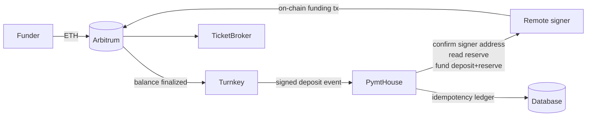
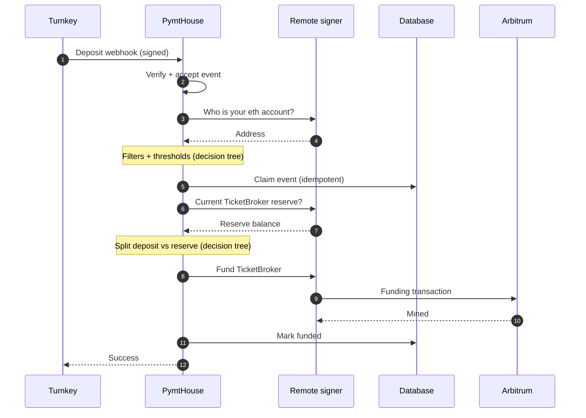
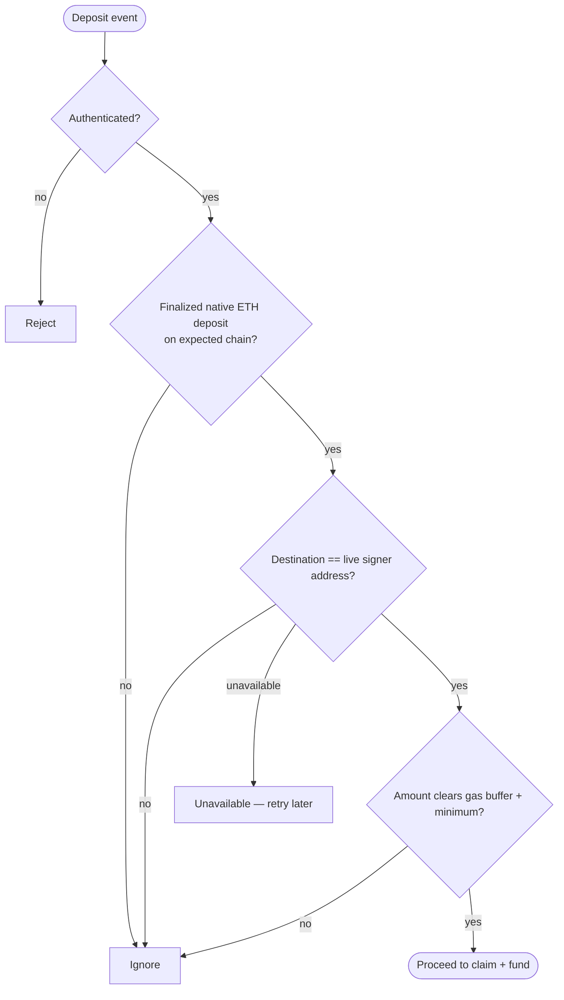
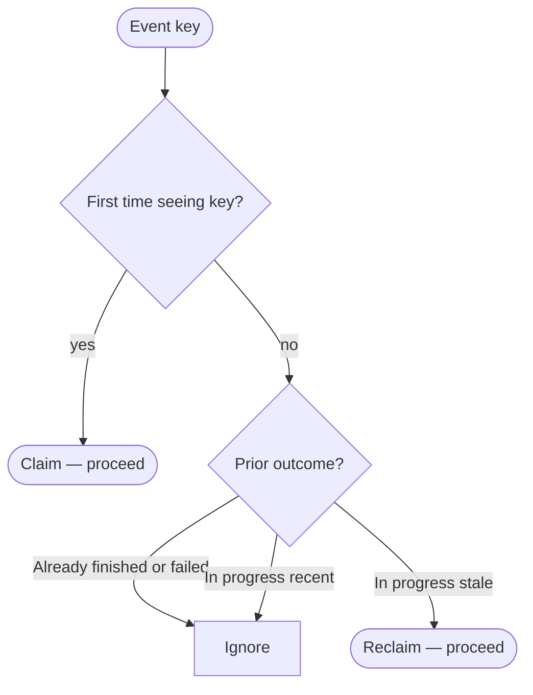
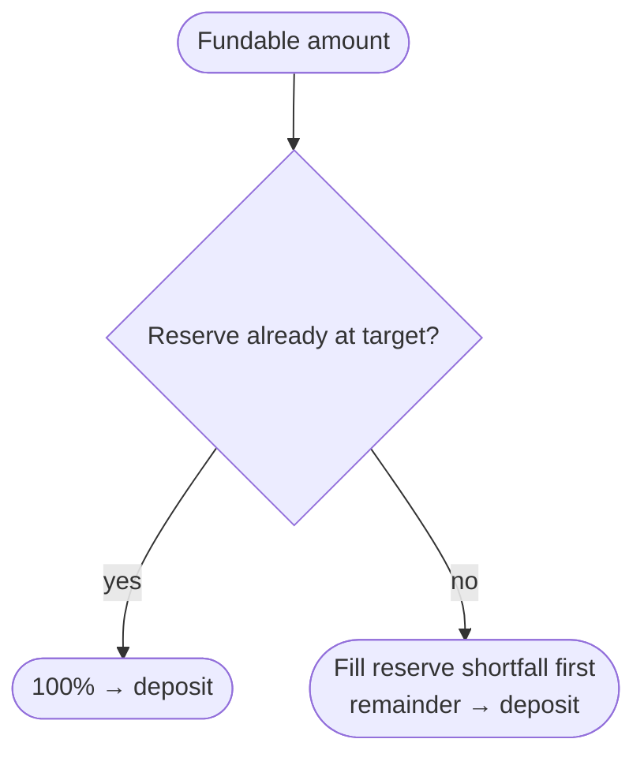

# Turnkey balance → TicketBroker auto-funding

When native ETH arrives in the **remote signer** wallet on Arbitrum, Turnkey
notifies PymtHouse. PymtHouse decides whether that deposit belongs to this
signer and is large enough to act on, then asks the signer to move funds into
Livepeer **TicketBroker** (deposit + reserve) so the gateway can pay for work.

This is the **deposit automation** path. It is separate from the **identity**
webhook that authorizes end-user JWTs before ticket signing; that path never
moves ETH.

```bash
npm run turnkey:create-webhook
# optional: --url https://staging.pymthouse.com/webhooks/turnkey-balance
```

Balance webhooks require a Turnkey billing org (Pay As You Go / Pro / Enterprise)
and must be registered from the **parent** billing organization.

---

## Participants

| Actor | Role |
| --- | --- |
| Funder | Sends ETH to the signer address on Arbitrum One |
| Turnkey | Detects finalized balance changes; delivers signed webhooks |
| PymtHouse | Verifies, filters, records, and instructs funding |
| Remote signer | Holds the ETH account; submits the TicketBroker transaction |
| TicketBroker | On-chain deposit + reserve used for Livepeer payments |

---

## Data flow

How value and control signals move from a chain deposit to TicketBroker credit.



### Trust ideas (high level)

1. **Authenticate the webhook** before any funding side effect.
2. **Bind to the live signer account** — the deposit destination must match the
   eth address the signer process reports, not only a configured env value.
3. **Treat the CLI as privileged** — funding calls go through the protected
   signer control plane (DMZ), not a public API.
4. **Exactly-once intent** — each Turnkey event key is claimed once so retries
   and duplicates do not double-fund.

---

## Transaction flow

Happy path only. Branching lives in [Decision trees](#decision-trees).



| Stage | What can go wrong |
| --- | --- |
| Verify | Reject unsigned / replayed / malformed events |
| Filter | Wrong chain, asset, address, or amount too small → ignore |
| Claim | Duplicate or in-flight event → ignore |
| Fund | Signer or chain failure → record failure; no silent retry |

---

## Decision trees

### Should we fund this deposit?



### Can we claim this event?

Prevents double-funding when Turnkey retries or delivers companions.



### How do we split deposit vs reserve?

Incoming fundable amount fills TicketBroker **reserve** up to a configured
target, then the remainder goes to **deposit**.



---

## Operating parameters

Defaults are sized for Arbitrum One. Override via Vercel env if needed.

| Knob | Default | Intent |
| --- | --- | --- |
| Chain | Arbitrum One | Only fund deposits on the configured chain |
| Gas buffer | ~0.0001 ETH | Leave ETH in the wallet to pay for the funding tx |
| Minimum fund | ~0.001 ETH | Ignore dust after the buffer |
| Reserve target | ~0.25 ETH | Prefer filling reserve before deposit |

**Practical tip:** send **≥ ~0.002 ETH** so companion/dust events near the
threshold do not confuse operators. Turnkey may emit **multiple** events for one
user transfer; a small “ignored” event does not mean the main deposit failed.

Required wiring: Turnkey org API credentials (webhook registration),
`SIGNER_CLI_URL` to the signer control plane, and DB migrations applied on the
target Neon branch.

---

## Outcomes operators see

| Result | Meaning |
| --- | --- |
| Funded | Event claimed; TicketBroker updated on-chain |
| Ignored | Valid webhook, intentionally no funding (filter, dust, duplicate, …) |
| Unauthorized | Signature / auth failed |
| Error | Funding attempted and failed, or signer temporarily unreachable |

---

## How to verify

1. Webhook registered; PymtHouse can reach the signer CLI.
2. Send a deposit ≥ ~0.002 ETH to the **signer** address on Arbitrum One.
3. Logs show a successful fund; ledger row is `funded`.
4. Explorer shows the signer’s TicketBroker funding tx; signer UI deposit/reserve increased.

---

## Design decisions

| Choice | Why | Cost |
| --- | --- | --- |
| Live signer address check | Avoid funding the wrong process if config drifts | Funding path depends on signer availability |
| Ignore (ack) bad/small events | Stops Turnkey retry storms | Operators must read ignore reasons |
| Idempotent claim ledger | Safe under retries without distributed locks | Stuck/failed claims need ops attention |
| Keep a gas buffer in-wallet | Funding tx must still pay gas | Tiny deposits are skipped |
| Reserve-first split | Payment reliability floor | Concurrent large deposits can race on reserve reads |
| Separate from identity webhook | Money movement ≠ user auth | Two webhook surfaces to operate |

---

## Follow-ups

- [ ] Richer ops logging when address binding fails (expected vs live address).
- [ ] Metrics by ignore reason and fund latency.
- [ ] Alerting / runbook for failed or stuck claims.
- [ ] Safe manual retry for failed funds without double-credit.
- [ ] Multi-signer routing if more than one funded wallet is required.
- [ ] Per-user deposit wallets (MoonPay phase 2) — see [moonpay-onramp-demo.md](./moonpay-onramp-demo.md).
