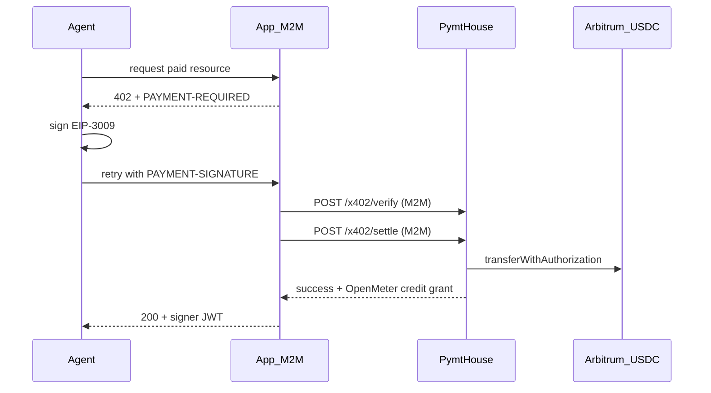

# x402 Facilitator

PymtHouse exposes a **spec-compliant x402 v2 facilitator** for machine payments in USDC on Arbitrum. Resource servers (apps) verify and settle EIP-3009 `transferWithAuthorization` payloads; agents pay with a wallet or a device-code-style payment approval flow.

## Endpoints

| Method | Path | Auth |
|--------|------|------|
| `GET` | `/api/v1/x402/supported` | Public |
| `POST` | `/api/v1/x402/verify` | M2M Basic, public `app_*` `client_id` (rate-limited), or bearer JWT |
| `POST` | `/api/v1/x402/settle` | M2M Basic + `x402:settle` scope |
| `POST` | `/api/v1/x402/payment-codes` | Public `app_*`, bearer, or M2M |
| `GET` | `/api/v1/x402/payment-codes/{code}` | Same (poll; use `device_code` to receive payload) |
| `POST` | `/api/v1/x402/payment-codes/{code}/approve` | NextAuth session (browser) |
| `POST` | `/api/v1/apps/{clientId}/x402/wallet` | M2M + `x402:settle` |

Networks: `eip155:42161` (Arbitrum One USDC `0xaf88…5831`), `eip155:421614` (Arbitrum Sepolia USDC).

## Enable for an app

1. In **App settings → Capabilities**, check **Enable x402 payments**.
2. Optionally set a deposit address (payTo), or call `POST /api/v1/apps/{clientId}/x402/wallet` to provision via Turnkey.
3. Optionally toggle **Enable fiat on-ramp** independently.
4. The M2M helper automatically receives the `x402:settle` scope.

## Resource-server flow (livepeer-python-gateway apps)



When prepaid credits are exhausted, minting a user signer JWT returns **HTTP 402** with a `PAYMENT-REQUIRED` header (base64 JSON) if the app has x402 enabled and a payTo address. Settle with `externalUserId` to grant OpenMeter credits that unlock minting.

### Verify / settle body

```json
{
  "paymentPayload": {
    "x402Version": 2,
    "scheme": "exact",
    "network": "eip155:42161",
    "payload": {
      "signature": "0x…",
      "authorization": {
        "from": "0xBuyer",
        "to": "0xPayTo",
        "value": "10000",
        "validAfter": "0",
        "validBefore": "1735689600",
        "nonce": "0x…"
      }
    }
  },
  "paymentRequirements": {
    "scheme": "exact",
    "network": "eip155:42161",
    "asset": "0xaf88d065e77c8cC2239327C5EDb3A432268e5831",
    "amount": "10000",
    "payTo": "0xPayTo",
    "maxTimeoutSeconds": 300,
    "extra": { "name": "USD Coin", "version": "2", "assetTransferMethod": "eip3009" }
  },
  "externalUserId": "agent-user-1"
}
```

## Agent access (no M2M secret)

1. **Public client** — pass `client_id=app_…` (query, `X-Pmth-Client-Id`, or JSON body) to `/verify` and `/payment-codes`.
2. **Public PymtHouse app** — seed with `npx tsx scripts/seed-public-x402-app.ts` → client id `app_pymthouse_public`. Agents device-login against it and run payment codes without registering a developer app.
3. **Payment codes** — agent creates a code, human opens `/x402/approve`, signs EIP-3009 (paste Wallet Kit payload), agent polls with `device_code` and receives the `paymentPayload`.

## Environment

| Variable | Purpose |
|----------|---------|
| `X402_FACILITATOR_PRIVATE_KEY` | Gas wallet for `transferWithAuthorization` (required for settle) |
| `X402_RPC_URL` | Optional RPC override |
| `ETH_RPC_URL` / `signer_config.eth_rpc_url` | Fallback RPC for Arbitrum One |
| `X402_ALLOW_FACILITATOR_PAYTO_FALLBACK=1` | Dev-only: use facilitator address as payTo if Turnkey create fails |
| `TURNKEY_*` | Used when provisioning app deposit wallets |
| `PUBLIC_X402_APP_OWNER_ID` | Owner for the seeded public app |

## Python buyer sketch (gateway agents)

```python
import base64, json, time, urllib.request

# 1) After a 402 with PAYMENT-REQUIRED header:
pr = json.loads(base64.b64decode(payment_required_header))
req = pr["accepts"][0]

# 2a) Local EIP-712 sign → payment_payload, or
# 2b) Payment code flow:
body = json.dumps({"client_id": "app_pymthouse_public", "paymentRequirements": req}).encode()
r = urllib.request.urlopen(urllib.request.Request(
    f"{ISSUER}/api/v1/x402/payment-codes", data=body,
    headers={"Content-Type": "application/json"}, method="POST"))
code = json.load(r)
print("Approve at", code["verification_uri_complete"])
# poll GET .../payment-codes/{device_code}?client_id=...
# then POST settle via the resource server (M2M)
```

See also Stripe’s [machine x402 guide](https://docs.stripe.com/payments/machine/x402) for the resource-server middleware pattern; PymtHouse is the facilitator + clearinghouse (credits) rather than Stripe PaymentIntents.
