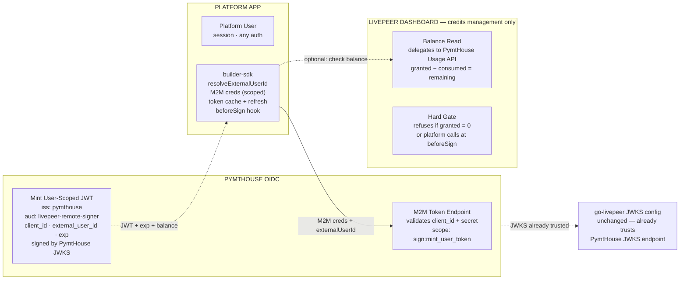
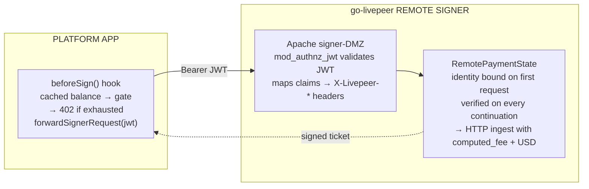
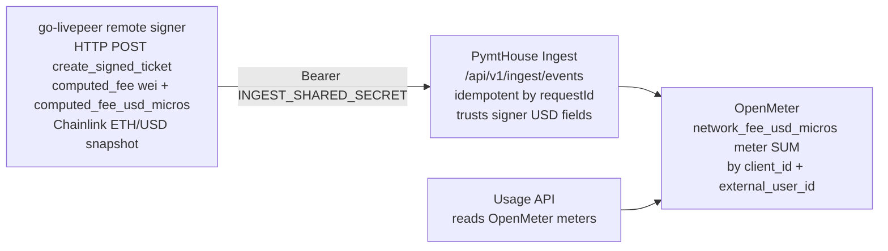
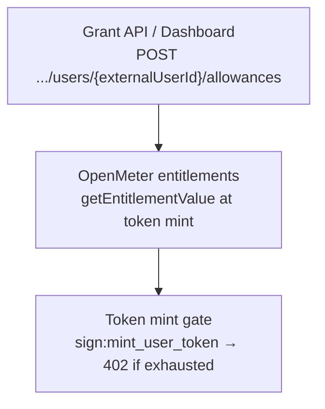
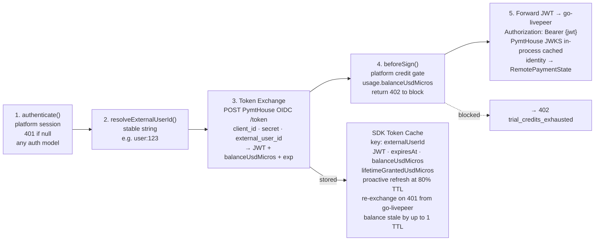
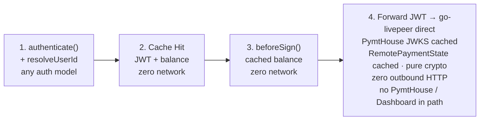

@rickstaa Below is an outline of the changes I recommend to be made on the clearinghouse side for this project. 

There is another focus area to separately solve - media streaming from browser - but I understand this is essentially resolved in https://github.com/livepeer/go-livepeer/pull/3938. Wiring up the gateway client into the browser should be tracked as a separate task. 

# Clearinghouse SDK — Architecture Diagrams

*Option A · Platform M2M → PymtHouse OIDC direct · Dashboard credits only · go-livepeer JWKS unchanged*

---

## Diagram 1 of 3 — Full Flow — Three Phases

*End-to-end view across session setup, the signing hot path, and async usage ingest. Dashboard is absent from both the token exchange and the signing path.*

### Phase 1 — Session Setup

### Phase 2 — Signing Hot Path

### Phase 3 — Usage Ingest (async)

*async · never blocks signing · go-livepeer remote signer is the single authoritative meter · signer-proxy Postgres rows are legacy/diagnostic only · num_tickets/session_balance are diagnostics, not billed*

---

**Token exchange (PymtHouse OIDC direct)**
- Platform SDK holds a PymtHouse M2M credential scoped to `sign:mint_user_token` only
- Calls PymtHouse OIDC `/token` with `{ client_id, client_secret, external_user_id }`
- PymtHouse mints JWT: `iss=pymthouse · aud=livepeer-remote-signer · external_user_id`
- go-livepeer JWKS config unchanged — no deployment change needed

**Signing hot path**
- SDK presents cached JWT to Apache signer-DMZ (JWT validated via mod_authnz_jwt)
- Apache maps `client_id` / `external_user_id` → `X-Livepeer-*` trusted headers
- go-livepeer `RemoteSignerUsageIdentityMode=trusted_headers` binds identity into `RemotePaymentState` on first request, verified on continuations
- Dashboard entirely absent from this path

**Usage metering (signer-authoritative)**
- go-livepeer emits `create_signed_ticket` with `computed_fee` (wei) and `computed_fee_usd_micros` (Chainlink ETH/USD at signing time)
- PymtHouse ingest relays to OpenMeter; does not recompute USD from pymthouse oracle
- Billing meters deterministic `price × pixels`, not ticket face value or `num_tickets`
- Requires `trusted_headers` identity on every payment request for per-user attribution in multi-tenant deployments

**Dashboard role (credits only)**
- Not in the token exchange path at all
- Manages credit grants and policies per user
- Balance = granted − consumed, where consumed comes from PymtHouse Usage API
- No separate debit ledger — PymtHouse is the single usage authority

---

## Diagram 2 of 3 — Trial Credits — OpenMeter entitlements + grants

*Trial balance lives in OpenMeter (feature `network_spend` on hosted instance). Consumption debits via the `network_fee_usd_micros` meter. Top-ups via `POST /api/v1/apps/{clientId}/users/{externalUserId}/allowances`; Starter included usage via subscription `issueAfterReset`.*

**Why OpenMeter for trial credits**
- Single system for consumption (meter) and balance (entitlements + grants)
- Token mint calls `getEntitlementValue` before issuing JWT; returns `balanceUsdMicros` in response body
- Platform trials always use hosted OpenMeter; BYO OpenMeter is for usage metering only

**PymtHouse OIDC checks balance at mint time**
- M2M scope `sign:mint_user_token` on `POST /api/v1/oidc/token`
- Hard gate — 402 if trial credits exhausted
- Balance returned in token exchange response body (not JWT claims) for `beforeSign` use
- TTL tuning: 60s = strict, 300s = default, 3600s = low-frequency batch

---

## Diagram 3 of 3 — SDK Token Lifecycle — Cold & Warm Paths

*Step-by-step request flow through `createHostedSignerProxyHandler()`. Cold path performs a token exchange; warm path is pure in-memory with zero outbound HTTP until go-livepeer.*

### Cold Path — token not in cache

### Warm Path — token in cache

**JWT claims:** `iss=pymthouse · aud=livepeer-remote-signer · client_id · external_user_id · exp · scope=sign:job`

**Response body:** `{ jwt, expiresAt, balanceUsdMicros, lifetimeGrantedUsdMicros }`

**M2M credential** scoped to `sign:mint_user_token` only — cannot call Usage API, Builder API, or any other PymtHouse endpoint.

**Hot path (warm, per-ticket)**
- In-memory cache lookup — zero I/O
- `beforeSign` with cached balance — zero I/O
- HTTP POST to go-livepeer with `Bearer {jwt}`
- PymtHouse JWKS in-process (cached) + `RemotePaymentState` cached — pure crypto

**Out of hot path**
- Token exchange with PymtHouse OIDC — once per session, proactive at 80% TTL
- Balance read (Dashboard → PymtHouse Usage API) — only at exchange time
- JWKS fetch from PymtHouse — once by go-livepeer, then TTL-cached
- Kafka ingest + usage writes — fully async, never blocking